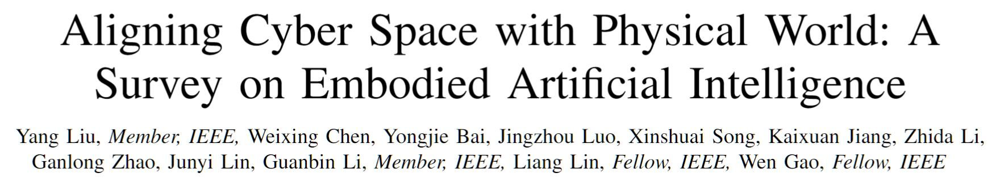

# Paper list for Embodied AI 

<p align="center">

</p>


#### We appreciate any useful suggestions for improvement of this paper list or survey from peers. Please raise issues or send an email to **liuy856@mail.sysu.edu.cn** and **chen867820261@gmail.com**. Thanks for your cooperation!

**Aligning Cyber Space with Physical World: A Survey on Embodied AI**    
  [[Yang Liu](https://yangliu9208.github.io)], Weixing Chen, Yongjie Bai, Jingzhou Luo, Xinshuai Song, Kaixuan Jiang, Zhida Li, Ganlong Zhao, Junyi Lin, Guanbin Li, Wen Gao, Liang Lin     
  [[PDF](https://arxiv.org/pdf/2407.06886)] 
<p align="center">

</p>  

## :collision: Update Log 
* [2024.07.10] We release the first version of the survey on Embodied AI [PDF](https://arxiv.org/pdf/2407.06886)!
* [2024.07.10] We release the first version of the paper list for Embodied AI. This page is continually updating!


## <a id="table-of-contents">📚 Table of Contents </a>

- [Books & Surveys](#books-surveys)
- [Embodied Simulators](#simulators)
- [Embodied Perception](#perception)
- [Embodied Interaction](#interaction)
- [Embodied Agent](#agent)
- [Sim-to-Real Adaptation](#sim-to-real)

## <a id="books-surveys"> Books & Surveys <a href="#table-of-contents">🔝</a> </a> 

* **Multimodal Large Models: The New Paradigm of Artificial General Intelligence**, Publishing House of Electronics Industry (PHE), 2024     
Yang Liu, Liang Lin     
[[Page](https://hcplab-sysu.github.io/Book-of-MLM/)]      

* **A Survey on Vision-Language-Action Models for Embodied AI**, arXiv:2405.14093, 2024   
Yueen Ma, Zixing Song, Yuzheng Zhuang, Jianye Hao, Irwin King    
[[Paper](https://arxiv.org/pdf/2405.14093)]

* **Towards Generalist Robot Learning from Internet Video: A Survey**, arXiv:2404.19664, 2024   
McCarthy, Robert, Daniel CH Tan, Dominik Schmidt, Fernando Acero, Nathan Herr, Yilun Du, Thomas G. Thuruthel, and Zhibin Li.  
[[Paper](https://arxiv.org/pdf/2404.19664)]

* **A Survey on Robotics with Foundation Models: toward Embodied AI**, arXiv:2402.02385, 2024    
Zhiyuan Xu, Kun Wu, Junjie Wen, Jinming Li, Ning Liu, Zhengping Che, and Jian Tang.     
[[Paper](https://arxiv.org/pdf/2402.02385)]     

* **Toward general-purpose robots via foundation models: A survey and meta-analysis**, arXiv:2312.08782, 2023   
Yafei Hu, Quanting Xie, Vidhi Jain, Jonathan Francis, Jay Patrikar, Nikhil Keetha, Seungchan Kim et al.  
[[Paper](https://arxiv.org/pdf/2312.08782)]    

* **A survey of embodied ai: From simulators to research tasks**, IEEE Transactions on Emerging Topics in Computational Intelligence, 2022    
Jiafei Duan, Samson Yu, Hui Li Tan, Hongyuan Zhu, Cheston Tan    
[[Paper](https://arxiv.org/pdf/2103.04918)]    

* **The development of embodied cognition: Six lessons from babies**, Artificial life, 2005    
Linda Smith, Michael Gasser    
[[Paper](https://cogdev.sitehost.iu.edu/labwork/6_lessons.pdf)]    

* **Embodied artificial intelligence: Trends and challenges**, Lecture notes in computer science, 2004    
Rolf Pfeifer, Fumiya Iida   
[[Paper](https://people.csail.mit.edu/iida/papers/PfeiferIidaEAIDags.pdf)]     

## <a id="simulators"> Embodied Simulators <a href="#table-of-contents">🔝</a> </a>
### General Simulator


* **Nvidia isaac sim: Robotics simulation and synthetic data**, NVIDIA, 2023
[[page](https://developer.nvidia.com/isaac/sim)]

* **Design and use paradigms for gazebo, an open-source multi-robot simulator**, IROS, 2004
Koenig, Nathan, Andrew, Howard. 
[[page](https://citeseerx.ist.psu.edu/document?repid=rep1&type=pdf&doi=79f91c1c95271a075b91e9fdca43d6c31e4cbe17)]

* **Pybullet, a python module for physics simulation for games, robotics and machine learning**, 2016
Coumans, Erwin, Yunfei, Bai. 

* **Webots: open-source robot simulator**
Cyberbotics
[[page](https://cyberbotics.com/doc/reference/index), [code](https://github.com/cyberbotics/webots)]

* **MuJoCo: A physics engine for model-based control**, IROS, 2012
Todorov, Emanuel, Tom, Erez, Yuval, Tassa. 
[[page](https://ieeexplore.ieee.org/abstract/document/6386109/), [code](https://github.com/google-deepmind/mujoco)]

* **Unity: A general platform for intelligent agents**, ArXiv, 2020
Juliani, Arthur, Vincent-Pierre, Berges, Ervin, Teng, Andrew, Cohen, Jonathan, Harper, Chris, Elion, Chris, Goy, Yuan, Gao, Hunter, Henry, Marwan, Mattar, Danny, Lange. 
[[page](https://arxiv.org/pdf/1809.02627)]

* **AirSim: High-Fidelity Visual and Physical Simulation for Autonomous Vehicles**, Field and Service Robotics, 2017
Shital Shah, , Debadeepta Dey, Chris Lovett, Ashish Kapoor. 
[[page](https://arxiv.org/pdf/1705.05065.pdf%20http://arxiv.org/abs/1705.05065)]

* **Modular open robots simulation engine: Morse**, ICRA, 2011
Echeverria, Gilberto and Lassabe, Nicolas and Degroote, Arnaud and Lemaignan, S{\'e}verin
[[page](https://www.openrobots.org/morse/material/media/pdf/paper-icra.pdf)]

* **V-REP: A versatile and scalable robot simulation framework**, IROS, 2013
Rohmer, Eric, Surya PN, Singh, Marc, Freese. 
[[page](https://coppeliarobotics.com/coppeliaSim_v-rep_iros2013.pdf)]


### Real-Scene Based Simulators
* **ThreeDWorld: A Platform for Interactive Multi-Modal Physical Simulation**, NeurIPS, 2021  
Gan, Chuang, J., Schwartz, Seth, Alter, Martin, Schrimpf, James, Traer, JulianDe, Freitas, Jonas, Kubilius, Abhishek, Bhandwaldar, Nick, Haber, Megumi, Sano, Kuno, Kim, Elias, Wang, Damian, Mrowca, Michael, Lingelbach, Aidan, Curtis, KevinT., Feigelis, DavidM., Bear, Dan, Gutfreund, DavidD., Cox, JamesJ., DiCarlo, JoshH., McDermott, JoshuaB., Tenenbaum, Daniel, Yamins.   
[[page](https://arxiv.org/pdf/2007.04954)]

* **iGibson 1.0: A Simulation Environment for Interactive Tasks in Large Realistic Scenes**, IROS, 2021  
Shen, Bokui, Fei, Xia, Chengshu, Li, Roberto, Martín-Martín, Linxi, Fan, Guanzhi, Wang, Claudia, Pérez-D’Arpino, Shyamal, Buch, Sanjana, Srivastava, Lyne, Tchapmi, Micael, Tchapmi, Kent, Vainio, Josiah, Wong, Li, Fei-Fei, Silvio, Savarese.   
[[page](https://arxiv.org/pdf/2012.02924)]

* **SAPIEN: A SimulAted Part-Based Interactive ENvironment**, CVPR, 2020  
Xiang, Fanbo, Yuzhe, Qin, Kaichun, Mo, Yikuan, Xia, Hao, Zhu, Fangchen, Liu, Minghua, Liu, Hanxiao, Jiang, Yifu, Yuan, He, Wang, Li, Yi, Angel X., Chang, Leonidas J., Guibas, Hao, Su.   
[[page](http://openaccess.thecvf.com/content_CVPR_2020/papers/Xiang_SAPIEN_A_SimulAted_Part-Based_Interactive_ENvironment_CVPR_2020_paper.pdf)]

* **Habitat: A Platform for Embodied AI Research**, ICCV, 2019  
Savva, Manolis, Abhishek, Kadian, Oleksandr, Maksymets, Yili, Zhao, Erik, Wijmans, Bhavana, Jain, Julian, Straub, Jia, Liu, Vladlen, Koltun, Jitendra, Malik, Devi, Parikh, Dhruv, Batra.   
[[page](http://openaccess.thecvf.com/content_ICCV_2019/papers/Savva_Habitat_A_Platform_for_Embodied_AI_Research_ICCV_2019_paper.pdf)]

* **VirtualHome: Simulating Household Activities Via Programs**, CVPR, 2018  
Puig, Xavier, Kevin, Ra, Marko, Boben, Jiaman, Li, Tingwu, Wang, Sanja, Fidler, Antonio, Torralba.   
[[page](http://openaccess.thecvf.com/content_cvpr_2018/papers/Puig_VirtualHome_Simulating_Household_CVPR_2018_paper.pdf)]

* **Matterport3D: Learning from RGB-D Data in Indoor Environments**, 3DV, 2017  
Chang, Angel, Angela, Dai, Thomas, Funkhouser, Maciej, Halber, Matthias, Niebner, Manolis, Savva, Shuran, Song, Andy, Zeng, Yinda, Zhang.   
[[page](https://arxiv.org/pdf/1709.06158)]

* **AI2-THOR: An Interactive 3D Environment for Visual AI**. arXiv, 2017  
Kolve, Eric, Roozbeh, Mottaghi, Daniel, Gordon, Yuke, Zhu, Abhinav, Gupta, Ali, Farhadi.   
[[page](https://arxiv.org/pdf/1712.05474)]

* **ProcTHOR: Large-Scale Embodied AI Using Procedural Generation**, NeurIPS, 2022  
Deitke, VanderBilt, Herrasti, Weihs, Salvador, Ehsani, Han, Kolve, Farhadi, Kembhavi, Mottaghi   
[[page](https://arxiv.org/pdf/2206.06994)]

* **RoboGen: Towards Unleashing Infinite Data for Automated Robot Learning via Generative Simulation**, arXiv, 2023  
Wang, Yufei, Zhou, Xian, Feng, Chen, Tsun-Hsuan, Wang, Yian, Wang, Katerina, Fragkiadaki, Zackory, Erickson, David, Held, Chuang, Gan.   
[[page](https://arxiv.org/pdf/2311.01455)]

* **Holodeck: Language Guided Generation of 3D Embodied AI Environments**, CVPR, 2024  
Yue Yang, , Fan-Yun Sun, Luca Weihs, Eli VanderBilt, Alvaro Herrasti, Winson Han, Jiajun Wu, Nick Haber, Ranjay Krishna, Lingjie Liu, Chris Callison-Burch, Mark Yatskar, Aniruddha Kembhavi, Christopher Clark.   
[[page](https://openaccess.thecvf.com/content/CVPR2024/papers/Yang_Holodeck_Language_Guided_Generation_of_3D_Embodied_AI_Environments_CVPR_2024_paper.pdf)]

* **PhyScene: Physically Interactable 3D Scene Synthesis for Embodied AI**, CVPR, 2024  
Yang, Yandan, Baoxiong, Jia, Peiyuan, Zhi, Siyuan, Huang.   
[[page](https://openaccess.thecvf.com/content/CVPR2024/papers/Yang_PhyScene_Physically_Interactable_3D_Scene_Synthesis_for_Embodied_AI_CVPR_2024_paper.pdf)]

## <a id="perception">  Embodied Perception <a href="#table-of-contents">🔝</a> </a>
### Active Visual Exploration

* **MonoSLAM: Real-time single camera SLAM**, IEEE T-PAMI 29. 6(2007): 1052–1067  
Davison, Andrew J, Ian D, Reid, Nicholas D, Molton, Olivier, Stasse.   
[[page]()]

* **A multi-state constraint Kalman filter for vision-aided inertial navigation**, IROS, 2007  
Mourikis, Anastasios I, Stergios I, Roumeliotis.   
[[page]()]

* **Parallel tracking and mapping for small AR workspaces**, ISMAR, 2007  
Klein, Georg, David, Murray.   
[[page]()]

* **ORB-SLAM: a versatile and accurate monocular SLAM system** IEEE T-RO 31. 5(2015): 1147–1163  
Mur-Artal, Raul, Jose Maria Martinez, Montiel, Juan D, Tardos.   
[[page]()]

* **DTAM: Dense tracking and mapping in real-time**, ICCV, 2011  
Newcombe, Richard A, Steven J, Lovegrove, Andrew J, Davison.  
[[page]()]

* **LSD-SLAM: Large-scale direct monocular SLAM**, ECCV, 2014  
Engel, Jakob, Thomas, Schops, Daniel, Cremers.  
[[page]()]

* **Slam++: Simultaneous localisation and mapping at the level of objects**, CVPR, 2013  
Salas-Moreno, Renato F, Richard A, Newcombe, Hauke, Strasdat, Paul HJ, Kelly, Andrew J, Davison.   
[[page]()]

* **Cubeslam: Monocular 3-d object slam**, IEEE T-RO 35. 4(2019): 925–938  
Yang, Shichao, Sebastian, Scherer.  
[[page]()]

* **Hierarchical topic model based object association for semantic SLAM**, IEEE T-VCG 25. 11(2019): 3052–3062  
Zhang, Jianhua, Mengping, Gui, Qichao, Wang, Ruyu, Liu, Junzhe, Xu, Shengyong, Chen.   
[[page]()]

* **Quadricslam: Dual quadrics from object detections as landmarks in object-oriented slam**, IEEE Robotics and Automation Letters 4. 1(2018): 1–8.  
Nicholson, Lachlan, Michael, Milford, Niko, Sünderhauf.   
[[page]()]

* **So-slam: Semantic object slam with scale proportional and symmetrical texture constraints**. IEEE Robotics and Automation Letters 7. 2(2022): 4008–4015.  
Liao, Ziwei, Yutong, Hu, Jiadong, Zhang, Xianyu, Qi, Xiaoyu, Zhang, Wei, Wang.   
[[page]()]

* **DS-SLAM: A semantic visual SLAM towards dynamic environments**, IROS, 2018  
Yu, Chao, Zuxin, Liu, Xin-Jun, Liu, Fugui, Xie, Yi, Yang, Qi, Wei, Qiao, Fei.   
[[page]()]

* **DynaSLAM: Tracking, mapping, and inpainting in dynamic scenes**, IEEE Robotics and Automation Letters 3. 4(2018): 4076–4083  
Bescos, Berta, José M, Facil, Javier, Civera, José, Neira.   
[[page]()]

* **SG-SLAM: A real-time RGB-D visual SLAM toward dynamic scenes with semantic and geometric information**, IEEE Transactions on Instrumentation and Measurement 72. (2022): 1–12.
Cheng, Shuhong, Changhe, Sun, Shijun, Zhang, Dianfan, Zhang. 
[[page]()]


* **OVD-SLAM: An online visual SLAM for dynamic environments**, IEEE Sensors Journal, 2023.
He, Jiaming, Mingrui, Li, Yangyang, Wang, Hongyu, Wang. 
[[page]()]


* **Gs-slam: Dense visual slam with 3d gaussian splatting**, CVPR, 2024.
Yan, Chi, Delin, Qu, Dan, Xu, Bin, Zhao, Zhigang, Wang, Dong, Wang, Xuelong, Li. 
[[page]()]

* **Multi-view 3d object detection network for autonomous driving**, CVPR, 2017.
Chen, Xiaozhi, Huimin, Ma, Ji, Wan, Bo, Li, Tian, Xia. 
[[page]()]

* **Pointpillars: Fast encoders for object detection from point clouds**, CVPR, 2019.
Lang, Alex H, Sourabh, Vora, Holger, Caesar, Lubing, Zhou, Jiong, Yang, Oscar, Beijbom. 
[[page]()]

* **Multi-view convolutional neural networks for 3d shape recognition**, ICCV, 2015.
Su, Hang, Subhransu, Maji, Evangelos, Kalogerakis, Erik, Learned-Miller. 
[[page]()]

* **Voxnet: A 3d convolutional neural network for real-time object recognition**, IROS, 2015.
Maturana, Daniel, Sebastian, Scherer. 
[[page]()]

* **Semantic scene completion from a single depth image**, CVPR, 2017.
Song, Shuran, Fisher, Yu, Andy, Zeng, Angel X, Chang, Manolis, Savva, Thomas, Funkhouser. 
[[page]()]

* **4d spatio-temporal convnets: Minkowski convolutional neural networks**, CVPR, 2019.
Choy, Christopher, JunYoung, Gwak, Silvio, Savarese. 
[[page]()]

* **3d semantic segmentation with submanifold sparse convolutional networks**, CVPR, 2018.
Graham, Benjamin, Martin, Engelcke, Laurens, Van Der Maaten. 
[[page]()]

* **Embodiedscan: A holistic multi-modal 3d perception suite towards embodied ai** CVPR, 2024.
Wang, Tai, Xiaohan, Mao, Chenming, Zhu, Runsen, Xu, Ruiyuan, Lyu, Peisen, Li, Xiao, Chen, Wenwei, Zhang, Kai, Chen, Tianfan, Xue, others. 
[[page]()]

* **Pointnet: Deep learning on point sets for 3d classification and segmentation**, CVPR, 2017.
Qi, Charles R, Hao, Su, Kaichun, Mo, Leonidas J, Guibas. 
[[page]()]

* **Pointnet++: Deep hierarchical feature learning on point sets in a metric space**, NeurIPS, 2017
Qi, Charles Ruizhongtai, Li, Yi, Hao, Su, Leonidas J, Guibas. 
[[page]()]

* **Rethinking network design and local geometry in point cloud: A simple residual MLP framework**, arXiv, 2022.
Ma, Xu, Can, Qin, Haoxuan, You, Haoxi, Ran, Yun, Fu. 
[[page]()]

* **Point transformer**, ICCV, 2021.
Zhao, Hengshuang, Li, Jiang, Jiaya, Jia, Philip HS, Torr, Vladlen, Koltun. 
[[page]()]

* **Swin3d: A pretrained transformer backbone for 3d indoor scene understanding**, arXiv, 2023.
Yang, Yu-Qi, Yu-Xiao, Guo, Jian-Yu, Xiong, Yang, Liu, Hao, Pan, Peng-Shuai, Wang, Xin, Tong, Baining, Guo. 
[[page]()]

* **Point transformer v2: Grouped vector attention and partition-based pooling** NeurIPS, 2022
Wu, Xiaoyang, Yixing, Lao, Li, Jiang, Xihui, Liu, Hengshuang, Zhao. 
[[page]()]

* **Point Transformer V3: Simpler Faster Stronger**, CVPR, 2024.
Wu, Xiaoyang, Li, Jiang, Peng-Shuai, Wang, Zhijian, Liu, Xihui, Liu, Yu, Qiao, Wanli, Ouyang, Tong, He, Hengshuang, Zhao. 
[[page]()]

* **PointMamba: A Simple State Space Model for Point Cloud Analysis**, arXiv, 2024.
Liang, Dingkang, Xin, Zhou, Xinyu, Wang, Xingkui, Zhu, Wei, Xu, Zhikang, Zou, Xiaoqing, Ye, Xiang, Bai. 
[[page]()]

* **Point Could Mamba: Point Cloud Learning via State Space Model**, arXiv, 2024.
Zhang, Tao, Xiangtai, Li, Haobo, Yuan, Shunping, Ji, Shuicheng, Yan. 
[[page]()]

* **Mamba3d: Enhancing local features for 3d point cloud analysis via state space model** arXiv, 2024.
Han, Xu, Yuan, Tang, Zhaoxuan, Wang, Xianzhi, Li. 
[[page]()]

* **The curious robot: Learning visual representations via physical interactions**, ECCV, 2016.
Pinto, Lerrel, Dhiraj, Gandhi, Yuanfeng, Han, Yong-Lae, Park, Abhinav, Gupta. 
[[page]()]

* **Transferring implicit knowledge of non-visual object properties across heterogeneous robot morphologies**, ICRA, 2023.
Tatiya, Gyan, Jonathan, Francis, Jivko, Sinapov. 
[[page]()]

* **Learning to look around: Intelligently exploring unseen environments for unknown tasks**, CVPR, 2018.
Jayaraman, Dinesh, Kristen, Grauman. 
[[page]()]

* **Neu-nbv: Next best view planning using uncertainty estimation in image-based neural rendering**, IROS, 2023.
Jin, Liren, Xieyuanli, Chen, Julius, Rückin, Marija, Popovi\'c. 
[[page]()]

* **Off-policy evaluation with online adaptation for robot exploration in challenging environments**, IEEE Robotics and Automation Letters, 2023.
Hu, Yafei, Junyi, Geng, Chen, Wang, John, Keller, Sebastian, Scherer. 
[[page]()]

* **Evidential Active Recognition: Intelligent and Prudent Open-World Embodied Perception**, CVPR, 2024.
Fan, Lei, Mingfu, Liang, Yunxuan, Li, Gang, Hua, Ying, Wu. 
[[page]()]


### 3D Visual Grounding
* **ScanRefer: 3D Object Localization in RGB-D Scans using Natural Language**, ECCV, 2020
Chen, Dave Zhenyu and Chang, Angel X and Nie{\ss}ner, Matthias 
[[page]](https://arxiv.org/pdf/1912.08830)

* **ReferIt3D: Neural Listeners for Fine-Grained 3D Object Identification in Real-World Scenes**, ECCV, 2020
Achlioptas, Panos and Abdelreheem, Ahmed and Xia, Fei and Elhoseiny, Mohamed and Guibas, Leonidas
[[page]](https://www.ecva.net/papers/eccv_2020/papers_ECCV/papers/123460409.pdf)

* **Text-guided graph neural networks for referring 3D instance segmentation**, AAAI, 2021
Huang, Pin-Hao and Lee, Han-Hung and Chen, Hwann-Tzong and Liu, Tyng-Luh
[[page]](https://ojs.aaai.org/index.php/AAAI/article/view/16253/16060)

* **InstanceRefer: Cooperative Holistic Understanding for Visual Grounding on Point Clouds through Instance Multi-level Contextual Referring**, ICCV, 2021
Yuan, Zhihao and Yan, Xu and Liao, Yinghong and Zhang, Ruimao and Wang, Sheng and Li, Zhen and Cui, Shuguang
[[page]](https://arxiv.org/pdf/2103.01128)

* **Free-form Description Guided 3D Visual Graph Network for Object Grounding in Point Cloud**, CVPR, 2021
Feng, Mingtao and Li, Zhen and Li, Qi and Zhang, Liang and Zhang, XiangDong and Zhu, Guangming and Zhang, Hui and Wang, Yaonan and Mian, Ajmal
[[page]](https://arxiv.org/pdf/2103.16381)

* **SAT: 2D Semantics Assisted Training for 3D Visual Grounding**, CVPR, 2021
Yang, Zhengyuan and Zhang, Songyang and Wang, Liwei and Luo, Jiebo
[[page]](https://arxiv.org/pdf/2105.11450)

* **LanguageRefer: Spatiallanguage model for 3D visual grounding**, CVPR, 2021
Roh, Junha and Desingh, Karthik and Farhadi, Ali and Fox, Dieter
[[page]](https://arxiv.org/pdf/2107.03438)

* **3DVG-Transformer: Relation Modeling for Visual Grounding on Point Clouds**, ICCV, 2021
Zhao, Lichen and Cai, Daigang and Sheng, Lu and Xu, Dong
[[page]](https://openaccess.thecvf.com/content/ICCV2021/papers/Zhao_3DVG-Transformer_Relation_Modeling_for_Visual_Grounding_on_Point_Clouds_ICCV_2021_paper.pdf)

* **TransRefer3D: Entity-and-relation aware transformer for fine-grained 3D visual grounding**, CVPR, 2021
He, Dailan and Zhao, Yusheng and Luo, Junyu and Hui, Tianrui and Huang, Shaofei and Zhang, Aixi and Liu, Si
[[page]](https://arxiv.org/pdf/2108.02388)

* **Multi-view transformer for 3D visual grounding**, CVPR, 2022
Huang, Shijia and Chen, Yilun and Jia, Jiaya and Wang, Liwei
[[page]](https://arxiv.org/pdf/2204.02174)

* **Look Around and Refer: 2D Synthetic Semantics Knowledge Distillation for 3D Visual Grounding**, CVPR, 2022
Bakr, Eslam and Alsaedy, Yasmeen and Elhoseiny, Mohamed
[[page]](https://arxiv.org/pdf/2211.14241)

* **LLM-Grounder: Open-Vocabulary 3D Visual Grounding with Large Language Model as an Agent**, arXix, 2023
Yang, Jianing and Chen, Xuweiyi and Qian, Shengyi and Madaan, Nikhil and Iyengar, Madhavan and Fouhey, David F and Chai, Joyce
[[page]](https://arxiv.org/pdf/2309.12311)

* **Visual Programming for Zero-shot Open-Vocabulary 3D Visual Grounding**, arXix, 2023
Yuan, Zhihao and Ren, Jinke and Feng, Chun-Mei and Zhao, Hengshuang and Cui, Shuguang and Li, Zhen
[[page]](https://arxiv.org/pdf/2311.15383)

* **3D-SPS: Single-Stage 3D Visual Grounding via Referred Point Progressive Selection**, CVPR, 2022
Luo, Junyu and Fu, Jiahui and Kong, Xianghao and Gao, Chen and Ren, Haibing and Shen, Hao and Xia, Huaxia and Liu, Si
[[page]](https://arxiv.org/pdf/2204.06272)

* **Bottom Up Top Down Detection Transformers for Language Grounding in Images and Point Clouds**, ECCV, 2022
Jain, Ayush and Gkanatsios, Nikolaos and Mediratta, Ishita and Fragkiadaki, Katerina
[[page]](https://arxiv.org/pdf/2112.08879)

* **EDA: Explicit Text-Decoupling and Dense Alignment for 3D Visual Grounding**, CVPR, 2023
Wu, Yanmin and Cheng, Xinhua and Zhang, Renrui and Cheng, Zesen and Zhang, Jian
[[page]](https://openaccess.thecvf.com/content/CVPR2023/papers/Wu_EDA_Explicit_Text-Decoupling_and_Dense_Alignment_for_3D_Visual_Grounding_CVPR_2023_paper.pdf)


### Visual Language Navigation


* **Vision-and-Language Navigation: Interpreting Visually-Grounded Navigation Instructions in Real Environments**, CVPR, 2018.
Anderson, Peter, Qi, Wu, Damien, Teney, Jake, Bruce, Mark, Johnson, Niko, Sunderhauf, Ian, Reid, Stephen, Gould, Anton, Hengel. 
[[page](https://arxiv.org/pdf/1711.07280)]

* **Stay on the Path: Instruction Fidelity in Vision-and-Language Navigation**, ACL, 2019.
Jain, Vihan, Gabriel, Magalhaes, Alexander, Ku, Ashish, Vaswani, Eugene, Ie, Jason, Baldridge. 
[[page](https://arxiv.org/pdf/1905.12255)]

* **Beyond the Nav-Graph: Vision-and-Language Navigation in Continuous Environments**, ECCV, 2020,
Krantz, Jacob and Wijmans, Erik and Majumdar, Arjun and Batra, Dhruv and Lee, Stefan.
[[page](https://arxiv.org/pdf/2004.02857)]

* **TOUCHDOWN: Natural Language Navigation and Spatial Reasoning in Visual Street Environments**, CVPR, 2019.
Chen, Howard, Alane, Suhr, Dipendra, Misra, Noah, Snavely, Yoav, Artzi. 
[[page](https://arxiv.org/pdf/1811.12354)]

* **REVERIE: Remote Embodied Visual Referring Expression in Real Indoor Environments**, CVPR, 2020.
Qi, Yuankai, Qi, Wu, Peter, Anderson, Xin, Wang, William Yang, Wang, Chunhua, Shen, Anton, Hengel. 
[[page](https://arxiv.org/pdf/1904.10151)]

* **SOON: Scenario Oriented Object Navigation with Graph-based Exploration**, CVPR, 2021.
Zhu, Fengda, Xiwen, Liang, Yi, Zhu, Qizhi, Yu, Xiaojun, Chang, Xiaodan, Liang. 
[[page](https://arxiv.org/pdf/2103.17138)]

* **Find What You Want: Learning Demand-conditioned Object Attribute Space for Demand-driven Navigation**, NIPS, 2023.
Wang, Chen, Li, Wu, Dong. 
[[page](https://arxiv.org/pdf/2309.08138)]

* **ALFRED: A Benchmark for Interpreting Grounded Instructions for Everyday Tasks**, CVPR, 2020.
Shridhar, Mohit, Jesse, Thomason, Daniel, Gordon, Yonatan, Bisk, Winson, Han, Roozbeh, Mottaghi, Luke, Zettlemoyer, Dieter, Fox. 
[[page](https://arxiv.org/pdf/1912.01734)]

* **HomeRobot: Open-Vocabulary Mobile Manipulation**, NIPS, 2023.
Yenamandra, Sriram, Arun, Ramachandran, Karmesh, Yadav, Austin, Wang, Mukul, Khanna, Theophile, Gervet, Tsung-Yen, Yang, Vidhi, Jain, AlexanderWilliam, Clegg, John, Turner, Zsolt, Kira, Manolis, Savva, Angel, Chang, DevendraSingh, Chaplot, Dhruv, Batra, Roozbeh, Mottaghi, Yonatan, Bisk, Chris, Paxton. 
[[page](https://arxiv.org/pdf/2306.11565)]

* **Behavior-1k: A benchmark for embodied ai with 1,000 everyday activities and realistic simulation**, Conference on Robot Learning. 2023.
Li, Chengshu, Ruohan, Zhang, Josiah, Wong, Cem, Gokmen, Sanjana, Srivastava, Roberto, Mart\in-Mart\'\in, Chen, Wang, Gabrael, Levine, Michael, Lingelbach, Jiankai, Sun, others. 
[[page](https://arxiv.org/pdf/2403.09227)]

* **Vision-and-dialog navigation**, Conference on Robot Learning. 2020.
Thomason, Jesse, Michael, Murray, Maya, Cakmak, Luke, Zettlemoyer. 
[[page](https://arxiv.org/pdf/1907.04957)]

* **DialFRED: Dialogue-Enabled Agents for Embodied Instruction Following**, arXiv, 2022.
Gao, Xiaofeng, Qiaozi, Gao, Ran, Gong, Kaixiang, Lin, Govind, Thattai, GauravS., Sukhatme. 
[[page](https://arxiv.org/pdf/2202.13330)]

* **Language and visual entity relationship graph for agent navigation**, NeurIPS, 2020.
Hong, Yicong, Cristian, Rodriguez, Yuankai, Qi, Qi, Wu, Stephen, Gould. 
[[page](https://arxiv.org/pdf/2010.09304)]

* **Language-Guided Navigation via Cross-Modal Grounding and Alternate Adversarial Learning**, IEEE T-CSVT 31. (2020): 3469-3481.
Weixia Zhang, , Chao Ma, Qi Wu, Xiaokang Yang. 
[[page](https://arxiv.org/pdf/2011.10972)]

* **Vision-Language Navigation Policy Learning and Adaptation**, IEEE T-PAMI 43. 12(2021): 4205-4216.
Wang, Xin, Qiuyuan, Huang, Asli, Celikyilmaz, Jianfeng, Gao, Dinghan, Shen, Yuan-Fang, Wang, William Yang, Wang, Lei, Zhang. 
[[page](https://arxiv.org/pdf/https://ieeexplore.ieee.org/document/8986691)]

* **FILM: Following Instructions in Language with Modular Methods**, ICLR, 2022.
So Yeon Min, , Devendra Singh Chaplot, Pradeep Kumar Ravikumar, Yonatan Bisk, Ruslan Salakhutdinov. 
[[page](https://arxiv.org/pdf/2110.07342)]

* **LM-Nav: Robotic Navigation with Large Pre-Trained Models of Language, Vision, and Action**, Conference on Robot Learning. 2022.
Dhruv Shah, , Blazej Osinski, Brian Ichter, Sergey Levine. 
[[page](https://arxiv.org/pdf/2207.04429)]

* **HOP: History-and-Order Aware Pretraining for Vision-and-Language Navigation**, CVPR, 2022.
Qiao, Yanyuan, Yuankai, Qi, Yicong, Hong, Zheng, Yu, Peng, Wang, Qi, Wu. 
[[page](https://arxiv.org/pdf/2203.11591)]

* **Towards Learning a Generalist Model for Embodied Navigation**, CVPR, 2024.
Duo Zheng, , Shijia Huang, Lin Zhao, Yiwu Zhong, Liwei Wang. 
[[page](https://arxiv.org/pdf/2312.02010)]

* **Fast-Slow Test-time Adaptation for Online Vision-and-Language Navigation** ICML, 2024.
Junyu Gao, , Xuan Yao, Changsheng Xu. 
[[page](https://arxiv.org/pdf/2311.13209)]

* **Discuss before moving: Visual language navigation via multi-expert discussions**, ICRA, 2024.
Long, Yuxing, Xiaoqi, Li, Wenzhe, Cai, Hao, Dong. 
[[page](https://arxiv.org/pdf/2309.11382)]

* **Vision-and-Language Navigation via Causal Learning**, CVPR, 2024.
Liuyi Wang, Qijun Chen. 
[[page](https://arxiv.org/pdf/2404.10241)]

* **Volumetric Environment Representation for Vision-Language Navigation**, CVPR, 2024.
Rui Liu, Yi Yang. 
[[page](https://arxiv.org/pdf/2403.14158)]

* **NaVid: Video-based VLM Plans the Next Step for Vision-and-Language Navigation**, ArXiv, 2024.
Jiazhao Zhang, , Kunyu Wang, Rongtao Xu, Gengze Zhou, Yicong Hong, Xiaomeng Fang, Qi Wu, Zhizheng Zhang, Wang He. 
[[page](https://arxiv.org/pdf/2402.15852)]

* **Look Before You Leap: Bridging Model-Free and Model-Based Reinforcement Learning for Planned-Ahead Vision-and-Language Navigation**, ECCV, 2018.
Xin Eric Wang, , Wenhan Xiong, Hongmin Wang, William Yang Wang. 
[[page](https://arxiv.org/pdf/1803.07729)]

* **Neighbor-view enhanced model for vision and language navigation**, MM, 2021.
An, Dong, Yuankai, Qi, Yan, Huang, Qi, Wu, Liang, Wang, Tieniu, Tan. 
[[page](https://arxiv.org/pdf/2107.07201)]

* **Bridging the Gap Between Learning in Discrete and Continuous Environments for Vision-and-Language Navigation**, CVPR, 2022.
Hong, Yicong, Zun, Wang, Qi, Wu, Stephen, Gould. 
[[page](https://arxiv.org/pdf/2203.02764)]

* **March in Chat: Interactive Prompting for Remote Embodied Referring Expression**, ICCV, 2023.
Qiao, Yanyuan, Yuankai, Qi, Zheng, Yu, Jing, Liu, Qi, Wu. 
[[page](https://arxiv.org/pdf/2308.10141)]

* **Lookahead Exploration with Neural Radiance Representation for Continuous Vision-Language Navigation**, CVPR 2024.
Wang, Zihan, Xiangyang, Li, Jiahao, Yang, Yeqi, Liu, Junjie, Hu, Ming, Jiang, Shuqiang, Jiang. 
[[page](https://arxiv.org/pdf/2404.01943)]

* **ETPNav: Evolving Topological Planning for Vision-Language Navigation in Continuous Environments**, IEEE T-PAMI, 2024.
An, Dong, Hanqing, Wang, Wenguan, Wang, Zun, Wang, Yan, Huang, Keji, He, Liang, Wang. 
[[page](https://arxiv.org/pdf/2304.03047)]

* **Multi-level compositional reasoning for interactive instruction following**, AAAI, 2023.
Bhambri, Suvaansh, Byeonghwi, Kim, Jonghyun, Choi. 
[[page](https://arxiv.org/pdf/2308.09387)]

* **Vision and Language Navigation in the Real World via Online Visual Language Mapping**, ArXiv, 2023.
Chengguang Xu, , Hieu T. Nguyen, Christopher Amato, Lawson L.S. Wong. 
[[page](https://arxiv.org/pdf/2310.10822)]

* **Embodied Instruction Following in Unknown Environments**, ArXiv, 2024.
Wu, Wang, Xu, Lu, Yan. 
[[page](https://arxiv.org/pdf/2406.11818)]

## <a id="interaction"> Embodied Interaction <a href="#table-of-contents">🔝</a> </a> 
* **Embodied Question Answering**, CVPR, 2018
Das, Abhishek and Datta, Samyak and Gkioxari, Georgia and Lee, Stefan and Parikh, Devi and Batra, Dhruv
[[page]](https://openaccess.thecvf.com/content_cvpr_2018/papers/Das_Embodied_Question_Answering_CVPR_2018_paper.pdf)

* **Multi-Target Embodied Question Answering**, CVPR, 2019
Yu, Licheng and Chen, Xinlei and Gkioxari, Georgia and Bansal, Mohit and Berg, Tamara L and Batra, Dhruv
[[page]](http://openaccess.thecvf.com/content_CVPR_2019/papers/Yu_Multi-Target_Embodied_Question_Answering_CVPR_2019_paper.pdf)

* **Embodied Question Answering in Photorealistic Environments with Point Cloud Perception**, CVPR, 2019
Wijmans, Erik and Datta, Samyak and Maksymets, Oleksandr and Das, Abhishek and Gkioxari, Georgia and Lee, Stefan and Essa, Irfan and Parikh, Devi and Batra, Dhruv
[[page]](http://openaccess.thecvf.com/content_CVPR_2019/papers/Wijmans_Embodied_Question_Answering_in_Photorealistic_Environments_With_Point_Cloud_Perception_CVPR_2019_paper.pdf)

* **IQA: Visual Question Answering in Interactive Environments**, CVPR, 2018
Gordon, Daniel and Kembhavi, Aniruddha and Rastegari, Mohammad and Redmon, Joseph and Fox, Dieter and Farhadi, Ali
[[page]](http://openaccess.thecvf.com/content_cvpr_2018/papers/Gordon_IQA_Visual_Question_CVPR_2018_paper.pdf)

* **VideoNavQA: Bridging the Gap between Visual and Embodied Question Answering**, BMVC, 2019
Cangea, C{\u{a}}t{\u{a}}lina and Belilovsky, Eugene and Li{\`o}, Pietro and Courville, Aaron
[[page]](https://arxiv.org/pdf/1908.04950)

* **Knowledge-based Embodied Question Answering**, TPAMI, 2023
Tan, Sinan and Ge, Mengmeng and Guo, Di and Liu, Huaping and Sun, Fuchun
[[page]](https://pubmed.ncbi.nlm.nih.gov/37195849/)

* **OpenEQA: Embodied Question Answering in the Era of Foundation Models**, CVPR, 2024
Majumdar, Arjun and Ajay, Anurag and Zhang, Xiaohan and Putta, Pranav and Yenamandra, Sriram and Henaff, Mikael and Silwal, Sneha and Mcvay, Paul and Maksymets, Oleksandr and Arnaud, Sergio and others
[[page]](http://openaccess.thecvf.com/content/CVPR2024/papers/Majumdar_OpenEQA_Embodied_Question_Answering_in_the_Era_of_Foundation_Models_CVPR_2024_paper.pdf)

* **Explore until Confident: Efficient Exploration for Embodied Question Answering**, ICRA Workshop VLMNM, 2024
Ren, Allen Z and Clark, Jaden and Dixit, Anushri and Itkina, Masha and Majumdar, Anirudha and Sadigh, Dorsa
[[page]](https://arxiv.org/pdf/2403.15941)

* **S-EQA: Tackling Situational Queries in Embodied Question Answering**, arXix, 2024
Dorbala, Vishnu Sashank and Goyal, Prasoon and Piramuthu, Robinson and Johnston, Michael and Manocha, Dinesh and Ghanadhan, Reza
[[page]](https://arxiv.org/pdf/2405.04732)

* **Building Generalizable Agents with a Realistic and Rich 3D Environment**, ECCV, 2018
Wu, Yi and Wu, Yuxin and Gkioxari, Georgia and Tian, Yuandong
[[page]](https://arxiv.org/pdf/1801.02209)

* **MINOS: Multimodal Indoor Simulator for Navigation in Complex Environments**, ECCV, 2018
Savva, Manolis and Chang, Angel X and Dosovitskiy, Alexey and Funkhouser, Thomas and Koltun, Vladlen
[[page]](https://arxiv.org/pdf/1712.03931)

* **Matterport3D: Learning from rgb-d data in indoor environments,**, IEEE International Conference on 3D Vision, 2017
Chang, Angel and Dai, Angela and Funkhouser, Thomas and Halber, Maciej and Niessner, Matthias and Savva, Manolis and Song, Shuran and Zeng, Andy and Zhang, Yinda
[[page]](https://arxiv.org/pdf/1709.06158)

* **ScanNet: Richly-annotated 3D Reconstructions of Indoor Scenes**, CVPR, 2017
Dai, Angela and Chang, Angel X and Savva, Manolis and Halber, Maciej and Funkhouser, Thomas and Nie{\ss}ner, Matthias
[[page]](https://www.computer.org/csdl/proceedings-article/cvpr/2017/0457c432/12OmNyRg4C5)

* **Habitat-Matterport 3D Dataset (HM3D): 1000 Large-scale 3D Environments for Embodied AI**, NeurIPS, 2021
Ramakrishnan, Santhosh K and Gokaslan, Aaron and Wijmans, Erik and Maksymets, Oleksandr and Clegg, Alex and Turner, John and Undersander, Eric and Galuba, Wojciech and Westbury, Andrew and Chang, Angel X and others
[[page]](https://datasets-benchmarks-proceedings.neurips.cc/paper_files/paper/2021/file/34173cb38f07f89ddbebc2ac9128303f-Paper-round2.pdf)

* **Neural Modular Control for Embodied Question Answering**, ECCV, 2018
Das, Abhishek and Gkioxari, Georgia and Lee, Stefan and Parikh, Devi and Batra, Dhruv
[[page]](https://authors.library.caltech.edu/records/ykvm4-2ed40/files/1810.11181.pdf)

* **Revisiting EmbodiedQA: A Simple Baseline and Beyond**, IEEE Transactions on Image Processing, 2020
Wu, Yu and Jiang, Lu and Yang, Yi
[[page]](https://opus.lib.uts.edu.au/rest/bitstreams/ee2d1faf-ce3b-4f63-a133-4217d19e9db1/retrieve)

* **Multi-agent Embodied Question Answering in Interactive Environments**, ECCV, 2020
Tan, Sinan and Xiang, Weilai and Liu, Huaping and Guo, Di and Sun, Fuchun
[[page]](https://dl.acm.org/doi/abs/10.1007/978-3-030-58601-0_39)

* **A frontier-based approach for autonomous exploration**, CIRA, 1997
Yamauchi, Brian
[[page]](https://dl.acm.org/doi/abs/10.5555/523996.793157)

* **Map-based Modular Approach for Zero-shot Embodied Question Answering**, arXiv, 2024
Sakamoto, Koya and Azuma, Daichi and Miyanishi, Taiki and Kurita, Shuhei and Kawanabe, Motoaki
[[page]](https://ui.adsabs.harvard.edu/abs/2024arXiv240516559S/abstract)

* **Embodied Question Answering via Multi-LLM Systems**, arXiv, 2024
Bhrij Patel and Vishnu Sashank Dorbala and Amrit Singh Bedi
[[page]](https://arxiv.org/pdf/2406.10918)

* **Language Models are Few-Shot Learners**, NIPS, 2020
Brown, Tom and Mann, Benjamin and Ryder, Nick and Subbiah, Melanie and Kaplan, Jared D and Dhariwal, Prafulla and Neelakantan, Arvind and Shyam, Pranav and Sastry, Girish and Askell, Amanda and others
[[page]](https://dl.acm.org/doi/pdf/10.5555/3495724.3495883)

* **Deep Learning Approaches to Grasp Synthesis: A Review**, IEEE Transactions on Robotics, 2023
Newbury, Rhys and Gu, Morris and Chumbley, Lachlan and Mousavian, Arsalan and Eppner, Clemens and Leitner, J{\"u}rgen and Bohg, Jeannette and Morales, Antonio and Asfour, Tamim and Kragic, Danica and others
[[page]](https://dl.acm.org/doi/abs/10.1109/TRO.2023.3280597)

* **End-to-end Trainable Deep Neural Network for Robotic Grasp Detection and Semantic Segmentation from RGB**, ICRA, 2021
Ainetter, Stefan and Fraundorfer, Friedrich
[[page]](https://elib.dlr.de/146134/)

* **Jacquard: A Large Scale Dataset for Robotic Grasp Detection**, IROS, 2018
Depierre, Amaury and Dellandr{\'e}a, Emmanuel and Chen, Liming
[[page]](https://ieeexplore.ieee.org/abstract/document/8593950)

* **Efficient grasping from RGBD images: Learning using a new rectangle representation**, IEEE International Conference on Robotics and Automation, 2011
Jiang, Yun and Moseson, Stephen and Saxena, Ashutosh
[[page]](https://ieeexplore.ieee.org/abstract/document/5980145)

* **Shape Completion Enabled Robotic Grasping**, IROS, 2017
Varley, Jacob and DeChant, Chad and Richardson, Adam and Ruales, Joaqu{\'\i}n and Allen, Peter
[[page]](https://ieeexplore.ieee.org/abstract/document/8206060)

* **GraspNet-1Billion: A Large-Scale Benchmark for General Object Grasping**, CVPR, 2020
Fang, Hao-Shu and Wang, Chenxi and Gou, Minghao and Lu, Cewu
[[page]](https://openaccess.thecvf.com/content_CVPR_2020/html/Fang_GraspNet-1Billion_A_Large-Scale_Benchmark_for_General_Object_Grasping_CVPR_2020_paper.html)

* **ACRONYM: A Large-Scale Grasp Dataset Based on Simulation**, ICRA, 2021
Eppner, Clemens and Mousavian, Arsalan and Fox, Dieter
[[page]](https://ieeexplore.ieee.org/abstract/document/9560844)

* **6-DOF GraspNet: Variational Grasp Generation for Object Manipulation**, ICCV, 2019
Mousavian, Arsalan and Eppner, Clemens and Fox, Dieter
[[page]](https://openaccess.thecvf.com/content_ICCV_2019/html/Mousavian_6-DOF_GraspNet_Variational_Grasp_Generation_for_Object_Manipulation_ICCV_2019_paper.html)

* **MultiGripperGrasp: A Dataset for Robotic Grasping from Parallel Jaw Grippers to Dexterous Hands**, arXiv, 2024
Murrilo, Luis Felipe Casas and Khargonkar, Ninad and Prabhakaran, Balakrishnan and Xiang, Yu
[[page]](https://arxiv.org/abs/2403.09841)

* **Language-guided Robot Grasping: CLIP-based Referring Grasp Synthesis in Clutter**, CoRL, 2023
Tziafas, Georgios and Xu, Yucheng and Goel, Arushi and Kasaei, Mohammadreza and Li, Zhibin and Kasaei, Hamidreza
[[page]](https://www.research.ed.ac.uk/en/publications/language-guided-robot-grasping-clip-based-referring-grasp-synthes)

* **Reasoning Grasping via Multimodal Large Language Model**, arXiv, 2024
Jin, Shiyu and Xu, Jinxuan and Lei, Yutian and Zhang, Liangjun
[[page]](https://arxiv.org/abs/2402.06798)

* **Reasoning Tuning Grasp: Adapting Multi-Modal Large Language Models for Robotic Grasping**, CoRL, 2023 
Xu, Jinxuan and Jin, Shiyu and Lei, Yutian and Zhang, Yuqian and Zhang, Liangjun
[[page]](https://openreview.net/forum?id=3mKb5iyZ2V)

* **SemGrasp: Semantic Grasp Generation via Language Aligned Discretization**, CoRR, 2024
Li, Kailin and Wang, Jingbo and Yang, Lixin and Lu, Cewu and Dai, Bo
[[page]](https://openreview.net/forum?id=WUbr8NV1G6)

* **CLIPort: What and Where Pathways for Robotic Manipulation**, CoRL, 2022
Shridhar, Mohit and Manuelli, Lucas and Fox, Dieter
[[page]](https://proceedings.mlr.press/v164/shridhar22a.html)

* **Distilled Feature Fields Enable Few-Shot Language-Guided Manipulation**, CoRL, 2023
Shen, William and Yang, Ge and Yu, Alan and Wong, Jansen and Kaelbling, Leslie Pack and Isola, Phillip
[[page]](https://proceedings.mlr.press/v229/shen23a.html)

* **GaussianGrasper: 3D Language Gaussian Splatting for Open-vocabulary Robotic Grasping**, arXiv, 2024
Zheng, Yuhang and Chen, Xiangyu and Zheng, Yupeng and Gu, Songen and Yang, Runyi and Jin, Bu and Li, Pengfei and Zhong, Chengliang and Wang, Zengmao and Liu, Lina and others
[[page]](https://arxiv.org/abs/2403.09637)

* **AnyGrasp: Robust and Efficient Grasp Perception in Spatial and Temporal Domains**, IEEE Transactions on Robotics, 2023
Fang, Hao-Shu and Wang, Chenxi and Fang, Hongjie and Gou, Minghao and Liu, Jirong and Yan, Hengxu and Liu, Wenhai and Xie, Yichen and Lu, Cewu
[[page]](https://ieeexplore.ieee.org/abstract/document/10167687)

## <a id="agent"> Embodied Agent <a href="#table-of-contents">🔝</a> </a> 

* **Rt-1: Robotics transformer for real-world control at scale**, ArXiv, 2022.
Brohan, Anthony, Noah, Brown, Justice, Carbajal, Yevgen, Chebotar, Joseph, Dabis, Chelsea, Finn, Keerthana, Gopalakrishnan, Karol, Hausman, Alex, Herzog, Jasmine, Hsu, others. 
[[page]()]

* **Do as i can, not as i say: Grounding language in robotic affordances**, Conference on robot learning. 2023.
Brohan, Anthony, Yevgen, Chebotar, Chelsea, Finn, Karol, Hausman, Alexander, Herzog, Daniel, Ho, Julian, Ibarz, Alex, Irpan, Eric, Jang, Ryan, Julian.
[[page]()]

* **Q-transformer: Scalable offline reinforcement learning via autoregressive q-functions**, Conference on Robot Learning. 2023.
Chebotar, Yevgen, Quan, Vuong, Karol, Hausman, Fei, Xia, Yao, Lu, Alex, Irpan, Aviral, Kumar, Tianhe, Yu, Alexander, Herzog, Karl, Pertsch, others. 
[[page]()]

* **Palm-e: An embodied multimodal language model**, ArXiv, 2023.
Driess, Danny, Fei, Xia, Mehdi SM, Sajjadi, Corey, Lynch, Aakanksha, Chowdhery, Brian, Ichter, Ayzaan, Wahid, Jonathan, Tompson, Quan, Vuong, Tianhe, Yu, others. 
[[page]()]

* **Rt-2: Vision-language-action models transfer web knowledge to robotic control**, Conference on Robot Learning. 2023.
Zitkovich, Brianna, Tianhe, Yu, Sichun, Xu, Peng, Xu, Ted, Xiao, Fei, Xia, Jialin, Wu, Paul, Wohlhart, Stefan, Welker, Ayzaan, Wahid, others. 
[[page]()]

* **Rt-h: Action hierarchies using language**, ArXiv, 2024.
Belkhale, Suneel, Tianli, Ding, Ted, Xiao, Pierre, Sermanet, Quon, Vuong, Jonathan, Tompson, Yevgen, Chebotar, Debidatta, Dwibedi, Dorsa, Sadigh. 
[[page]()]

* **Open x-embodiment: Robotic learning datasets and rt-x models**, arXiv preprint arXiv:2310.08864. (2023).
Padalkar, , others. 
[[page]()]

* **Embodiedgpt: Vision-language pre-training via embodied chain of thought**, NeurIPS, 2024
Mu, Yao, Qinglong, Zhang, Mengkang, Hu, Wenhai, Wang, Mingyu, Ding, Jun, Jin, Bin, Wang, Jifeng, Dai, Yu, Qiao, Ping, Luo. 
[[page]()]

* **Vision-language foundation models as effective robot imitators**, ArXiv, 2023.
Li, Xinghang, Minghuan, Liu, Hanbo, Zhang, Cunjun, Yu, Jie, Xu, Hongtao, Wu, Chilam, Cheang, Ya, Jing, Weinan, Zhang, Huaping, Liu, others. 
[[page]()]

* **Autort: Embodied foundation models for large scale orchestration of robotic agents**, arXiv preprint arXiv:2401.12963. (2024).
Ahn, Michael, Debidatta, Dwibedi, Chelsea, Finn, Montse Gonzalez, Arenas, Keerthana, Gopalakrishnan, Karol, Hausman, Brian, Ichter, Alex, Irpan, Nikhil, Joshi, Ryan, Julian, others. 
[[page]()]

* **Sara-rt: Scaling up robotics transformers with self-adaptive robust attention**, ArXiv, 2023.
Leal, Isabel, Krzysztof, Choromanski, Deepali, Jain, Avinava, Dubey, Jake, Varley, Michael, Ryoo, Yao, Lu, Frederick, Liu, Vikas, Sindhwani, Quan, Vuong, others. 
[[page]()]

* **RoboMamba: Multimodal State Space Model for Efficient Robot Reasoning and Manipulation**, ArXiv, 2024.
Liu, Jiaming, Mengzhen, Liu, Zhenyu, Wang, Lily, Lee, Kaichen, Zhou, Pengju, An, Senqiao, Yang, Renrui, Zhang, Yandong, Guo, Shanghang, Zhang. 
[[page]()]

* **Rt-h: Action hierarchies using language**, ArXiv, 2024.
Belkhale, Suneel, Tianli, Ding, Ted, Xiao, Pierre, Sermanet, Quon, Vuong, Jonathan, Tompson, Yevgen, Chebotar, Debidatta, Dwibedi, Dorsa, Sadigh. 
[[page]()]

* **Cliport: What and where pathways for robotic manipulation**, Conference on robot learning. 2022.
Shridhar, Mohit, Lucas, Manuelli, Dieter, Fox. 
[[page]()]

* **Strips: A new approach to the application of theorem proving to problem solving**, Artificial Intelligence 2. 3(1971): 189-208.
Richard E. Fikes, , Nils J. Nilsson. 
[[page]()]

* **PDDL-the planning domain definition language**, Technical Report. 1998.
Drew McDermott, , Malik Ghallab, Adele E. Howe, Craig A. Knoblock, Ashwin Ram, Manuela M. Veloso, Daniel S. Weld, David E. Wilkins. 
[[page]()]

* **The Monte Carlo method**, Journal of the American Statistical Association 44 247. (1949): 335-41 .
Nicholas C. Metropolis, , S. M. Ulam. 
[[page]()]

* **A Formal Basis for the Heuristic Determination of Minimum Cost Paths**, IEEE Trans. Syst. Sci. Cybern. 4. (1968): 100-107.
Peter E. Hart, , Nils J. Nilsson, Bertram Raphael. 
[[page]()]

* **Language models as zero-shot planners: Extracting actionable knowledge for embodied agents**, ICML, 2022.
Huang, Wenlong, Pieter, Abbeel, Deepak, Pathak, Igor, Mordatch. 
[[page]()]

* **Inner Monologue: Embodied Reasoning through Planning with Language Models**, Conference on Robot Learning, 2022.
Huang, Wenlong, Fei, Xia, Ted, Xiao, Harris, Chan, Jacky, Liang, Pete, Florence, Andy, Zeng, Jonathan, Tompson, Igor, Mordatch, Yevgen, Chebotar, Pierre, Sermanet, Noah, Brown, Tomas, Jackson, Linda, Luu, Sergey, Levine, Karol, Hausman, Brian, Ichter. 
[[page]()]

* **Language Models as Zero-Shot Planners: Extracting Actionable Knowledge for Embodied Agents**, ICML, 2022.
Huang, Wenlong, Pieter, Abbeel, Deepak, Pathak, Igor, Mordatch. 
[[page]()]

* **Lota-bench: Benchmarking language-oriented task planners for embodied agents**, ArXiv, 2024.
Choi, Jae-Woo, Youngwoo, Yoon, Hyobin, Ong, Jaehong, Kim, Minsu, Jang. 
[[page]()]

* **LLM-Planner: Few-Shot Grounded Planning for Embodied Agents with Large Language Models**, ICCV, 2023
Chan Hee Song, , Jiaman Wu, Clay Washington, Brian M. Sadler, Wei-Lun Chao, Yu Su. 
[[page]()]

* **Open-Ended Instructable Embodied Agents with Memory-Augmented Large Language Models** EMNLP, 2023.
Sarch, Gabriel, Yue, Wu, Michael J., Tarr, Katerina, Fragkiadaki. 
[[page]()]

* **Voyager: An Open-Ended Embodied Agent with Large Language Models**, (2023).
Wang, Guanzhi, Yuqi, Xie, Yunfan, Jiang, Ajay, Mandlekar, Chaowei, Xiao, Yuke, Zhu, Linxi, Fan, Anima, Anandkumar. 
[[page]()]

* **Skill Induction and Planning with Latent Language**, ACL, 2021.
Pratyusha Sharma, , Antonio Torralba, Jacob Andreas. 
[[page]()]

* **ReAct: Synergizing Reasoning and Acting in Language Models** (2023).
Yao, Shunyu, Jeffrey, Zhao, Dian, Yu, Nan, Du, Izhak, Shafran, Karthik, Narasimhan, Yuan, Cao. 
[[page]()]

* **ProgPrompt: Generating Situated Robot Task Plans Using Large Language Models** (2022).
Singh, Ishika, Valts, Blukis, Arsalan, Mousavian, Ankit, Goyal, Danfei, Xu, Jonathan, Tremblay, Dieter, Fox, Jesse, Thomason, Animesh, Garg. 
[[page]()]

* **ChatGPT for Robotics: Design Principles and Model Abilities**, IEEE Access 12. (2023): 55682-55696.
Sai Vemprala, , Rogerio Bonatti, Arthur Fender C. Bucker, Ashish Kapoor. 
[[page]()]

* **Code as Policies: Language Model Programs for Embodied Control**, ICRA, 2023,
Jacky Liang, , Wenlong Huang, F. Xia, Peng Xu, Karol Hausman, Brian Ichter, Peter R. Florence, Andy Zeng. 
[[page]()]

* **Socratic Models: Composing Zero-Shot Multimodal Reasoning with Language** (2022).
Zeng, Andy, Maria, Attarian, Brian, Ichter, Krzysztof, Choromanski, Adrian, Wong, Stefan, Welker, Federico, Tombari, Aveek, Purohit, Michael, Ryoo, Vikas, Sindhwani, Johnny, Lee, Vincent, Vanhoucke, Pete, Florence. 
[[page]()]

* **Socratic Planner: Inquiry-Based Zero-Shot Planning for Embodied Instruction Following** (2024).
Suyeon Shin, , Sujin jeon, Junghyun Kim, Gi-Cheon Kang, Byoung-Tak Zhang. 
[[page]()]

* **The Monte Carlo method**, Journal of the American Statistical Association 44 247. (1949): 335-41 .
Nicholas C. Metropolis, , S. M. Ulam. 
[[page]()]

* **Large Language Models as Commonsense Knowledge for Large-Scale Task Planning** (2023).
Zhao, Zirui, Wee Sun, Lee, David, Hsu. 
[[page]()]

* **Reasoning with Language Model Is Planning with World Model** (2023).
Hao, Shibo, Yi, Gu, Haodi, Ma, Joshua Jiahua, Hong, Zhen, Wang, Daisy Zhe, Wang, Zhiting, Hu. 
[[page]()]


* **LGMCTS: Language-Guided Monte-Carlo Tree Search for Executable Semantic Object Rearrangement**, arXiv, 2023.
Haonan Chang, , Kai Gao, Kowndinya Boyalakuntla, Alex Lee, Baichuan Huang, Harish Udhaya Kumar, Jinjin Yu, Abdeslam Boularias. 
[[page]()]

* **Translating Natural Language to Planning Goals with Large-Language Models**, arXiv, 2023.
Xie, Yaqi, Chen, Yu, Tongyao, Zhu, Jinbin, Bai, Ze, Gong, Harold, Soh. 
[[page]()]

* **LLM+P: Empowering Large Language Models with Optimal Planning Proficiency**, arXiv, 2023.
Liu, Bo, Yuqian, Jiang, Xiaohan, Zhang, Qiang, Liu, Shiqi, Zhang, Joydeep, Biswas, Peter, Stone. 
[[page]()]

* **Generalized Planning in PDDL Domains with Pretrained Large Language Models**, arXiv, 2023.
Silver, Tom, Soham, Dan, Kavitha, Srinivas, Joshua B., Tenenbaum, Leslie Pack, Kaelbling, Michael, Katz. 
[[page]()]

* **Dynamic Planning with a LLM**, arXiv, 2023.
Dagan, Gautier, Frank, Keller, Alex, Lascarides. 
[[page]()]

* **Towards Efficient LLM Grounding for Embodied Multi-Agent Collaboration** arXiv, 2024.
Zhang, Yang, Shixin, Yang, Chenjia, Bai, Fei, Wu, Xiu, Li, Xuelong, Li, Zhen, Wang. 
[[page]()]

* **Embodied Task Planning with Large Language Models**, arXiv, 2023.
Wu, Zhenyu, Ziwei, Wang, Xiuwei, Xu, Jiwen, Lu, Haibin, Yan. 
[[page]()]

* **SayPlan: Grounding Large Language Models using 3D Scene Graphs for Scalable Task Planning**, Conference on Robot Learning. 2023.
Krishan Rana, , Jesse Haviland, Sourav Garg, Jad Abou-Chakra, Ian D. Reid, Niko Sunderhauf. 
[[page]()]

* **ConceptGraphs: Open-Vocabulary 3D Scene Graphs for Perception and Planning**, ArXiv, 2023.
Qiao Gu, , Ali Kuwajerwala, Sacha Morin, Krishna Murthy Jatavallabhula, Bipasha Sen, Aditya Agarwal, Corban Rivera, William Paul, Kirsty Ellis, Ramalingam Chellappa, Chuang Gan, Celso Miguel de Melo, Joshua B Tenenbaum, Antonio Torralba, Florian Shkurti, Liam Paull. 
[[page]()]

* **RoboGPT: an intelligent agent of making embodied long-term decisions for daily instruction tasks**, arXiv, 2023.
Yaran Chen, , Wenbo Cui, Yuanwen Chen, Mining Tan, Xinyao Zhang, Dong Zhao, He Wang. 
[[page]()]

* **Embodied Instruction Following in Unknown Environments**, arXiv, 2024.
Zhenyu Wu, , Ziwei Wang, Xiuwei Xu, Jiwen Lu, Haibin Yan. 
[[page]()]

* **Chat with the Environment: Interactive Multimodal Perception Using Large Language Models** (2023).
Zhao, Xufeng, Mengdi, Li, Cornelius, Weber, Muhammad Burhan, Hafez, Stefan, Wermter. 
[[page]()]

* **Video Language Planning**, (2023).
Du, Yilun, Mengjiao, Yang, Pete, Florence, Fei, Xia, Ayzaan, Wahid, Brian, Ichter, Pierre, Sermanet, Tianhe, Yu, Pieter, Abbeel, Joshua B., Tenenbaum, Leslie, Kaelbling, Andy, Zeng, Jonathan, Tompson. 
[[page]()]

* **Code as Policies: Language Model Programs for Embodied Control**, ICRA, 2023,
Jacky Liang, , Wenlong Huang, F. Xia, Peng Xu, Karol Hausman, Brian Ichter, Peter R. Florence, Andy Zeng. 
[[page]()]

* **Reflexion: an autonomous agent with dynamic memory and self-reflection**, ArXiv, 2023.
Noah Shinn, , Beck Labash, A. Gopinath. 
[[page]()]

* **Describe, Explain, Plan and Select: Interactive Planning with Large Language Models Enables Open-World Multi-Task Agents** ArXiv, 2023.
Zihao Wang, , Shaofei Cai, Anji Liu, Xiaojian Ma, Yitao Liang. 
[[page]()]

## <a id="sim-to-real"> Sim-to-Real Adaptation <a href="#table-of-contents">🔝</a> </a> 
* **World Models**, NIPS, 2018
Ha, David and Schmidhuber, J{\"u}rgen
[[page]](https://mx.nthu.edu.tw/~jlliu/teaching/AI17/Auto8.pdf)

* **Pandora: Towards General World Model with Natural Language Actions and Video States**, arXiv, 2024
Xiang, Jiannan and Liu, Guangyi and Gu, Yi and Gao, Qiyue and Ning, Yuting and Zha, Yuheng and Feng, Zeyu and Tao, Tianhua and Hao, Shibo and Shi, Yemin and others
[[page]](https://arxiv.org/abs/2406.09455)

* **3D-VLA: A 3D Vision-Language-Action Generative World Model**, ICML, 2024 
Zhen, Haoyu and Qiu, Xiaowen and Chen, Peihao and Yang, Jincheng and Yan, Xin and Du, Yilun and Hong, Yining and Gan, Chuang
[[page]](https://openreview.net/forum?id=EZcFK8HupF)

* **Diffusion World Model: Future Modeling Beyond Step-by-Step Rollout for Offline Reinforcement Learning**, arXiv, 2024
Ding, Zihan and Zhang, Amy and Tian, Yuandong and Zheng, Qinqing
[[page]](https://arxiv.org/abs/2402.03570)

* **MC-JEPA: A Joint-Embedding Predictive Architecture for Self-Supervised Learning of Motion and Content Features**, ICLR, 2024
Bardes, Adrien and Ponce, Jean and LeCun, Yann
[[page]](https://openreview.net/forum?id=9XdLlbxZCC)

* **A-JEPA: Joint-Embedding Predictive Architecture Can Listen**, arXiv, 2023
Fei, Zhengcong and Fan, Mingyuan and Huang, Junshi
[[page]](https://arxiv.org/abs/2311.15830)

* **Learning and Leveraging World Models in Visual Representation Learning**, arXiv, 2024
Garrido, Quentin and Assran, Mahmoud and Ballas, Nicolas and Bardes, Adrien and Najman, Laurent and LeCun, Yann
[[page]](https://arxiv.org/abs/2403.00504)

* **iVideoGPT: Interactive VideoGPTs are Scalable World Models**, arXiv, 2024
Wu, Jialong and Yin, Shaofeng and Feng, Ningya and He, Xu and Li, Dong and Hao, Jianye and Long, Mingsheng
[[page]](https://arxiv.org/abs/2405.15223)

* **Spatiotemporal Predictive Pre-training for Robotic Motor Control**, arXiv, 2024
Yang, Jiange and Liu, Bei and Fu, Jianlong and Pan, Bocheng and Wu, Gangshan and Wang, Limin
[[page]](https://arxiv.org/abs/2403.05304)

* **MuDreamer: Learning Predictive World Models without Reconstruction**, ICLR, 2024 
Burchi, Maxime and Timofte, Radu
[[page]](https://openreview.net/forum?id=9pe38WpsbX)

* **From Word Models to World Models: Translating from Natural Language to the Probabilistic Language of Thought**, arXiv, 2024
Wong, Lionel and Grand, Gabriel and Lew, Alexander K and Goodman, Noah D and Mansinghka, Vikash K and Andreas, Jacob and Tenenbaum, Joshua B
[[page]](https://arxiv.org/abs/2306.12672)

* **ElastoGen: 4D Generative Elastodynamics**, arXiv, 2024
Feng, Yutao and Shang, Yintong and Feng, Xiang and Lan, Lei and Zhe, Shandian and Shao, Tianjia and Wu, Hongzhi and Zhou, Kun and Su, Hao and Jiang, Chenfanfu and others
[[page]](https://arxiv.org/abs/2405.15056)

* **One-2-3-45: Any Single Image to 3D Mesh in 45 Seconds without Per-Shape Optimization**, NeurIPS, 2023
Liu, Minghua and Xu, Chao and Jin, Haian and Chen, Linghao and Varma T, Mukund and Xu, Zexiang and Su, Hao
[[page]](https://openreview.net/forum?id=A6X9y8n4sT)

* **LEGENT: Open Platform for Embodied Agents**, arXiv, 2024
Cheng, Zhili and Wang, Zhitong and Hu, Jinyi and Hu, Shengding and Liu, An and Tu, Yuge and Li, Pengkai and Shi, Lei and Liu, Zhiyuan and Sun, Maosong
[[page]](https://arxiv.org/abs/2404.18243)

* **Point-JEPA: A Joint Embedding Predictive Architecture for Self-Supervised Learning on Point Cloud**, arXiv, 2024
Saito, Ayumu and Poovvancheri, Jiju
[[page]](https://arxiv.org/abs/2404.16432)

* **A Path Towards Autonomous Machine Intelligence Version 0.9.2, 2022-06-27**, Open Review, 2022
Yann LeCun
[[page]](https://openreview.net/pdf?id=BZ5a1r-kVsf&)

* **Introduction to Latent Variable Energy-Based Models: A Path Towards Autonomous Machine Intelligence**, arXiv, 2023
Dawid, Anna and LeCun, Yann
[[page]](https://arxiv.org/abs/2306.02572)

* **Real2Sim2Real: Self-Supervised Learning of Physical Single-Step Dynamic Actions for Planar Robot Casting**, ICRA, 2022
Lim, Vincent and Huang, Huang and Chen, Lawrence Yunliang and Wang, Jonathan and Ichnowski, Jeffrey and Seita, Daniel and Laskey, Michael and Goldberg, Ken
[[page]](https://dl.acm.org/doi/abs/10.1109/ICRA46639.2022.9811651)

* **Universal Manipulation Interface: In-The-Wild Robot Teaching Without In-The-Wild Robots**, arXiv， 2024
Chi, Cheng and Xu, Zhenjia and Pan, Chuer and Cousineau, Eric and Burchfiel, Benjamin and Feng, Siyuan and Tedrake, Russ and Song, Shuran
[[page]](https://arxiv.org/abs/2402.10329)

* **Mobile ALOHA: Learning Bimanual Mobile Manipulation with Low-Cost Whole-Body Teleoperation**, arXiv, 2024
Fu, Zipeng and Zhao, Tony Z and Finn, Chelsea
[[page]](https://mobile-aloha.github.io/resources/mobile-aloha.pdf)

* **Human-Agent Joint Learning for Efficient Robot Manipulation Skill Acquisition**, arXiv, 2024
Luo, Shengcheng and Peng, Quanquan and Lv, Jun and Hong, Kaiwen and Driggs-Campbell, Katherine Rose and Lu, Cewu and Li, Yong-Lu
[[page]](https://arxiv.org/pdf/2407.00299)

* **Transporter Networks: Rearranging the Visual World for Robotic Manipulation**, CoRL, 2021
Zeng, Andy and Florence, Pete and Tompson, Jonathan and Welker, Stefan and Chien, Jonathan and Attarian, Maria and Armstrong, Travis and Krasin, Ivan and Duong, Dan and Sindhwani, Vikas and others
[[page]](https://proceedings.mlr.press/v155/zeng21a.html)

* **GAPartNet: Cross-Category Domain-Generalizable Object Perception and Manipulation via Generalizable and Actionable Parts**, CVPR, 2023
Geng, Haoran and Xu, Helin and Zhao, Chengyang and Xu, Chao and Yi, Li and Huang, Siyuan and Wang, He
[[page]](https://ieeexplore.ieee.org/abstract/document/10203924)

* **Reconciling Reality through Simulation: A Real-to-Sim-to-Real Approach for Robust Manipulation**, arXiv, 2024
Torne, Marcel and Simeonov, Anthony and Li, Zechu and Chan, April and Chen, Tao and Gupta, Abhishek and Agrawal, Pulkit
[[page]](https://arxiv.org/abs/2403.03949)

* **TRANSIC: Sim-to-Real Policy Transfer by Learning from Online Correction**, arXiv, 2024
Jiang, Yunfan and Wang, Chen and Zhang, Ruohan and Wu, Jiajun and Fei-Fei, Li
[[page]](https://arxiv.org/abs/2405.10315)

* **Domain Randomization for Transferring Deep Neural Networks from Simulation to the Real World**, IROS, 2017
Tobin, Josh and Fong, Rachel and Ray, Alex and Schneider, Jonas and Zaremba, Wojciech and Abbeel, Pieter
[[page]](https://ieeexplore.ieee.org/abstract/document/8202133)

* **Learning Dexterous In-Hand Manipulation**, The International Journal of Robotics Research, 2020
Andrychowicz, OpenAI: Marcin and Baker, Bowen and Chociej, Maciek and Jozefowicz, Rafal and McGrew, Bob and Pachocki, Jakub and Petron, Arthur and Plappert, Matthias and Powell, Glenn and Ray, Alex and others
[[page]](https://journals.sagepub.com/doi/full/10.1177/0278364919887447)

* **Sim-to-Real Reinforcement Learning for Deformable Object Manipulation**, CoRL, 2018
Matas, Jan and James, Stephen and Davison, Andrew J
[[page]](http://proceedings.mlr.press/v87/matas18a/matas18a.pdf)

* **Sim2Real Transfer for Reinforcement Learning without Dynamics Randomization**, IROS, 2020
Kaspar, Manuel and Osorio, Juan D Mu{\~n}oz and Bock, J{\"u}rgen
[[page]](https://ieeexplore.ieee.org/abstract/document/9341260)

* **Preparing for the Unknown: Learning a Universal Policy with Online System Identification**, RSS, 2017
Yu, Wenhao and Tan, Jie and Liu, C Karen and Turk, Greg
[[page]](https://arxiv.org/abs/1702.02453)

* **Natural Language Can Help Bridge the Sim2Real Gap**, arXiv, 2024
Yu, Albert and Foote, Adeline and Mooney, Raymond and Mart{\'\i}n-Mart{\'\i}n, Roberto
[[page]](https://arxiv.org/pdf/2405.10020)

* **Reward-Adaptive Reinforcement Learning: Dynamic Policy Gradient Optimization for Bipedal Locomotion**, IEEE TPAMI, 2023
Huang, Changxin and Wang, Guangrun and Zhou, Zhibo and Zhang, Ronghui and Lin, Liang
[[page]](https://www.computer.org/csdl/journal/tp/2023/06/09956746/1Iu2CDAJBcc)

* **DeepGait: Planning and Control of Quadrupedal Gaits using Deep Reinforcement Learning**, IEEE Robotics and Automation Letters, 2020
Tsounis, Vassilios and Alge, Mitja and Lee, Joonho and Farshidian, Farbod and Hutter, Marco
[[page]](https://arxiv.org/pdf/1909.08399)

* **Learning Fine-Grained Bimanual Manipulation with Low-Cost Hardware**, ICML, 2023
Zhao, Tony Z and Kumar, Vikash and Levine, Sergey and Finn, Chelsea
[[page]](https://openreview.net/forum?id=e8Eu1lqLaf)

* **Visual Whole-Body Control for Legged Loco-Manipulation**, arXiv, 2024 
Liu, Minghuan and Chen, Zixuan and Cheng, Xuxin and Ji, Yandong and Yang, Ruihan and Wang, Xiaolong
[[page]](https://arxiv.org/pdf/2403.16967)

* **Dynamic walk of a biped**, The International Journal of Robotics Research, 1984
Miura, Hirofumi and Shimoyama, Isao
[[page]](https://journals.sagepub.com/doi/abs/10.1177/027836498400300206)

* **A Compliant Hybrid Zero Dynamics Controller for Stable, Efficient and Fast Bipedal Walking on MABEL**, The International Journal of Robotics Research, 2011
Sreenath, Koushil and Park, Hae-Won and Poulakakis, Ioannis and Grizzle, Jessy W
[[page]](https://sites.udel.edu/poulakas/files/2022/10/J07-A-Compliant-Hybrid-Zero-Dynamics-Controller.pdf)

* **MIT Cheetah 3: Design and Control of a Robust, Dynamic Quadruped Robot**, IEEE/RSJ International Conference on Intelligent Robots and Systems (IROS), 2018
Bledt, Gerardo and Powell, Matthew J and Katz, Benjamin and Di Carlo, Jared and Wensing, Patrick M and Kim, Sangbae
[[page]](https://dspace.mit.edu/bitstream/handle/1721.1/126619/iros.pdf?sequence=2)

* **ANYmal - a highly mobile and dynamic quadrupedal robot**, IEEE/RSJ international conference on intelligent robots and systems (IROS), 2016
Hutter, Marco and Gehring, Christian and Jud, Dominic and Lauber, Andreas and Bellicoso, C Dario and Tsounis, Vassilios and Hwangbo, Jemin and Bodie, Karen and Fankhauser, Peter and Bloesch, Michael and others
[[page]](https://www.research-collection.ethz.ch/bitstream/handle/20.500.11850/118642/eth-49454-01.pdf;sequence=1)

* **Optimization Based Full Body Control for the Atlas Robot**, IEEE-RAS International Conference on Humanoid Robots, 2014
Feng, Siyuan and Whitman, Eric and Xinjilefu, X and Atkeson, Christopher G
[[page]](http://www.cs.cmu.edu/afs/cs/user/sfeng/www/sf_hum14.pdf)

* **Optimized Jumping on the MIT Cheetah 3 Robot**, ICRA, 2019
Nguyen, Quan and Powell, Matthew J and Katz, Benjamin and Di Carlo, Jared and Kim, Sangbae
[[page]](https://ieeexplore.ieee.org/abstract/document/8794449)

* **Continuous Jumping for Legged Robots on Stepping Stones via Trajectory Optimization and Model Predictive Control**, IEEE CDC, 2022
Nguyen, Chuong and Bao, Lingfan and Nguyen, Quan
[[page]](https://arxiv.org/pdf/2204.01147)

* **Practice Makes Perfect: An Optimization-Based Approach to Controlling Agile Motions for a Quadruped Robot**, IEEE Robotics \& Automation Magazine, 2016
Gehring, Christian and Coros, Stelian and Hutter, Marco and Bellicoso, Carmine Dario and Heijnen, Huub and Diethelm, Remo and Bloesch, Michael and Fankhauser, P{\'e}ter and Hwangbo, Jemin and Hoepflinger, Mark and others
[[page]](https://www.research-collection.ethz.ch/bitstream/handle/20.500.11850/183161.1/1/eth-49107-01.pdf)

* **Dynamic Walking on Randomly-Varying Discrete Terrain With One-Step Preview**, Robotics: Science and Systems, 2017
Nguyen, Quan and Agrawal, Ayush and Da, Xingye and Martin, William C and Geyer, Hartmut and Grizzle, Jessy W and Sreenath, Koushil
[[page]](https://hybrid-robotics.berkeley.edu/publications/RSS2017_DiscreteTerrain_Walking.pdf)

* **Deep Kernels for Optimizing Locomotion Controllers**, CoRL, 2017
Antonova, Rika and Rai, Akshara and Atkeson, Christopher G
[[page]](http://proceedings.mlr.press/v78/antonova17a/antonova17a.pdf)

* **Expressive Whole-Body Control for Humanoid Robots**, arXiv, 2024
Cheng, Xuxin and Ji, Yandong and Chen, Junming and Yang, Ruihan and Yang, Ge and Wang, Xiaolong
[[page]](https://arxiv.org/pdf/2402.16796)

* **The MIT Humanoid Robot: Design, Motion Planning, and Control for Acrobatic Behaviors**, IEEE-RAS 20th International Conference on Humanoid Robots (Humanoids), 2021
Chignoli, Matthew and Kim, Donghyun and Stanger-Jones, Elijah and Kim, Sangbae
[[page]](https://arxiv.longhoe.net/pdf/2104.09025)


## :newspaper: Citation 
If you think this survey is helpful, please feel free to leave a star ⭐️ and cite our paper:

```bibtex
@article{liu2024aligning,
  title={Aligning Cyber Space with Physical World: A Comprehensive Survey on Embodied AI},
  author={Liu, Yang and Chen, Weixing and Bai, Yongjie and Luo, Jingzhou and Song, Xinshuai and Jiang, Kaixuan and Li, Zhida and Zhao, Ganlong and Lin, Junyi and Li, Guanbin and others},
  journal={arXiv preprint arXiv:2407.06886},
  year={2024}
}
```

