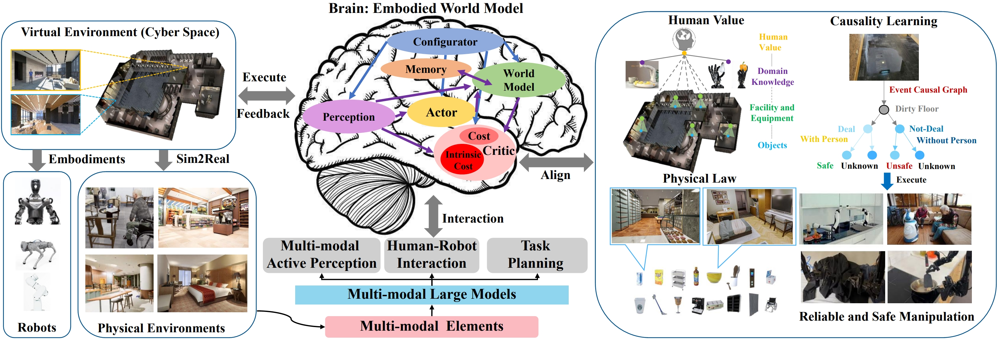
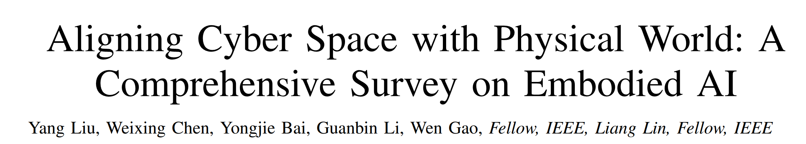

<br>
<p align="center">
<h1 align="center"><strong>Paper List  and Resource Repository for Embodied AI</strong></h1>
  <p align="center">
    <a href='https://www.sysu-hcp.net/' target='_blank'>HCPLab</a>&emsp;
    <br>
    SYSU HCP Lab and Pengcheng Laboratory
    <br>
  </p>
</p>

<p align="center">

</p>

[](https://arxiv.org/abs/2407.06886)
[](https://github.com/HCPLab-SYSU/Embodied_AI_Paper_List/blob/main/EmbodiedAI_Review.pdf)
[](https://github.com/HCPLab-SYSU/Embodied_AI_Paper_List)

#### We appreciate any useful suggestions for improvement of this paper list or survey from peers. Please raise issues or send an email to **liuy856@mail.sysu.edu.cn** and **chen867820261@gmail.com**. Thanks for your cooperation! We also welcome your pull requests for this project!



[**Aligning Cyber Space with Physical World: A Comprehensive Survey on Embodied AI, IEEE/ASME Transactions on Mechatronics 2025**](https://arxiv.org/pdf/2407.06886)    
  [Yang Liu](https://yangliu9208.github.io), Weixing Chen, Yongjie Bai, [Xiaodan Liang](https://lemondan.github.io), [Guanbin Li](http://guanbinli.com/), [Wen Gao](https://idm.pku.edu.cn/info/1017/1041.htm), [Liang Lin](http://www.linliang.net/)     

<p align="center">

</p>  

## 🏠 About

Embodied Artificial Intelligence (Embodied AI) is crucial for achieving Artificial General Intelligence (AGI) and serves as a foundation for various applications (e.g., intelligent mechatronics systems, smart manufacturing) that bridge cyberspace and the physical world. Recently, the emergence of Multi-modal Large Models (MLMs) and World Models (WMs) have attracted significant attention due to their remarkable perception, interaction, and reasoning capabilities, making them a promising architecture for embodied agents. In this survey, we give a comprehensive exploration of the latest advancements in Embodied AI. Our analysis firstly navigates through the forefront of representative works of embodied robots and simulators, to fully understand the research focuses and their limitations. Then, we analyze four main research targets: 1) embodied perception, 2) embodied interaction, 3) embodied agent, and 4) sim-to-real adaptation, covering state-of-the-art methods, essential paradigms, and comprehensive datasets. Additionally, we explore the complexities of MLMs in virtual and real embodied agents, highlighting their significance in facilitating interactions in digital and physical environments.  Finally, we summarize the challenges and limitations of embodied AI and discuss potential future directions. We hope this survey will serve as a foundational reference for the research community. 

## :collision: Update Log 
* [2025.05.27] Our Embodied AI Survey paper is accepted by IEEE/ASME Transactions on Mechatronics!
* [2024.09.08] We are constantly updating the Dataset section!
* [2024.08.31] We added the Datasets section and classified the useful projects!
* [2024.08.19] To make readers focus on newest works, we have arranged papers in chronological order!   
* [2024.08.02] We regularly update the project weekly!   
* [2024.07.29] We have updated the project!   
* [2024.07.22] We have updated the paper list and other useful embodied projects!   
* [2024.07.10] We release the first version of the survey on Embodied AI [PDF](https://arxiv.org/pdf/2407.06886)!
* [2024.07.10] We release the first version of the paper list for Embodied AI. This page is continually updating!


## <a id="table-of-contents">📚 Table of Contents </a>

- [Books & Surveys](#books-surveys)
- [Embodied Simulators](#simulators)
- [Embodied Perception](#perception)
- [Embodied Interaction](#interaction)
- [Embodied Agent](#agent)
- [Sim-to-Real Adaptation](#sim-to-real)
- [Datasets](#datasets)

## <a id="books-surveys"> Books & Surveys <a href="#table-of-contents">🔝</a> </a> 

* **A Survey of Robotic Navigation and Manipulation with Physics Simulators in the Era of Embodied AI**, arXiv:2505.01458, 2025       
Lik Hang Kenny Wong, Xueyang Kang, Kaixin Bai, Jianwei Zhang.        
[[Paper](https://arxiv.org/pdf/2505.01458)]

* **Multimodal Large Models: The New Paradigm of Artificial General Intelligence**, Publishing House of Electronics Industry (PHE), 2024       
Yang Liu, Liang Lin             
[[Page](https://hcplab-sysu.github.io/Book-of-MLM/)]      

* **Aligning Cyber Space with Physical World: A Comprehensive Survey on Embodied AI**, arXiv:2407.06886, 2024       
Yang Liu, Weixing Chen, Yongjie Bai, Guanbin Li, Wen Gao, Liang Lin.        
[[Paper](https://arxiv.org/pdf/2407.06886)]    

* **All Robots in One: A New Standard and Unified Dataset for Versatile, General-Purpose Embodied Agents**, arXiv:2408.10899, 2024      
Zhiqiang Wang, Hao Zheng, Yunshuang Nie, Wenjun Xu, Qingwei Wang, Hua Ye, Zhe Li, Kaidong Zhang, Xuewen Cheng, Wanxi Dong, Chang Cai, Liang Lin, Feng Zheng, Xiaodan Liang           
[[Paper](https://arxiv.org/pdf/2408.10899)][[Project](https://imaei.github.io/project_pages/ario/)]

* **Embodied intelligence toward future smart manufacturing in the era of AI foundation model**, IEEE/ASME Transactions on Mechatronics, 2024         
Lei Ren, Jiabao Dong, Shuai Liu, Lin Zhang, and Lihui Wang.         
[[Paper](https://ieeexplore.ieee.org/abstract/document/10697107)]

* **A Survey of Embodied Learning for Object-Centric Robotic Manipulation**, arXiv:2408.11537, 2024   
Ying Zheng, Lei Yao, Yuejiao Su, Yi Zhang, Yi Wang, Sicheng Zhao, Yiyi Zhang, Lap-Pui Chau    
[[Paper](https://arxiv.org/pdf/2408.11537)]

* **Teleoperation of Humanoid Robots: A Survey**, IEEE Transactions on Robotics, 2024       
Kourosh Darvish, Luigi Penco, Joao Ramos, Rafael Cisneros, Jerry Pratt, Eiichi Yoshida, Serena Ivaldi, Daniele Pucci.        
[[Paper](https://arxiv.org/pdf/2301.04317)]

* **A Survey on Vision-Language-Action Models for Embodied AI**, arXiv:2405.14093, 2024   
Yueen Ma, Zixing Song, Yuzheng Zhuang, Jianye Hao, Irwin King    
[[Paper](https://arxiv.org/pdf/2405.14093)]

* **Towards Generalist Robot Learning from Internet Video: A Survey**, arXiv:2404.19664, 2024   
McCarthy, Robert, Daniel CH Tan, Dominik Schmidt, Fernando Acero, Nathan Herr, Yilun Du, Thomas G. Thuruthel, and Zhibin Li.  
[[Paper](https://arxiv.org/pdf/2404.19664)]

* **A Survey on Robotics with Foundation Models: toward Embodied AI**, arXiv:2402.02385, 2024    
Zhiyuan Xu, Kun Wu, Junjie Wen, Jinming Li, Ning Liu, Zhengping Che, and Jian Tang.     
[[Paper](https://arxiv.org/pdf/2402.02385)]     

* **Toward general-purpose robots via foundation models: A survey and meta-analysis**, Machines, 2023   
Yafei Hu, Quanting Xie, Vidhi Jain, Jonathan Francis, Jay Patrikar, Nikhil Keetha, Seungchan Kim, Yaqi Xie, Tianyi Zhang, Shibo Zhao, Yu Quan Chong, Chen Wang, Katia Sycara, Matthew Johnson-Roberson, Dhruv Batra, Xiaolong Wang, Sebastian Scherer, Zsolt Kira, Fei Xia, Yonatan Bisk.            
[[Paper](https://arxiv.org/pdf/2312.08782)]    

* **Deformable Object Manipulation in Caregiving Scenarios: A Review**, Machines, 2023   
Liman Wang, Jihong Zhu.  
[[Paper]https://www.mdpi.com/2075-1702/11/11/1013]

* **A survey of embodied ai: From simulators to research tasks**, IEEE Transactions on Emerging Topics in Computational Intelligence, 2022    
Jiafei Duan, Samson Yu, Hui Li Tan, Hongyuan Zhu, Cheston Tan    
[[Paper](https://arxiv.org/pdf/2103.04918)]    

* **The development of embodied cognition: Six lessons from babies**, Artificial life, 2005    
Linda Smith, Michael Gasser    
[[Paper](https://cogdev.sitehost.iu.edu/labwork/6_lessons.pdf)]    

* **Embodied artificial intelligence: Trends and challenges**, Lecture notes in computer science, 2004    
Rolf Pfeifer, Fumiya Iida   
[[Paper](https://people.csail.mit.edu/iida/papers/PfeiferIidaEAIDags.pdf)]     

## <a id="simulators"> Embodied Simulators <a href="#table-of-contents">🔝</a> </a>
### General Simulator

* **Design and use paradigms for gazebo, an open-source multi-robot simulator**, IROS, 2004        
Koenig, Nathan, Andrew, Howard.      
[[page](https://citeseerx.ist.psu.edu/document?repid=rep1&type=pdf&doi=79f91c1c95271a075b91e9fdca43d6c31e4cbe17)]

* **Nvidia isaac sim: Robotics simulation and synthetic data**, NVIDIA, 2023    
[[page](https://developer.nvidia.com/isaac/sim)]    

* **Aerial Gym -- Isaac Gym Simulator for Aerial Robots**, ArXiv, 2023    
Mihir Kulkarni and Theodor J. L. Forgaard and Kostas Alexis.     
[[paper](https://arxiv.org/abs/2305.16510)]     

* **Webots: open-source robot simulator**, 2018      
Cyberbotics      
[[page](https://cyberbotics.com/doc/reference/index), [code](https://github.com/cyberbotics/webots)]     

* **Unity: A general platform for intelligent agents**, ArXiv, 2020    
Juliani, Arthur, Vincent-Pierre, Berges, Ervin, Teng, Andrew, Cohen, Jonathan, Harper, Chris, Elion, Chris, Goy, Yuan, Gao, Hunter, Henry, Marwan, Mattar, Danny, Lange.    
[[page](https://arxiv.org/pdf/1809.02627)]    

* **AirSim: High-Fidelity Visual and Physical Simulation for Autonomous Vehicles**, Field and Service Robotics, 2017    
Shital Shah, , Debadeepta Dey, Chris Lovett, Ashish Kapoor.    
[[page](https://arxiv.org/pdf/1705.05065.pdf%20http://arxiv.org/abs/1705.05065)]    

* **Pybullet, a python module for physics simulation for games, robotics and machine learning**, 2016     
Coumans, Erwin, Yunfei, Bai.     
[[page](https://github.com/bulletphysics/bullet3)]       

* **V-REP: A versatile and scalable robot simulation framework**, IROS, 2013      
Rohmer, Eric, Surya PN, Singh, Marc, Freese.     
[[page](https://coppeliarobotics.com/coppeliaSim_v-rep_iros2013.pdf)]     

* **MuJoCo: A physics engine for model-based control**, IROS, 2012    
Todorov, Emanuel, Tom, Erez, Yuval, Tassa.      
[[page](https://ieeexplore.ieee.org/abstract/document/6386109/), [code](https://github.com/google-deepmind/mujoco)]     

* **Modular open robots simulation engine: Morse**, ICRA, 2011       
Echeverria, Gilberto and Lassabe, Nicolas and Degroote, Arnaud and Lemaignan, S{\'e}verin     
[[page](https://www.openrobots.org/morse/material/media/pdf/paper-icra.pdf)]    


### Real-Scene Based Simulators

* **InfiniteWorld: A Unified Scalable Simulation Framework for General Visual-Language Robot Interaction**, arxiv, 2024  
Pengzhen Ren, Min Li, Zhen Luo, Xinshuai Song, Ziwei Chen, Weijia Liufu, Yixuan Yang, Hao Zheng, Rongtao Xu, Zitong Huang, Tongsheng Ding, Luyang Xie, Kaidong Zhang, Changfei Fu, Yang Liu, Liang Lin, Feng Zheng, Xiaodan Liang.   
[[page](https://arxiv.org/pdf/2412.05789)]


* **ManiSkill3: GPU Parallelized Robotics Simulation and Rendering for Generalizable Embodied AI**, arxiv, 2024  
Stone Tao, Fanbo Xiang, Arth Shukla, Yuzhe Qin, Xander Hinrichsen, Xiaodi Yuan, Chen Bao, Xinsong Lin, Yulin Liu, Tse-kai Chan, Yuan Gao, Xuanlin Li, Tongzhou Mu, Nan Xiao, Arnav Gurha, Zhiao Huang, Roberto Calandra, Rui Chen, Shan Luo, Hao Su.   
[[page](https://arxiv.org/pdf/2410.00425)]

* **PhyScene: Physically Interactable 3D Scene Synthesis for Embodied AI**, arxiv, 2024  
Yang, Yandan, Baoxiong, Jia, Peiyuan, Zhi, Siyuan, Huang.   
[[page](https://openaccess.thecvf.com/content/CVPR2024/papers/Yang_PhyScene_Physically_Interactable_3D_Scene_Synthesis_for_Embodied_AI_CVPR_2024_paper.pdf)]

* **Holodeck: Language Guided Generation of 3D Embodied AI Environments**, CVPR, 2024  
Yue Yang, , Fan-Yun Sun, Luca Weihs, Eli VanderBilt, Alvaro Herrasti, Winson Han, Jiajun Wu, Nick Haber, Ranjay Krishna, Lingjie Liu, Chris Callison-Burch, Mark Yatskar, Aniruddha Kembhavi, Christopher Clark.   
[[page](https://openaccess.thecvf.com/content/CVPR2024/papers/Yang_Holodeck_Language_Guided_Generation_of_3D_Embodied_AI_Environments_CVPR_2024_paper.pdf)]

* **RoboGen: Towards Unleashing Infinite Data for Automated Robot Learning via Generative Simulation**, arXiv, 2023  
Wang, Yufei, Zhou, Xian, Feng, Chen, Tsun-Hsuan, Wang, Yian, Wang, Katerina, Fragkiadaki, Zackory, Erickson, David, Held, Chuang, Gan.   
[[page](https://arxiv.org/pdf/2311.01455)]

* **ProcTHOR: Large-Scale Embodied AI Using Procedural Generation**, NeurIPS, 2022  
Deitke, VanderBilt, Herrasti, Weihs, Salvador, Ehsani, Han, Kolve, Farhadi, Kembhavi, Mottaghi   
[[page](https://arxiv.org/pdf/2206.06994)]

* **ThreeDWorld: A Platform for Interactive Multi-Modal Physical Simulation**, NeurIPS, 2021  
Gan, Chuang, J., Schwartz, Seth, Alter, Martin, Schrimpf, James, Traer, JulianDe, Freitas, Jonas, Kubilius, Abhishek, Bhandwaldar, Nick, Haber, Megumi, Sano, Kuno, Kim, Elias, Wang, Damian, Mrowca, Michael, Lingelbach, Aidan, Curtis, KevinT., Feigelis, DavidM., Bear, Dan, Gutfreund, DavidD., Cox, JamesJ., DiCarlo, JoshH., McDermott, JoshuaB., Tenenbaum, Daniel, Yamins.   
[[page](https://arxiv.org/pdf/2007.04954)]

* **iGibson 1.0: A Simulation Environment for Interactive Tasks in Large Realistic Scenes**, IROS, 2021  
Shen, Bokui, Fei, Xia, Chengshu, Li, Roberto, Martín-Martín, Linxi, Fan, Guanzhi, Wang, Claudia, Pérez-D’Arpino, Shyamal, Buch, Sanjana, Srivastava, Lyne, Tchapmi, Micael, Tchapmi, Kent, Vainio, Josiah, Wong, Li, Fei-Fei, Silvio, Savarese.   
[[page](https://arxiv.org/pdf/2012.02924)]

* **SAPIEN: A SimulAted Part-Based Interactive ENvironment**, CVPR, 2020  
Xiang, Fanbo, Yuzhe, Qin, Kaichun, Mo, Yikuan, Xia, Hao, Zhu, Fangchen, Liu, Minghua, Liu, Hanxiao, Jiang, Yifu, Yuan, He, Wang, Li, Yi, Angel X., Chang, Leonidas J., Guibas, Hao, Su.   
[[page](http://openaccess.thecvf.com/content_CVPR_2020/papers/Xiang_SAPIEN_A_SimulAted_Part-Based_Interactive_ENvironment_CVPR_2020_paper.pdf)]

* **Habitat: A Platform for Embodied AI Research**, ICCV, 2019  
Savva, Manolis, Abhishek, Kadian, Oleksandr, Maksymets, Yili, Zhao, Erik, Wijmans, Bhavana, Jain, Julian, Straub, Jia, Liu, Vladlen, Koltun, Jitendra, Malik, Devi, Parikh, Dhruv, Batra.   
[[page](http://openaccess.thecvf.com/content_ICCV_2019/papers/Savva_Habitat_A_Platform_for_Embodied_AI_Research_ICCV_2019_paper.pdf)]

* **VirtualHome: Simulating Household Activities Via Programs**, CVPR, 2018  
Puig, Xavier, Kevin, Ra, Marko, Boben, Jiaman, Li, Tingwu, Wang, Sanja, Fidler, Antonio, Torralba.   
[[page](http://openaccess.thecvf.com/content_cvpr_2018/papers/Puig_VirtualHome_Simulating_Household_CVPR_2018_paper.pdf)]

* **Matterport3D: Learning from RGB-D Data in Indoor Environments**, 3DV, 2017  
Chang, Angel, Angela, Dai, Thomas, Funkhouser, Maciej, Halber, Matthias, Niebner, Manolis, Savva, Shuran, Song, Andy, Zeng, Yinda, Zhang.   
[[page](https://arxiv.org/pdf/1709.06158)]

* **AI2-THOR: An Interactive 3D Environment for Visual AI**. arXiv, 2017  
Kolve, Eric, Roozbeh, Mottaghi, Daniel, Gordon, Yuke, Zhu, Abhinav, Gupta, Ali, Farhadi.   
[[page](https://arxiv.org/pdf/1712.05474)]

## <a id="perception">  Embodied Perception <a href="#table-of-contents">🔝</a> </a>
### Active Visual Exploration

* **RoboRefer: Towards Spatial Referring with Reasoning in Vision-Language Models for Robotics**, arxiv, 2025.  
Enshen Zhou, Jingkun An, Cheng Chi, Yi Han, Shanyu Rong, Chi Zhang, Pengwei Wang, Zhongyuan Wang, Tiejun Huang, Lu Sheng, Shanghang Zhang.  
[[Paper](https://arxiv.org/abs/2506.04308)] [[Project](https://zhoues.github.io/RoboRefer/)]

* **3DAffordSplat: Efficient Affordance Reasoning with 3D Gaussians**, arxiv, 2025.     
Zeming Wei, Junyi Lin, Yang Liu, Weixing Chen, Jingzhou Luo, Guanbin Li, Liang Lin.     
[[Paper](https://arxiv.org/pdf/2504.11218)] [[Project](https://github.com/HCPLab-SYSU/3DAffordSplat)]    

* **Code-as-Monitor: Constraint-aware Visual Programming for Reactive and Proactive Robotic Failure Detection**, CVPR, 2025.  
Enshen Zhou, Qi Su, Cheng Chi, Zhizheng Zhang, Zhongyuan Wang, Tiejun Huang, Lu Sheng, He Wang.  
[[Paper](https://arxiv.org/abs/2412.04455)] [[Project](https://zhoues.github.io/Code-as-Monitor/)]

* **SnapMem: Snapshot-based 3D Scene Memory for Embodied Exploration and Reasoning**, arxiv, 2024.    
Yuncong Yang, Han Yang, Jiachen Zhou, Peihao Chen, Hongxin Zhang, Yilun Du, Chuang Gan.      
[[page](https://arxiv.org/pdf/2411.17735)]

* **AIR-Embodied: An Efficient Active 3DGS-based Interaction and Reconstruction Framework with Embodied Large Language Model**, arxiv, 2024.    
Zhenghao Qi, Shenghai Yuan, Fen Liu, Haozhi Cao, Tianchen Deng, Jianfei Yang, Lihua Xie.      
[[page](https://arxiv.org/pdf/2409.16019)]

* **BEHAVIOR Vision Suite: Customizable Dataset Generation via Simulation**, CVPR, 2024.    
Yunhao Ge, Yihe Tang, Jiashu Xu, Cem Gokmen, Chengshu Li, Wensi Ai, Benjamin Jose Martinez, Arman Aydin, Mona Anvari, Ayush K Chakravarthy, Hong-Xing Yu, Josiah Wong, Sanjana Srivastava, Sharon Lee, Shengxin Zha, Laurent Itti, Yunzhu Li, Roberto Martín-Martín, Miao Liu, Pengchuan Zhang, Ruohan Zhang, Li Fei-Fei, Jiajun Wu.         
[[page](https://openaccess.thecvf.com/content/CVPR2024/papers/Ge_BEHAVIOR_Vision_Suite_Customizable_Dataset_Generation_via_Simulation_CVPR_2024_paper.pdf)]

* **Coarse-to-Fine Detection of Multiple Seams for Robotic Welding**, arxiv, 2024.    
Pengkun Wei, Shuo Cheng, Dayou Li, Ran Song, Yipeng Zhang, Wei Zhang.      
[[page](https://arxiv.org/pdf/2408.10710)]      

* **Evidential Active Recognition: Intelligent and Prudent Open-World Embodied Perception**, CVPR, 2024.    
Fan, Lei, Mingfu, Liang, Yunxuan, Li, Gang, Hua, Ying, Wu.      
[[page](https://openaccess.thecvf.com/content/CVPR2024/papers/Fan_Evidential_Active_Recognition_Intelligent_and_Prudent_Open-World_Embodied_Perception_CVPR_2024_paper.pdf)]

* **SpatialBot: Precise Spatial Understanding with Vision Language Models**, arxiv, 2024.    
Wenxiao Cai, Yaroslav Ponomarenko, Jianhao Yuan, Xiaoqi Li, Wankou Yang, Hao Dong, Bo Zhao.      
[[page](https://arxiv.org/pdf/2406.13642)]

* **Embodied Uncertainty-Aware Object Segmentations**, IROS, 2024.      
Xiaolin Fang, Leslie Pack Kaelbling, Tom ́as Lozano-P ́erez.     
[[page](https://arxiv.org/pdf/2408.04760)]

* **Point Transformer V3: Simpler Faster Stronger**, CVPR, 2024.
Wu, Xiaoyang, Li, Jiang, Peng-Shuai, Wang, Zhijian, Liu, Xihui, Liu, Yu, Qiao, Wanli, Ouyang, Tong, He, Hengshuang, Zhao.    
[[page](https://openaccess.thecvf.com/content/CVPR2024/papers/Wu_Point_Transformer_V3_Simpler_Faster_Stronger_CVPR_2024_paper.pdf)]    

* **PointMamba: A Simple State Space Model for Point Cloud Analysis**, arXiv, 2024.   
Liang, Dingkang, Xin, Zhou, Xinyu, Wang, Xingkui, Zhu, Wei, Xu, Zhikang, Zou, Xiaoqing, Ye, Xiang, Bai.     
[[page](https://arxiv.org/pdf/2402.10739)]    

* **Point Could Mamba: Point Cloud Learning via State Space Model**, arXiv, 2024.    
Zhang, Tao, Xiangtai, Li, Haobo, Yuan, Shunping, Ji, Shuicheng, Yan.     
[[page](https://arxiv.org/pdf/2403.00762)]    

* **Mamba3d: Enhancing local features for 3d point cloud analysis via state space model**, arXiv, 2024.   
Han, Xu, Yuan, Tang, Zhaoxuan, Wang, Xianzhi, Li.    
[[page](https://arxiv.org/pdf/2404.14966)]

* **Gs-slam: Dense visual slam with 3d gaussian splatting**, CVPR, 2024.    
Yan, Chi, Delin, Qu, Dan, Xu, Bin, Zhao, Zhigang, Wang, Dong, Wang, Xuelong, Li.      
[[page]](https://openaccess.thecvf.com/content/CVPR2024/papers/Yan_GS-SLAM_Dense_Visual_SLAM_with_3D_Gaussian_Splatting_CVPR_2024_paper.pdf)    

* **GOReloc: Graph-based Object-Level Relocalization for Visual SLAM**, IEEE RAL, 2024.    
Yutong Wang, Chaoyang Jiang, Xieyuanli Chen.      
[[page]](https://arxiv.org/pdf/2408.07917)

* **Embodiedscan: A holistic multi-modal 3d perception suite towards embodied ai** CVPR, 2024.    
Wang, Tai, Xiaohan, Mao, Chenming, Zhu, Runsen, Xu, Ruiyuan, Lyu, Peisen, Li, Xiao, Chen, Wenwei, Zhang, Kai, Chen, Tianfan, Xue, others.      
[[page](https://openaccess.thecvf.com/content/CVPR2024/papers/Wang_EmbodiedScan_A_Holistic_Multi-Modal_3D_Perception_Suite_Towards_Embodied_AI_CVPR_2024_paper.pdf)]

* **Neu-nbv: Next best view planning using uncertainty estimation in image-based neural rendering**, IROS, 2023.    
Jin, Liren, Xieyuanli, Chen, Julius, Rückin, Marija, Popovi\'c.    
[[page](https://arxiv.org/pdf/2303.01284)]    

* **Off-policy evaluation with online adaptation for robot exploration in challenging environments**, IEEE Robotics and Automation Letters, 2023.   
Hu, Yafei, Junyi, Geng, Chen, Wang, John, Keller, Sebastian, Scherer.    
[[page](https://arxiv.org/pdf/2204.03140)]    

* **OVD-SLAM: An online visual SLAM for dynamic environments**, IEEE Sensors Journal, 2023.    
He, Jiaming, Mingrui, Li, Yangyang, Wang, Hongyu, Wang.     
[[page]](https://ieeexplore.ieee.org/abstract/document/10113832)    

* **Transferring implicit knowledge of non-visual object properties across heterogeneous robot morphologies**, ICRA, 2023.    
Tatiya, Gyan, Jonathan, Francis, Jivko, Sinapov.    
[[page](https://arxiv.org/pdf/2209.06890)]

* **Swin3d: A pretrained transformer backbone for 3d indoor scene understanding**, arXiv, 2023.   
Yang, Yu-Qi, Yu-Xiao, Guo, Jian-Yu, Xiong, Yang, Liu, Hao, Pan, Peng-Shuai, Wang, Xin, Tong, Baining, Guo.    
[[page](https://arxiv.org/pdf/2304.06906)]

* **Point transformer v2: Grouped vector attention and partition-based pooling**, NeurIPS, 2022.   
Wu, Xiaoyang, Yixing, Lao, Li, Jiang, Xihui, Liu, Hengshuang, Zhao.     
[[page](https://proceedings.neurips.cc/paper_files/paper/2022/file/d78ece6613953f46501b958b7bb4582f-Paper-Conference.pdf)]

* **Rethinking network design and local geometry in point cloud: A simple residual MLP framework**, arXiv, 2022.
Ma, Xu, Can, Qin, Haoxuan, You, Haoxi, Ran, Yun, Fu. 
[[page](https://arxiv.org/pdf/2202.07123)]    

* **So-slam: Semantic object slam with scale proportional and symmetrical texture constraints**. IEEE Robotics and Automation Letters 7. 2(2022): 4008–4015.  
Liao, Ziwei, Yutong, Hu, Jiadong, Zhang, Xianyu, Qi, Xiaoyu, Zhang, Wei, Wang.   
[[page]](https://ieeexplore.ieee.org/abstract/document/9705562)

* **SG-SLAM: A real-time RGB-D visual SLAM toward dynamic scenes with semantic and geometric information**, IEEE Transactions on Instrumentation and Measurement 72. (2022): 1–12.      
Cheng, Shuhong, Changhe, Sun, Shijun, Zhang, Dianfan, Zhang.    
[[page]](https://ieeexplore.ieee.org/abstract/document/9978699)   

* **Point transformer**, ICCV, 2021.
Zhao, Hengshuang, Li, Jiang, Jiaya, Jia, Philip HS, Torr, Vladlen, Koltun.     
[[page](https://openaccess.thecvf.com/content/ICCV2021/papers/Zhao_Point_Transformer_ICCV_2021_paper.pdf)]    

* **Pointpillars: Fast encoders for object detection from point clouds**, CVPR, 2019.    
Lang, Alex H, Sourabh, Vora, Holger, Caesar, Lubing, Zhou, Jiong, Yang, Oscar, Beijbom.     
[[page]](https://openaccess.thecvf.com/content_CVPR_2019/papers/Lang_PointPillars_Fast_Encoders_for_Object_Detection_From_Point_Clouds_CVPR_2019_paper.pdf)    

* **4d spatio-temporal convnets: Minkowski convolutional neural networks**, CVPR, 2019.    
Choy, Christopher, JunYoung, Gwak, Silvio, Savarese.    
[[page]](https://openaccess.thecvf.com/content_CVPR_2019/papers/Choy_4D_Spatio-Temporal_ConvNets_Minkowski_Convolutional_Neural_Networks_CVPR_2019_paper.pdf)

* **Cubeslam: Monocular 3-d object slam**, IEEE T-RO 35. 4(2019): 925–938  
Yang, Shichao, Sebastian, Scherer.  
[[page]](https://ieeexplore.ieee.org/abstract/document/8708251)

* **Hierarchical topic model based object association for semantic SLAM**, IEEE T-VCG 25. 11(2019): 3052–3062  
Zhang, Jianhua, Mengping, Gui, Qichao, Wang, Ruyu, Liu, Junzhe, Xu, Shengyong, Chen.   
[[page]](https://ieeexplore.ieee.org/abstract/document/8794595)

* **DS-SLAM: A semantic visual SLAM towards dynamic environments**, IROS, 2018   
Yu, Chao, Zuxin, Liu, Xin-Jun, Liu, Fugui, Xie, Yi, Yang, Qi, Wei, Qiao, Fei.   
[[page]](https://ieeexplore.ieee.org/abstract/document/8593691)

* **DynaSLAM: Tracking, mapping, and inpainting in dynamic scenes**, IEEE Robotics and Automation Letters 3. 4(2018): 4076–4083     
Bescos, Berta, José M, Facil, Javier, Civera, José, Neira.   
[[page]](https://ieeexplore.ieee.org/abstract/document/8421015)

* **Quadricslam: Dual quadrics from object detections as landmarks in object-oriented slam**, IEEE Robotics and Automation Letters 4. 1(2018): 1–8.  
Nicholson, Lachlan, Michael, Milford, Niko, Sünderhauf.   
[[page]](https://ieeexplore.ieee.org/abstract/document/8440105)

* **3d semantic segmentation with submanifold sparse convolutional networks**, CVPR, 2018.    
Graham, Benjamin, Martin, Engelcke, Laurens, Van Der Maaten.     
[[page](https://openaccess.thecvf.com/content_cvpr_2018/papers/Graham_3D_Semantic_Segmentation_CVPR_2018_paper.pdf)]

* **Learning to look around: Intelligently exploring unseen environments for unknown tasks**, CVPR, 2018.   
Jayaraman, Dinesh, Kristen, Grauman.    
[[page](https://openaccess.thecvf.com/content_cvpr_2018/papers/Jayaraman_Learning_to_Look_CVPR_2018_paper.pdf)]    

* **Multi-view 3d object detection network for autonomous driving**, CVPR, 2017.    
Chen, Xiaozhi, Huimin, Ma, Ji, Wan, Bo, Li, Tian, Xia.     
[[page]](https://openaccess.thecvf.com/content_cvpr_2017/papers/Chen_Multi-View_3D_Object_CVPR_2017_paper.pdf)    

* **Semantic scene completion from a single depth image**, CVPR, 2017.    
Song, Shuran, Fisher, Yu, Andy, Zeng, Angel X, Chang, Manolis, Savva, Thomas, Funkhouser.     
[[page]](https://openaccess.thecvf.com/content_cvpr_2017/papers/Song_Semantic_Scene_Completion_CVPR_2017_paper.pdf)    

* **Pointnet: Deep learning on point sets for 3d classification and segmentation**, CVPR, 2017.    
Qi, Charles R, Hao, Su, Kaichun, Mo, Leonidas J, Guibas.     
[[page](Pointnet: Deep learning on point sets for 3d classification and segmentation)]    

* **Pointnet++: Deep hierarchical feature learning on point sets in a metric space**, NeurIPS, 2017.    
Qi, Charles Ruizhongtai, Li, Yi, Hao, Su, Leonidas J, Guibas.     
[[page](https://proceedings.neurips.cc/paper_files/paper/2017/file/d8bf84be3800d12f74d8b05e9b89836f-Paper.pdf)]

* **The curious robot: Learning visual representations via physical interactions**, ECCV, 2016.   
Pinto, Lerrel, Dhiraj, Gandhi, Yuanfeng, Han, Yong-Lae, Park, Abhinav, Gupta.    
[[page](https://arxiv.org/pdf/1604.01360)]    

* **Multi-view convolutional neural networks for 3d shape recognition**, ICCV, 2015.    
Su, Hang, Subhransu, Maji, Evangelos, Kalogerakis, Erik, Learned-Miller.     
[[page]](https://www.cv-foundation.org/openaccess/content_iccv_2015/papers/Su_Multi-View_Convolutional_Neural_ICCV_2015_paper.pdf)    

* **Voxnet: A 3d convolutional neural network for real-time object recognition**, IROS, 2015.    
Maturana, Daniel, Sebastian, Scherer.     
[[page]](https://ieeexplore.ieee.org/abstract/document/7353481)    

* **ORB-SLAM: a versatile and accurate monocular SLAM system** IEEE T-RO 31. 5(2015): 1147–1163  
Mur-Artal, Raul, Jose Maria Martinez, Montiel, Juan D, Tardos.   
[[page]](https://ieeexplore.ieee.org/abstract/document/7219438/)

* **LSD-SLAM: Large-scale direct monocular SLAM**, ECCV, 2014  
Engel, Jakob, Thomas, Schops, Daniel, Cremers.  
[[page]](https://link.springer.com/chapter/10.1007/978-3-319-10605-2_54)

* **Slam++: Simultaneous localisation and mapping at the level of objects**, CVPR, 2013  
Salas-Moreno, Renato F, Richard A, Newcombe, Hauke, Strasdat, Paul HJ, Kelly, Andrew J, Davison.   
[[page]](https://openaccess.thecvf.com/content_cvpr_2013/papers/Salas-Moreno_SLAM_Simultaneous_Localisation_2013_CVPR_paper.pdf)

* **DTAM: Dense tracking and mapping in real-time**, ICCV, 2011  
Newcombe, Richard A, Steven J, Lovegrove, Andrew J, Davison.  
[[page]](https://ieeexplore.ieee.org/abstract/document/6126513/)

* **MonoSLAM: Real-time single camera SLAM**, IEEE T-PAMI, 2007.  
Davison, Andrew J, Ian D, Reid, Nicholas D, Molton, Olivier, Stasse.   
[[page]](http://www.doc.ic.ac.uk/~ajd/Publications/davison_etal_pami2007.pdf)

* **A multi-state constraint Kalman filter for vision-aided inertial navigation**, IROS, 2007  
Mourikis, Anastasios I, Stergios I, Roumeliotis.   
[[page]](https://intra.engr.ucr.edu/~mourikis/tech_reports/TR_MSCKF.pdf)

* **Parallel tracking and mapping for small AR workspaces**, ISMAR, 2007  
Klein, Georg, David, Murray.   
[[page]](https://ieeexplore.ieee.org/abstract/document/4538852/)

### 3D Visual Perception and Grounding
* **UAD: Unsupervised Affordance Distillation for Generalization in Robotic Manipulation**, ICRA, 2025
Yihe Tang, Wenlong Huang, Yingke Wang, Chengshu Li, Roy Yuan, Ruohan Zhang, Jiajun Wu, Li Fei-Fei  
[[page]](https://openreview.net/pdf?id=an953WOpo2)

* **Grounding 3D Object Affordance with Language Instructions, Visual Observations and Interactions**, arxiv, 2025  
He Zhu, Quyu Kong, Kechun Xu, Xunlong Xia, Bing Deng, Jieping Ye, Rong Xiong, Yue Wang  
[[page]](https://arxiv.org/pdf/2504.04744)  

* **3D-AffordanceLLM: Harnessing Large Language Models for Open-Vocabulary Affordance Detection in 3D Worlds**, arxiv, 2025  
Hengshuo Chu, Xiang Deng, Qi Lv, Xiaoyang Chen, Yinchuan Li, Jianye Hao, Liqiang Nie  
[[page]](https://arxiv.org/pdf/2502.20041)  

* **SeqAfford: Sequential 3D affordance reasoning via Multimodal Large Language Model**, CVPR, 2025  
Hanqing Wang, Chunlin Yu, Haoyang Luo, Jingyi Yu, Ye Shi, Jingya Wang  
[[page]](https://arxiv.org/pdf/2412.01550) 

* **GEAL: Generalizable 3D Affordance Learning with Cross-Modal Consistency**, CVPR, 2025  
Dongyue Lu, Lingdong Kong, Tianxin Huang, Gim Hee Lee  
[[page]](https://arxiv.org/pdf/2412.09511)  

* **GREAT: Geometry-Intention Collaborative Inference for Open-Vocabulary 3D Object Affordance Grounding**, arxiv, 2024  
Yawen Shao, Wei Zhai, Yuhang Yang, Hongchen Luo, Yang Cao, Zheng-Jun Zha, CVPR, 2025 
[[page]](https://arxiv.org/pdf/2411.19626)  

* **LASO: Language-guided affordance segmentation on 3d object**, CVPR, 2024  
Yicong Li, Na Zhao, Junbin Xiao, Chun Feng, Xiang Wang, Tat-seng Chua  
[[page]](https://openaccess.thecvf.com/content/CVPR2024/papers/Li_LASO_Language-guided_Affordance_Segmentation_on_3D_Object_CVPR_2024_paper.pdf)  

* **SceneFun3D: fine-grained functionality and affordance understanding in 3D scenes**, CVPR, 2024  
Alexandros Delitzas, Ayca Takmaz, Federico Tombari, Robert Sumner, Marc Pollefeys, Francis Engelmann  
[[page]](https://openaccess.thecvf.com/content/CVPR2024/html/Delitzas_SceneFun3D_Fine-Grained_Functionality_and_Affordance_Understanding_in_3D_Scenes_CVPR_2024_paper.html)  

* **Language-conditioned affordance-pose detection in 3d point clouds**, ICRA, 2024  
Toan Nguyen, Minh Nhat Vu, Baoru Huang, Tuan Van Vo, Vy Truong, Ngan Le, Thieu Vo, Bac Le, Anh Nguyen  
[[page]](https://arxiv.org/pdf/2309.10911)   

* **DSPNet: Dual-vision Scene Perception for Robust 3D Question Answering**, CVPR, 2025        
Jingzhou Luo, Yang Liu, Weixing Chen, Zhen Li, Yaowei Wang, Guanbin Li, Liang Lin                                   
[[page]](https://arxiv.org/pdf/2503.03190)[project](https://github.com/LZ-CH/DSPNet)    

* **Learning 2D Invariant Affordance Knowledge for 3D Affordance Grounding**, arxiv, 2024        
Xianqiang Gao, Pingrui Zhang, Delin Qu, Dong Wang, Zhigang Wang, Yan Ding, Bin Zhao, Xuelong Li                               
[[page]](https://arxiv.org/pdf/2408.13024)

* **EmbodiedSAM: Online Segment Any 3D Thing in Real Time**, arxiv, 2024        
Xiuwei Xu, Huangxing Chen, Linqing Zhao, Ziwei Wang, Jie Zhou, Jiwen Lu                          
[[page]](https://arxiv.org/pdf/2408.11811)

* **OpenScan: A Benchmark for Generalized Open-Vocabulary 3D Scene Understanding**, arxiv, 2024        
Youjun Zhao, Jiaying Lin, Shuquan Ye, Qianshi Pang, Rynson W.H. Lau                           
[[page]](https://arxiv.org/pdf/2408.11030)

* **LLMI3D: Empowering LLM with 3D Perception from a Single 2D Image**, arxiv, 2024       
Fan Yang, Sicheng Zhao, Yanhao Zhang, Haoxiang Chen, Hui Chen, Wenbo Tang, Haonan Lu, Pengfei Xu, Zhenyu Yang, Jungong Han, Guiguang Ding                      
[[page]](https://arxiv.org/pdf/2408.07422)

* **MMScan: A Multi-Modal 3D Scene Dataset with Hierarchical Grounded Language Annotations**, arxiv, 2024       
Ruiyuan Lyu, Tai Wang, Jingli Lin, Shuai Yang, Xiaohan Mao, Yilun Chen, Runsen Xu, Haifeng Huang, Chenming Zhu, Dahua Lin, Jiangmiao Pang                   
[[page]](https://arxiv.org/pdf/2406.09401)

* **ShapeLLM: Universal 3D Object Understanding for Embodied Interaction**, arxiv, 2024          
Zekun Qi, Runpei Dong, Shaochen Zhang, Haoran Geng, Chunrui Han, Zheng Ge, He Wang, Li Yi, Kaisheng Ma      
[[page]](https://qizekun.github.io/shapellm/)

* **LEO: An Embodied Generalist Agent in 3D World**, ICML, 2024      
Jiangyong Huang, Silong Yong, Xiaojian Ma, Xiongkun Linghu, Puhao Li, Yan Wang, Qing Li, Song-Chun Zhu, Baoxiong Jia, and Siyuan Huang   
[[page]](https://embodied-generalist.github.io/)    

* **SceneVerse: Scaling 3D Vision-Language Learning for Grounded Scene Understanding**, ECCV, 2024    
Baoxiong Jia, Yixin Chen, Huangyue Yu, Yan Wang, Xuesong Niu, Tengyu Liu, Qing Li, and Siyuan Huang    
[[page]](https://scene-verse.github.io/)    

* **PQ3D: Unifying 3D Vision-Language Understanding via Promptable Queries**, ECCV, 2024     
Ziyu Zhu, Zhuofan Zhang, Xiaojian Ma, Xuesong Niu, Yixin Chen, Baoxiong Jia, Zhidong Deng, Siyuan Huang, and Qing Li    
[[page]](https://3d-vista.github.io/)

* **MultiPLY: A Multisensory Object-Centric Embodied Large Language Model in 3D World**, CVPR, 2024     
Yining Hong, Zishuo Zheng, Peihao Chen, Yian Wang, Junyan Li, Chuang Gan     
[[page]](https://openaccess.thecvf.com/content/CVPR2024/papers/Hong_MultiPLY_A_Multisensory_Object-Centric_Embodied_Large_Language_Model_in_3D_CVPR_2024_paper.pdf)

* **MP5: A Multi-modal Open-ended Embodied System in Minecraft via Active Perception**, CVPR, 2024     
Yiran Qin, Enshen Zhou, Qichang Liu, Zhenfei Yin, Lu Sheng, Ruimao Zhang, Yu Qiao, Jing Shao        
[[page]](https://openaccess.thecvf.com/content/CVPR2024/papers/Qin_MP5_A_Multi-modal_Open-ended_Embodied_System_in_Minecraft_via_Active_CVPR_2024_paper.pdf)

* **MaskClustering: View Consensus based Mask Graph Clustering for Open-Vocabulary 3D Instance Segmentation**, CVPR, 2024     
Mi Yan, Jiazhao Zhang, Yan Zhu, He Wang            
[[page]](https://arxiv.org/pdf/2401.07745)

* **TACO: Benchmarking Generalizable Bimanual Tool-ACtion-Object Understanding**, CVPR, 2024     
Yun Liu, Haolin Yang, Xu Si, Ling Liu, Zipeng Li, Yuxiang Zhang, Yebin Liu, Li Yi                
[[page]](https://taco2024.github.io/)

* **EDA: Explicit Text-Decoupling and Dense Alignment for 3D Visual Grounding**, CVPR, 2023   
Wu, Yanmin and Cheng, Xinhua and Zhang, Renrui and Cheng, Zesen and Zhang, Jian   
[[page]](https://openaccess.thecvf.com/content/CVPR2023/papers/Wu_EDA_Explicit_Text-Decoupling_and_Dense_Alignment_for_3D_Visual_Grounding_CVPR_2023_paper.pdf)   

* **Affordpose: A large-scale dataset of hand-object interactions with affordance-driven hand pose**, ICCV, 2023  
Juntao Jian, Xiuping Liu, Manyi Li, Ruizhen Hu, Jian Liu  
[[page]](https://openaccess.thecvf.com/content/ICCV2023/html/Jian_AffordPose_A_Large-Scale_Dataset_of_Hand-Object_Interactions_with_Affordance-Driven_Hand_ICCV_2023_paper.html)

* **Grounding 3d object affordance from 2d interactions in images**, ICCV, 2023  
Yuhang Yang, Wei Zhai, Hongchen Luo, Yang Cao, Jiebo Luo, Zheng-Jun Zha  
[[page]](https://openaccess.thecvf.com/content/ICCV2023/html/Yang_Grounding_3D_Object_Affordance_from_2D_Interactions_in_Images_ICCV_2023_paper.html)  

* **3d-vista: Pre-trained transformer for 3d vision and text alignment**, ICCV, 2023       
Ziyu Zhu, Xiaojian Ma, Yixin Chen, Zhidong Deng, Siyuan Huang, and Qing Li      
[[page]](https://3d-vista.github.io/)    

* **LeaF: Learning Frames for 4D Point Cloud Sequence Understanding**, ICCV, 2023       
Yunze Liu, Junyu Chen, Zekai Zhang, Li Yi        
[[page]](https://openaccess.thecvf.com/content/ICCV2023/papers/Liu_LeaF_Learning_Frames_for_4D_Point_Cloud_Sequence_Understanding_ICCV_2023_paper.pdf)

* **SQA3D: Situated Question Answering in 3D Scenes**, ICLR, 2023    
Xiaojian Ma, Silong Yong, Zilong Zheng, Qing Li, Yitao Liang, Song-Chun Zhu, and Siyuan Huang    
[[page]]([https://sqa3d.github.io/)

* **LLM-Grounder: Open-Vocabulary 3D Visual Grounding with Large Language Model as an Agent**, arXix, 2023   
Yang, Jianing and Chen, Xuweiyi and Qian, Shengyi and Madaan, Nikhil and Iyengar, Madhavan and Fouhey, David F and Chai, Joyce   
[[page]](https://arxiv.org/pdf/2309.12311)   

* **Visual Programming for Zero-shot Open-Vocabulary 3D Visual Grounding**, arXix, 2023   
Yuan, Zhihao and Ren, Jinke and Feng, Chun-Mei and Zhao, Hengshuang and Cui, Shuguang and Li, Zhen   
[[page]](https://arxiv.org/pdf/2311.15383)

* **Multi-view transformer for 3D visual grounding**, CVPR, 2022   
Huang, Shijia and Chen, Yilun and Jia, Jiaya and Wang, Liwei   
[[page]](https://arxiv.org/pdf/2204.02174)    

* **Look Around and Refer: 2D Synthetic Semantics Knowledge Distillation for 3D Visual Grounding**, CVPR, 2022   
Bakr, Eslam and Alsaedy, Yasmeen and Elhoseiny, Mohamed   
[[page]](https://arxiv.org/pdf/2211.14241)   

* **3D-SPS: Single-Stage 3D Visual Grounding via Referred Point Progressive Selection**, CVPR, 2022   
Luo, Junyu and Fu, Jiahui and Kong, Xianghao and Gao, Chen and Ren, Haibing and Shen, Hao and Xia, Huaxia and Liu, Si   
[[page]](https://arxiv.org/pdf/2204.06272)    

* **Bottom Up Top Down Detection Transformers for Language Grounding in Images and Point Clouds**, ECCV, 2022   
Jain, Ayush and Gkanatsios, Nikolaos and Mediratta, Ishita and Fragkiadaki, Katerina   
[[page]](https://arxiv.org/pdf/2112.08879)   

* **3d affordancenet: A benchmark for visual object affordance understanding**, CVPR, 2021  
Shengheng Deng, Xun Xu, Chaozheng Wu, Ke Chen, Kui Jia  
[[page]](https://openaccess.thecvf.com/content/CVPR2021/html/Deng_3D_AffordanceNet_A_Benchmark_for_Visual_Object_Affordance_Understanding_CVPR_2021_paper.html)

* **Text-guided graph neural networks for referring 3D instance segmentation**, AAAI, 2021   
Huang, Pin-Hao and Lee, Han-Hung and Chen, Hwann-Tzong and Liu, Tyng-Luh   
[[page]](https://ojs.aaai.org/index.php/AAAI/article/view/16253/16060)   

* **InstanceRefer: Cooperative Holistic Understanding for Visual Grounding on Point Clouds through Instance Multi-level Contextual Referring**, ICCV, 2021   
Yuan, Zhihao and Yan, Xu and Liao, Yinghong and Zhang, Ruimao and Wang, Sheng and Li, Zhen and Cui, Shuguang   
[[page]](https://arxiv.org/pdf/2103.01128)   

* **Free-form Description Guided 3D Visual Graph Network for Object Grounding in Point Cloud**, CVPR, 2021   
Feng, Mingtao and Li, Zhen and Li, Qi and Zhang, Liang and Zhang, XiangDong and Zhu, Guangming and Zhang, Hui and Wang, Yaonan and Mian, Ajmal   
[[page]](https://arxiv.org/pdf/2103.16381)   

* **SAT: 2D Semantics Assisted Training for 3D Visual Grounding**, CVPR, 2021   
Yang, Zhengyuan and Zhang, Songyang and Wang, Liwei and Luo, Jiebo   
[[page]](https://arxiv.org/pdf/2105.11450)   

* **LanguageRefer: Spatiallanguage model for 3D visual grounding**, CVPR, 2021   
Roh, Junha and Desingh, Karthik and Farhadi, Ali and Fox, Dieter   
[[page]](https://arxiv.org/pdf/2107.03438)   

* **3DVG-Transformer: Relation Modeling for Visual Grounding on Point Clouds**, ICCV, 2021    
Zhao, Lichen and Cai, Daigang and Sheng, Lu and Xu, Dong    
[[page]](https://openaccess.thecvf.com/content/ICCV2021/papers/Zhao_3DVG-Transformer_Relation_Modeling_for_Visual_Grounding_on_Point_Clouds_ICCV_2021_paper.pdf)    

* **TransRefer3D: Entity-and-relation aware transformer for fine-grained 3D visual grounding**, CVPR, 2021    
He, Dailan and Zhao, Yusheng and Luo, Junyu and Hui, Tianrui and Huang, Shaofei and Zhang, Aixi and Liu, Si
[[page]](https://arxiv.org/pdf/2108.02388)   

* **ScanRefer: 3D Object Localization in RGB-D Scans using Natural Language**, ECCV, 2020    
Chen, Dave Zhenyu and Chang, Angel X and Nie{\ss}ner, Matthias    
[[page]](https://arxiv.org/pdf/1912.08830)    

* **ReferIt3D: Neural Listeners for Fine-Grained 3D Object Identification in Real-World Scenes**, ECCV, 2020   
Achlioptas, Panos and Abdelreheem, Ahmed and Xia, Fei and Elhoseiny, Mohamed and Guibas, Leonidas   
[[page]](https://www.ecva.net/papers/eccv_2020/papers_ECCV/papers/123460409.pdf)   


### Visual Language Navigation

* **Towards Long-Horizon Vision-Language Navigation: Platform, Benchmark and Method**, CVPR, 2025.       
Xinshuai Song, Weixing Chen, Yang Liu, Weikai Chen, Guanbin Li, Liang Lin.             
[[page](https://arxiv.org/pdf/2412.09082)][project](https://hcplab-sysu.github.io/LH-VLN/)   

* **DivScene: Benchmarking LVLMs for Object Navigation with Diverse Scenes and Objects**, arxiv, 2024.     
Zhaowei Wang, Hongming Zhang, Tianqing Fang, Ye Tian, Yue Yang, Kaixin Ma, Xiaoman Pan, Yangqiu Song, Dong Yu.     
[[Paper](https://arxiv.org/abs/2410.02730)] [[Project](https://zhaowei-wang-nlp.github.io/divscene-project-page/)]

* **MapGPT: Map-Guided Prompting with Adaptive Path Planning for Vision-and-Language Navigation**, ACL, 2024.       
Jiaqi Chen, Bingqian Lin, Ran Xu, Zhenhua Chai, Xiaodan Liang, Kwan-Yee K. Wong.             
[[page](https://chen-judge.github.io/MapGPT/)]

* **NavCoT: Boosting LLM-Based Vision-and-Language Navigation via Learning Disentangled Reasoning**, ArXiv, 2024.      
Bingqian Lin, Yunshuang Nie, Ziming Wei, Jiaqi Chen, Shikui Ma, Jianhua Han, Hang Xu, Xiaojun Chang, Xiaodan Liang.             
[[page](https://arxiv.org/abs/2403.07376)]       

* **OMEGA: Efficient Occlusion-Aware Navigation for Air-Ground Robot in Dynamic Environments via State Space Model**, ArXiv, 2024.      
Junming Wang, Dong Huang, Xiuxian Guan, Zekai Sun, Tianxiang Shen, Fangming Liu, Heming Cui.         
[[page](https://arxiv.org/pdf/2408.10618)]

* **CoVLA: Comprehensive Vision-Language-Action Dataset for Autonomous Driving**, ArXiv, 2024.      
Hidehisa Arai, Keita Miwa, Kento Sasaki, Yu Yamaguchi, Kohei Watanabe, Shunsuke Aoki, Issei Yamamoto.         
[[page](https://arxiv.org/pdf/2408.10845)]

* **FLAME: Learning to Navigate with Multimodal LLM in Urban Environments**, ArXiv, 2024.      
Yunzhe Xu, Yiyuan Pan, Zhe Liu, Hesheng Wang.       
[[page](https://arxiv.org/pdf/2408.11051)]

* **Affordances-Oriented Planning using Foundation Models for Continuous Vision-Language Navigation**, ArXiv, 2024.      
Jiaqi Chen, Bingqian Lin, Xinmin Liu, Xiaodan Liang, Kwan-Yee K Wong.         
[[page](https://arxiv.org/pdf/2407.05890)]

* **Embodied Instruction Following in Unknown Environments**, ArXiv, 2024.      
Wu, Wang, Xu, Lu, Yan.       
[[page](https://arxiv.org/pdf/2406.11818)]       

* **DISCO: Embodied Navigation and Interaction via Differentiable Scene Semantics and Dual-level Control**, arxiv, 2024.                
Xinyu Xu, Shengcheng Luo, Yanchao Yang, Yong-Lu Li, Cewu Lu.              
[[page]](https://arxiv.org/abs/2407.14758)

* **NOLO: Navigate Only Look Once**, arxiv, 2024.                
Bohan Zhou, Jiangxing Wang, Zongqing Lu.              
[[page]](https://arxiv.org/pdf/2408.01384)

* **Towards Learning a Generalist Model for Embodied Navigation**, CVPR, 2024.    
Duo Zheng, , Shijia Huang, Lin Zhao, Yiwu Zhong, Liwei Wang.     
[[page](https://arxiv.org/pdf/2312.02010)]     

* **Fast-Slow Test-time Adaptation for Online Vision-and-Language Navigation** ICML, 2024.    
Junyu Gao, , Xuan Yao, Changsheng Xu.    
[[page](https://arxiv.org/pdf/2311.13209)]   

* **Discuss before moving: Visual language navigation via multi-expert discussions**, ICRA, 2024.   
Long, Yuxing, Xiaoqi, Li, Wenzhe, Cai, Hao, Dong.    
[[page](https://arxiv.org/pdf/2309.11382)]    

* **Vision-and-Language Navigation via Causal Learning**, CVPR, 2024.   
Liuyi Wang, Qijun Chen.    
[[page](https://arxiv.org/pdf/2404.10241)]   

* **Volumetric Environment Representation for Vision-Language Navigation**, CVPR, 2024.   
Rui Liu, Yi Yang.    
[[page](https://arxiv.org/pdf/2403.14158)]    

* **Lookahead Exploration with Neural Radiance Representation for Continuous Vision-Language Navigation**, CVPR 2024.   
Wang, Zihan, Xiangyang, Li, Jiahao, Yang, Yeqi, Liu, Junjie, Hu, Ming, Jiang, Shuqiang, Jiang. 
[[page](https://arxiv.org/pdf/2404.01943)]    

* **Bridging zero-shot object navigation and foundation models through pixel-guided navigation skill** ICRA, 2024.           
Wenzhe Cai, Siyuan Huang, Guangran Cheng, Yuxing Long, Peng Gao, Changyin Sun, and Hao Dong.       
[[page]](https://github.com/wzcai99/Pixel-Navigator)      

* **OVER-NAV: Elevating Iterative Vision-and-Language Navigation with Open-Vocabulary Detection and StructurEd Representation**, CVPR, 2024.              
Ganlong Zhao, Guanbin Li, Weikai Chen, Yizhou Yu.           
[[page]](https://openaccess.thecvf.com/content/CVPR2024/papers/Zhao_OVER-NAV_Elevating_Iterative_Vision-and-Language_Navigation_with_Open-Vocabulary_Detection_and_StructurEd_CVPR_2024_paper.pdf)     

* **RILA: Reflective and Imaginative Language Agent for Zero-Shot Semantic Audio-Visual Navigation**, CVPR, 2024.                
Zeyuan Yang, Jiageng Liu, Peihao Chen, Anoop Cherian, Tim K. Marks, Jonathan Le Roux, Chuang Gan.       
[[page]](https://openaccess.thecvf.com/content/CVPR2024/papers/Yang_RILA_Reflective_and_Imaginative_Language_Agent_for_Zero-Shot_Semantic_Audio-Visual_CVPR_2024_paper.pdf)   

* **Towards Learning a Generalist Model for Embodied Navigation**, CVPR, 2024.                
Duo Zheng, Shijia Huang, Lin Zhao, Yiwu Zhong, Liwei Wang.       
[[page]](https://openaccess.thecvf.com/content/CVPR2024/papers/Zheng_Towards_Learning_a_Generalist_Model_for_Embodied_Navigation_CVPR_2024_paper.pdf)

* **Vision-and-Language Navigation via Causal Learning**, CVPR, 2024.                
Liuyi Wang, Zongtao He, Ronghao Dang, Mengjiao Shen, Chengju Liu, Qijun Chen.        
[[page]](https://openaccess.thecvf.com/content/CVPR2024/papers/Wang_Vision-and-Language_Navigation_via_Causal_Learning_CVPR_2024_paper.pdf)

* **Instance-aware Exploration-Verification-Exploitation for Instance ImageGoal Navigation**, CVPR, 2024.                
Xiaohan Lei, Min Wang, Wengang Zhou, Li Li, Houqiang Li.     
[[page]](https://openaccess.thecvf.com/content/CVPR2024/papers/Lei_Instance-aware_Exploration-Verification-Exploitation_for_Instance_ImageGoal_Navigation_CVPR_2024_paper.pdf)

* **Habitat Synthetic Scenes Dataset (HSSD-200): An Analysis of 3D Scene Scale and Realism Tradeoffs for ObjectGoal Navigation**, CVPR, 2024.                
Mukul Khanna, Yongsen Mao, Hanxiao Jiang, Sanjay Haresh, Brennan Shacklett, Dhruv Batra, Alexander Clegg, Eric Undersander, Angel X. Chang, Manolis Savva.     
[[page]](https://openaccess.thecvf.com/content/CVPR2024/papers/Khanna_Habitat_Synthetic_Scenes_Dataset_HSSD-200_An_Analysis_of_3D_Scene_CVPR_2024_paper.pdf)

* **SchurVINS: Schur Complement-Based Lightweight Visual Inertial Navigation System**, CVPR, 2024.                
Yunfei Fan, Tianyu Zhao, Guidong Wang.     
[[page]](https://openaccess.thecvf.com/content/CVPR2024/papers/Fan_SchurVINS_Schur_Complement-Based_Lightweight_Visual_Inertial_Navigation_System_CVPR_2024_paper.pdf)

* **SPOC: Imitating Shortest Paths in Simulation Enables Effective Navigation and Manipulation in the Real World**, CVPR, 2024.                
Kiana Ehsani, Tanmay Gupta, Rose Hendrix, Jordi Salvador, Luca Weihs, Kuo-Hao Zeng, Kunal Pratap Singh, Yejin Kim, Winson Han, Alvaro Herrasti, Ranjay Krishna, Dustin Schwenk, Eli VanderBilt, Aniruddha Kembhavi.  
[[page]](https://openaccess.thecvf.com/content/CVPR2024/papers/Ehsani_SPOC_Imitating_Shortest_Paths_in_Simulation_Enables_Effective_Navigation_and_CVPR_2024_paper.pdf)

* **Volumetric Environment Representation for Vision-Language Navigation**, CVPR, 2024.                
Rui Liu, Wenguan Wang, Yi Yang.     
[[page]](https://openaccess.thecvf.com/content/CVPR2024/papers/Liu_Volumetric_Environment_Representation_for_Vision-Language_Navigation_CVPR_2024_paper.pdf)

* **GOAT-Bench: A Benchmark for Multi-Modal Lifelong Navigation**, CVPR, 2024.                
Xiaohan Wang, Yuehu Liu, Xinhang Song, Yuyi Liu, Sixian Zhang, Shuqiang Jiang.        
[[page]](https://openaccess.thecvf.com/content/CVPR2024/papers/Khanna_GOAT-Bench_A_Benchmark_for_Multi-Modal_Lifelong_Navigation_CVPR_2024_paper.pdf)

* **An Interactive Navigation Method with Effect-oriented Affordance**, CVPR, 2024.                
Xiaohan Wang, Yuehu Liu, Xinhang Song, Yuyi Liu, Sixian Zhang, Shuqiang Jiang.      
[[page]](https://openaccess.thecvf.com/content/CVPR2024/papers/Wang_An_Interactive_Navigation_Method_with_Effect-oriented_Affordance_CVPR_2024_paper.pdf)

* **Imagine Before Go: Self-Supervised Generative Map for Object Goal Navigation**, CVPR, 2024.                
Sixian Zhang, Xinyao Yu, Xinhang Song, Xiaohan Wang, Shuqiang Jiang.         
[[page]](https://openaccess.thecvf.com/content/CVPR2024/papers/Zhang_Imagine_Before_Go_Self-Supervised_Generative_Map_for_Object_Goal_Navigation_CVPR_2024_paper.pdf)

* **MemoNav: Working Memory Model for Visual Navigation**, CVPR, 2024.                
Hongxin Li, Zeyu Wang, Xu Yang, Yuran Yang, Shuqi Mei, Zhaoxiang Zhang.         
[[page]](https://openaccess.thecvf.com/content/CVPR2024/papers/Li_MemoNav_Working_Memory_Model_for_Visual_Navigation_CVPR_2024_paper.pdf)

* **Versatile Navigation Under Partial Observability via Value-guided Diffusion Policy**, CVPR, 2024.                
Gengyu Zhang, Hao Tang, Yan Yan.         
[[page]](https://openaccess.thecvf.com/content/CVPR2024/papers/Zhang_Versatile_Navigation_Under_Partial_Observability_via_Value-guided_Diffusion_Policy_CVPR_2024_paper.pdf)

* **Lookahead Exploration with Neural Radiance Representation for Continuous Vision-Language Navigation**, CVPR, 2024.                
Zihan Wang, Xiangyang Li, Jiahao Yang, Yeqi Liu, Junjie Hu, Ming Jiang, Shuqiang Jiang.    
[[page]](https://openaccess.thecvf.com/content/CVPR2024/papers/Wang_Lookahead_Exploration_with_Neural_Radiance_Representation_for_Continuous_Vision-Language_Navigation_CVPR_2024_paper.pdf)

* **SPIN: Simultaneous Perception Interaction and Navigation**, CVPR, 2024.                
Shagun Uppal, Ananye Agarwal, Haoyu Xiong, Kenneth Shaw, Deepak Pathak.    
[[page]](https://openaccess.thecvf.com/content/CVPR2024/papers/Uppal_SPIN_Simultaneous_Perception_Interaction_and_Navigation_CVPR_2024_paper.pdf)

* **Correctable Landmark Discovery via Large Models for Vision-Language Navigation**, TPAMI, 2024.              
Bingqian Lin, Yunshuang Nie, Ziming Wei, Yi Zhu, Hang Xu, Shikui Ma, Jianzhuang Liu, Xiaodan Liang.           
[[page]](https://ieeexplore.ieee.org/abstract/document/10543121)

* **ETPNav: Evolving Topological Planning for Vision-Language Navigation in Continuous Environments**, IEEE T-PAMI, 2024.   
An, Dong, Hanqing, Wang, Wenguan, Wang, Zun, Wang, Yan, Huang, Keji, He, Liang, Wang. 
[[page](https://arxiv.org/pdf/2304.03047)]

* **NaVid: Video-based VLM Plans the Next Step for Vision-and-Language Navigation**, RSS, 2024.   
Jiazhao Zhang, Kunyu Wang, Rongtao Xu, Gengze Zhou, Yicong Hong, Xiaomeng Fang, Qi Wu, Zhizheng Zhang, He Wang.    
[[page](https://arxiv.org/pdf/2402.15852)]

* **March in Chat: Interactive Prompting for Remote Embodied Referring Expression**, ICCV, 2023.   
Qiao, Yanyuan, Yuankai, Qi, Zheng, Yu, Jing, Liu, Qi, Wu.    
[[page](https://arxiv.org/pdf/2308.10141)]     

* **Multi-level compositional reasoning for interactive instruction following**, AAAI, 2023.   
Bhambri, Suvaansh, Byeonghwi, Kim, Jonghyun, Choi.    
[[page](https://arxiv.org/pdf/2308.09387)]   

* **Vision and Language Navigation in the Real World via Online Visual Language Mapping**, ArXiv, 2023.   
Chengguang Xu, , Hieu T. Nguyen, Christopher Amato, Lawson L.S. Wong. 
[[page](https://arxiv.org/pdf/2310.10822)]    

* **Towards Deviation-robust Agent Navigation via Perturbation-aware Contrastive Learning**, TPAMI, 2023.              
Bingqian Lin, Yanxin Long, Yi Zhu, Fengda Zhu, Xiaodan Liang , Qixiang Ye, Liang Lin.           
[[page]](https://ieeexplore.ieee.org/abstract/document/10120966/)

* **Find What You Want: Learning Demand-conditioned Object Attribute Space for Demand-driven Navigation**, NIPS, 2023.   
Wang, Chen, Li, Wu, Dong.    
[[page](https://arxiv.org/pdf/2309.08138)]

* **HomeRobot: Open-Vocabulary Mobile Manipulation**, NIPS, 2023.   
Yenamandra, Sriram, Arun, Ramachandran, Karmesh, Yadav, Austin, Wang, Mukul, Khanna, Theophile, Gervet, Tsung-Yen, Yang, Vidhi, Jain, AlexanderWilliam, Clegg, John, Turner, Zsolt, Kira, Manolis, Savva, Angel, Chang, DevendraSingh, Chaplot, Dhruv, Batra, Roozbeh, Mottaghi, Yonatan, Bisk, Chris, Paxton.    
[[page](https://arxiv.org/pdf/2306.11565)]    

* **Behavior-1k: A benchmark for embodied ai with 1,000 everyday activities and realistic simulation**, Conference on Robot Learning. 2023.    
Li, Chengshu, Ruohan, Zhang, Josiah, Wong, Cem, Gokmen, Sanjana, Srivastava, Roberto, Mart\in-Mart\'\in, Chen, Wang, Gabrael, Levine, Michael, Lingelbach, Jiankai, Sun, others.    
[[page](https://arxiv.org/pdf/2403.09227)]

* **DialFRED: Dialogue-Enabled Agents for Embodied Instruction Following**, arXiv, 2022.   
Gao, Xiaofeng, Qiaozi, Gao, Ran, Gong, Kaixiang, Lin, Govind, Thattai, GauravS., Sukhatme.    
[[page](https://arxiv.org/pdf/2202.13330)]   

* **HOP: History-and-Order Aware Pretraining for Vision-and-Language Navigation**, CVPR, 2022.       
Qiao, Yanyuan, Yuankai, Qi, Yicong, Hong, Zheng, Yu, Peng, Wang, Qi, Wu.        
[[page](https://arxiv.org/pdf/2203.11591)]      

* **Bridging the Gap Between Learning in Discrete and Continuous Environments for Vision-and-Language Navigation**, CVPR, 2022.    
Hong, Yicong, Zun, Wang, Qi, Wu, Stephen, Gould.    
[[page](https://arxiv.org/pdf/2203.02764)]   

* **FILM: Following Instructions in Language with Modular Methods**, ICLR, 2022.   
So Yeon Min, , Devendra Singh Chaplot, Pradeep Kumar Ravikumar, Yonatan Bisk, Ruslan Salakhutdinov.    
[[page](https://arxiv.org/pdf/2110.07342)]   

* **LM-Nav: Robotic Navigation with Large Pre-Trained Models of Language, Vision, and Action**, Conference on Robot Learning. 2022.   
Dhruv Shah, , Blazej Osinski, Brian Ichter, Sergey Levine.      
[[page](https://arxiv.org/pdf/2207.04429)]

* **SOON: Scenario Oriented Object Navigation with Graph-based Exploration**, CVPR, 2021.      
Zhu, Fengda, Xiwen, Liang, Yi, Zhu, Qizhi, Yu, Xiaojun, Chang, Xiaodan, Liang.    
[[page](https://arxiv.org/pdf/2103.17138)]   

* **Vision-Language Navigation Policy Learning and Adaptation**, IEEE T-PAMI 43. 12(2021): 4205-4216.    
Wang, Xin, Qiuyuan, Huang, Asli, Celikyilmaz, Jianfeng, Gao, Dinghan, Shen, Yuan-Fang, Wang, William Yang, Wang, Lei, Zhang.    
[[page](https://arxiv.org/pdf/https://ieeexplore.ieee.org/document/8986691)]   

* **Neighbor-view enhanced model for vision and language navigation**, MM, 2021.   
An, Dong, Yuankai, Qi, Yan, Huang, Qi, Wu, Liang, Wang, Tieniu, Tan.    
[[page](https://arxiv.org/pdf/2107.07201)]   

* **Beyond the Nav-Graph: Vision-and-Language Navigation in Continuous Environments**, ECCV, 2020.         
Krantz, Jacob and Wijmans, Erik and Majumdar, Arjun and Batra, Dhruv and Lee, Stefan.   
[[page](https://arxiv.org/pdf/2004.02857)]

* **REVERIE: Remote Embodied Visual Referring Expression in Real Indoor Environments**, CVPR, 2020.   
Qi, Yuankai, Qi, Wu, Peter, Anderson, Xin, Wang, William Yang, Wang, Chunhua, Shen, Anton, Hengel.        
[[page](https://arxiv.org/pdf/1904.10151)]      

* **ALFRED: A Benchmark for Interpreting Grounded Instructions for Everyday Tasks**, CVPR, 2020.    
Shridhar, Mohit, Jesse, Thomason, Daniel, Gordon, Yonatan, Bisk, Winson, Han, Roozbeh, Mottaghi, Luke, Zettlemoyer, Dieter, Fox.    
[[page](https://arxiv.org/pdf/1912.01734)]   

* **Vision-and-dialog navigation**, Conference on Robot Learning. 2020.   
Thomason, Jesse, Michael, Murray, Maya, Cakmak, Luke, Zettlemoyer.    
[[page](https://arxiv.org/pdf/1907.04957)]   

* **Language and visual entity relationship graph for agent navigation**, NeurIPS, 2020.   
Hong, Yicong, Cristian, Rodriguez, Yuankai, Qi, Qi, Wu, Stephen, Gould.    
[[page](https://arxiv.org/pdf/2010.09304)]   

* **Language-Guided Navigation via Cross-Modal Grounding and Alternate Adversarial Learning**, IEEE T-CSVT 31. (2020): 3469-3481.    
Weixia Zhang, , Chao Ma, Qi Wu, Xiaokang Yang.    
[[page](https://arxiv.org/pdf/2011.10972)]   

* **Stay on the Path: Instruction Fidelity in Vision-and-Language Navigation**, ACL, 2019.   
Jain, Vihan, Gabriel, Magalhaes, Alexander, Ku, Ashish, Vaswani, Eugene, Ie, Jason, Baldridge.    
[[page](https://arxiv.org/pdf/1905.12255)]    

* **TOUCHDOWN: Natural Language Navigation and Spatial Reasoning in Visual Street Environments**, CVPR, 2019.   
Chen, Howard, Alane, Suhr, Dipendra, Misra, Noah, Snavely, Yoav, Artzi.    
[[page](https://arxiv.org/pdf/1811.12354)]

* **Vision-and-Language Navigation: Interpreting Visually-Grounded Navigation Instructions in Real Environments**, CVPR, 2018.   
Anderson, Peter, Qi, Wu, Damien, Teney, Jake, Bruce, Mark, Johnson, Niko, Sunderhauf, Ian, Reid, Stephen, Gould, Anton, Hengel.    
[[page](https://arxiv.org/pdf/1711.07280)]    

* **Look Before You Leap: Bridging Model-Free and Model-Based Reinforcement Learning for Planned-Ahead Vision-and-Language Navigation**, ECCV, 2018.   
Xin Eric Wang, , Wenhan Xiong, Hongmin Wang, William Yang Wang.    
[[page](https://arxiv.org/pdf/1803.07729)]     

### Non-Visual Perception: Tactile

* **When Vision Meets Touch: A Contemporary Review for Visuotactile Sensors from the Signal Processing Perspective**, Arxiv, 2024.    
Li, Shoujie and Wang, Zihan and Wu, Changsheng and Li, Xiang and Luo, Shan and Fang, Bin and Sun, Fuchun and Zhang, Xiao-Ping and Ding, Wenbo.    
[[page](https://arxiv.org/pdf/2406.12226)]

* **Enhancing Generalizable 6D Pose Tracking of an In-Hand Object with Tactile Sensing**, RA-L, 2024.    
Yun Liu, Xiaomeng Xu, Weihang Chen, Haocheng Yuan, He Wang, Jing Xu, Rui Chen, Li Yi.       
[[page](https://arxiv.org/abs/2210.04026)]

* **Learning visuotactile skills with two multifingered hands**, ArXiv, 2024.   
Lin, Toru and Zhang, Yu and Li, Qiyang and Qi, Haozhi and Yi, Brent and Levine, Sergey and Malik, Jitendra.   
[[page](https://arxiv.org/pdf/2404.16823)]   

* **Binding touch to everything: Learning unified multimodal tactile representations**, CVPR, 2024.   
Yang, Fengyu and Feng, Chao and Chen, Ziyang and Park, Hyoungseob and Wang, Daniel and Dou, Yiming and Zeng, Ziyao and Chen, Xien and Gangopadhyay, Rit and Owens, Andrew and others.   
[[page](https://openaccess.thecvf.com/content/CVPR2024/papers/Yang_Binding_Touch_to_Everything_Learning_Unified_Multimodal_Tactile_Representations_CVPR_2024_paper.pdf)]

* **Bioinspired sensors and applications in intelligent robots: a review**, Robotic Intelligence and Automation, 2024.    
Zhou, Yanmin and Yan, Zheng and Yang, Ye and Wang, Zhipeng and Lu, Ping and Yuan, Philip F and He, Bin.   
[[page](https://www.emerald.com/insight/content/doi/10.1108/RIA-07-2023-0088/full/pdf)]   

* **Give Me a Sign: Using Data Gloves for Static Hand-Shape Recognition**, Sensors, 2023.   
Achenbach, Philipp and Laux, Sebastian and Purdack, Dennis and Müller, Philipp Niklas and Göbel, Stefan.   
[[page](https://www.mdpi.com/1424-8220/23/24/9847/pdf)]   

* **Semantics-aware adaptive knowledge distillation for sensor-to-vision action recognition**, IEEE Transactions on Image Processing, 2021.   
Liu, Yang and Wang, Keze and Li, Guanbin and Lin, Liang.   
[[page](https://arxiv.org/pdf/2009.00210)]   

* **Hand movements: A window into haptic object recognition**, Cognitive psychology, 1987.    
Lederman, Susan J and Klatzky, Roberta L.   
[[page](https://www.sciencedirect.com/science/article/pii/0010028587900089)]   

* **Force and tactile sensing**, Springer Handbook of Robotics, 2016.   
Cutkosky, Mark R and Howe, Robert D and Provancher, William R.   
[[page](https://link.springer.com/chapter/10.1007/978-3-319-32552-1_28)]

* **Haptic perception: A tutorial**, Attention, Perception, & Psychophysics, 2009.   
Lederman, Susan J and Klatzky, Roberta L.   
[[page](https://link.springer.com/content/pdf/10.3758/APP.71.7.1439.pdf)]   

* **Flexible tactile sensing based on piezoresistive composites: A review**, Sensors, 2014.   
Stassi, Stefano and Cauda, Valentina and Canavese, Giancarlo and Pirri, Candido Fabrizio.   
[[page](https://www.mdpi.com/1424-8220/14/3/5296.)]   

* **Tactile sensing in dexterous robot hands**, Robotics and Autonomous Systems, 2015.    
Kappassov, Zhanat and Corrales, Juan-Antonio and Perdereau, Véronique.   
[[page](https://uca.hal.science/hal-01680649/document)]   

* **GelLink: A Compact Multi-phalanx Finger with Vision-based Tactile Sensing and Proprioception**, arXiv, 2024.   
Ma, Yuxiang and Adelson, Edward.   
[[page](https://arxiv.org/pdf/2403.14887)]

* **A Touch, Vision, and Language Dataset for Multimodal Alignment**, ArXiv, 2024.   
Fu, Letian and Datta, Gaurav and Huang, Huang and Panitch, William Chung-Ho and Drake, Jaimyn and Ortiz, Joseph and Mukadam, Mustafa and Lambeta, Mike and Calandra, Roberto and Goldberg, Ken.   
[[page](https://arxiv.org/pdf/2402.13232)]

* **Large-scale actionless video pre-training via discrete diffusion for efficient policy learning**, ArXiv, 2024.   
He, Haoran and Bai, Chenjia and Pan, Ling and Zhang, Weinan and Zhao, Bin and Li, Xuelong.   
[[page](https://arxiv.org/pdf/2402.14407)]

* **Snap-it, Tap-it, Splat-it: Tactile-Informed 3D Gaussian Splatting for Reconstructing Challenging Surfaces**, ArXiv, 2024.   
Comi, Mauro and Tonioni, Alessio and Yang, Max and Tremblay, Jonathan and Blukis, Valts and Lin, Yijiong and Lepora, Nathan F and Aitchison, Laurence.    
[[page](https://arxiv.org/pdf/2403.20275)]   

* **Tactile-augmented radiance fields**, CVPR, 2024.      
Dou, Yiming and Yang, Fengyu and Liu, Yi and Loquercio, Antonio and Owens, Andrew.    
[[page](https://openaccess.thecvf.com/content/CVPR2024/papers/Dou_Tactile-Augmented_Radiance_Fields_CVPR_2024_paper.pdf)]       

* **AnyRotate: Gravity-Invariant In-Hand Object Rotation with Sim-to-Real Touch**, ArXiv, 2024.      
Yang, Max and Lu, Chenghua and Church, Alex and Lin, Yijiong and Ford, Chris and Li, Haoran and Psomopoulou, Efi and Barton, David AW and Lepora, Nathan F.     
[[page](https://arxiv.org/pdf/2405.07391)]      

* **Feature-level Sim2Real Regression of Tactile Images for Robot Manipulation**, ICRA ViTac, 2024.    
Duan, Boyi and Qian, Kun and Zhao, Yongqiang and Zhang, Dongyuan and Luo, Shan.    
[[page](https://shanluo.github.io/ViTacWorkshops/content/ViTac2024_Paper_09.pdf)]   

* **MAE4GM: Visuo-Tactile Learning for Property Estimation of Granular Material using Multimodal Autoencoder**,ICRA ViTac, 2024.    
Zhang, Zeqing and Zheng, Guangze and Ji, Xuebo and Chen, Guanqi and Jia, Ruixing and Chen, Wentao and Chen, Guanhua and Zhang, Liangjun and Pan, Jia.    
[[page](https://shanluo.github.io/ViTacWorkshops/content/ViTac2024_Paper_01.pdf)]

* **Octopi: Object Property Reasoning with Large Tactile-Language Models**, arXiv preprint arXiv:2405.02794, 2024.     
Yu, Samson and Lin, Kelvin and Xiao, Anxing and Duan, Jiafei and Soh, Harold.    
[[page](https://arxiv.org/pdf/2405.02794)]

* **9dtact: A compact vision-based tactile sensor for accurate 3D shape reconstruction and generalizable 6D force estimation**, IEEE Robotics and Automation Letters, 2023.   
Lin, Changyi and Zhang, Han and Xu, Jikai and Wu, Lei and Xu, Huazhe.   
[[page](https://arxiv.org/pdf/2308.14277)]

* **Allsight: A low-cost and high-resolution round tactile sensor with zero-shot learning capability**, IEEE Robotics and Automation Letters, 2023.   
Azulay, Osher and Curtis, Nimrod and Sokolovsky, Rotem and Levitski, Guy and Slomovik, Daniel and Lilling, Guy and Sintov, Avishai.    
[[page](https://arxiv.org/pdf/2307.02928)]   

* **Vistac towards a unified multi-modal sensing finger for robotic manipulation**, IEEE Sensors Journal, 2023.   
Athar, Sheeraz and Patel, Gaurav and Xu, Zhengtong and Qiu, Qiang and She, Yu.   
[[page](https://ieeexplore.ieee.org/abstract/document/10242327/)]   

* **Midastouch: Monte-carlo inference over distributions across sliding touch**, CoRL, 2023.   
Suresh, Sudharshan and Si, Zilin and Anderson, Stuart and Kaess, Michael and Mukadam, Mustafa.   
[[page](https://proceedings.mlr.press/v205/suresh23a/suresh23a.pdf)]    

* **The objectfolder benchmark: Multisensory learning with neural and real objects**, CVPR, 2023.   
Gao, Ruohan and Dou, Yiming and Li, Hao and Agarwal, Tanmay and Bohg, Jeannette and Li, Yunzhu and Fei-Fei, Li and Wu, Jiajun.
[[page](http://openaccess.thecvf.com/content/CVPR2023/papers/Gao_The_ObjectFolder_Benchmark_Multisensory_Learning_With_Neural_and_Real_Objects_CVPR_2023_paper.pdf)]

* **Imagebind: One embedding space to bind them all**, CVPR, 2023.   
Girdhar, Rohit and El-Nouby, Alaaeldin and Liu, Zhuang and Singh, Mannat and Alwala, Kalyan Vasudev and Joulin, Armand and Misra, Ishan.   
[[page](https://openaccess.thecvf.com/content/CVPR2023/papers/Girdhar_ImageBind_One_Embedding_Space_To_Bind_Them_All_CVPR_2023_paper.pdf)]

* **Touching a nerf: Leveraging neural radiance fields for tactile sensory data generation**, Conference on Robot Learning, pp. 1618-1628, 2023.    
Zhong, Shaohong and Albini, Alessandro and Jones, Oiwi Parker and Maiolino, Perla and Posner, Ingmar.   
[[page](https://proceedings.mlr.press/v205/zhong23a/zhong23a.pdf)]    

* **Learning to read braille: Bridging the tactile reality gap with diffusion models**, ArXiv, 2023.   
Higuera, Carolina and Boots, Byron and Mukadam, Mustafa.   
[[page](https://arxiv.org/pdf/2304.01182)]   

* **Generating visual scenes from touch**, CVPR, 2023.   
Yang, Fengyu and Zhang, Jiacheng and Owens, Andrew.   
[[page](https://openaccess.thecvf.com/content/ICCV2023/papers/Yang_Generating_Visual_Scenes_from_Touch_ICCV_2023_paper.pdf)]

* **Dtact: A vision-based tactile sensor that measures high-resolution 3D geometry directly from darkness**, ICRA, 2023.   
Lin, Changyi and Lin, Ziqi and Wang, Shaoxiong and Xu, Huazhe.   
[[page](https://arxiv.org/pdf/2209.13916)]

* **In-hand pose estimation using hand-mounted RGB cameras and visuotactile sensors**, IEEE Access, 2023.    
Gao, Yuan and Matsuoka, Shogo and Wan, Weiwei and Kiyokawa, Takuya and Koyama, Keisuke and Harada, Kensuke.   
[[page](https://ieeexplore.ieee.org/iel7/6287639/6514899/10043666.pdf)]   

* **Collision-aware in-hand 6D object pose estimation using multiple vision-based tactile sensors**, ICRA, 2023.    
Caddeo, Gabriele M and Piga, Nicola A and Bottarel, Fabrizio and Natale, Lorenzo.    
[[page](https://arxiv.org/pdf/2301.13667)]

* **Implicit neural representation for 3D shape reconstruction using vision-based tactile sensing**, ArXiv, 2023.    
Comi, Mauro and Church, Alex and Li, Kejie and Aitchison, Laurence and Lepora, Nathan F.    
[[page](https://shanluo.github.io/ViTacWorkshops/content/ViTac2023_Paper_06.pdf)]    

* **Sliding touch-based exploration for modeling unknown object shape with multi-fingered hands**, IROS, 2023.   
Chen, Yiting and Tekden, Ahmet Ercan and Deisenroth, Marc Peter and Bekiroglu, Yasemin.   
[[page](https://arxiv.org/pdf/2308.00576)]   

* **General In-hand Object Rotation with Vision and Touch**, CoRL, 2023.          
Qi, Haozhi and Yi, Brent and Suresh, Sudharshan and Lambeta, Mike and Ma, Yi and Calandra, Roberto and Malik, Jitendra.        
[[page](https://proceedings.mlr.press/v229/qi23a/qi23a.pdf)]          

* **Sim-to-Real Model-Based and Model-Free Deep Reinforcement Learning for Tactile Pushing**, IEEE Robotics and Automation Letters, 2023.   
Yang, Max and Lin, Yijiong and Church, Alex and Lloyd, John and Zhang, Dandan and Barton, David AW and Lepora, Nathan F.     
[[page](https://arxiv.org/pdf/2307.14272)]      

* **Unsupervised adversarial domain adaptation for sim-to-real transfer of tactile images**, IEEE Transactions on Instrumentation and Measurement, 2023.       
Jing, Xingshuo and Qian, Kun and Jianu, Tudor and Luo, Shan.      
[[page](https://ieeexplore.ieee.org/abstract/document/10106009/)]

* **Learn from incomplete tactile data: Tactile representation learning with masked autoencoders**, IROS, 2023.    
Cao, Guanqun and Jiang, Jiaqi and Bollegala, Danushka and Luo, Shan.    
[[page](https://arxiv.org/pdf/2307.07358)]

* **Dexterity from touch: Self-supervised pre-training of tactile representations with robotic play**, ArXiv, 2023.    
Guzey, Irmak and Evans, Ben and Chintala, Soumith and Pinto, Lerrel.    
[[page](https://arxiv.org/pdf/2303.12076)]    

* **Gelslim 3.0: High-resolution measurement of shape, force and slip in a compact tactile-sensing finger**, ICRA, 2022.   
  Taylor, Ian H and Dong, Siyuan and Rodriguez, Alberto.   
  [[page](https://arxiv.org/pdf/2103.12269)]    

* **Tacto: A fast, flexible, and open-source simulator for high-resolution vision-based tactile sensors**, IEEE Robotics and Automation Letters, 2022.    
Wang, Shaoxiong and Lambeta, Mike and Chou, Po-Wei and Calandra, Roberto.   
[[page](https://arxiv.org/pdf/2012.08456)]   

* **Taxim: An example-based simulation model for GelSight tactile sensors**, IEEE Robotics and Automation Letters, 2022.   
Si, Zilin and Yuan, Wenzhen.   
[[page](https://arxiv.org/pdf/2109.04027)]

* **Objectfolder 2.0: A multisensory object dataset for sim2real transfer**, CVPR, 2022.      
Gao, Ruohan and Si, Zilin and Chang, Yen-Yu and Clarke, Samuel and Bohg, Jeannette and Fei-Fei, Li and Yuan, Wenzhen and Wu, Jiajun.     
[[page](http://openaccess.thecvf.com/content/CVPR2022/papers/Gao_ObjectFolder_2.0_A_Multisensory_Object_Dataset_for_Sim2Real_Transfer_CVPR_2022_paper.pdf)]      

* **Self-supervised visuo-tactile pretraining to locate and follow garment features**, ArXiv, 2022.      
Kerr, Justin and Huang, Huang and Wilcox, Albert and Hoque, Ryan and Ichnowski, Jeffrey and Calandra, Roberto and Goldberg, Ken.     
[[page](https://arxiv.org/pdf/2209.13042)]     

* **Visuotactile 6D pose estimation of an in-hand object using vision and tactile sensor data**, IEEE Robotics and Automation Letters, 2022.   
Dikhale, Snehal and Patel, Karankumar and Dhingra, Daksh and Naramura, Itoshi and Hayashi, Akinobu and Iba, Soshi and Jamali, Nawid.   
[[page](https://www.researchgate.net/profile/Snehal_Dikhale/publication/357842538_VisuoTactile_6D_Pose_Estimation_of_an_In-Hand_Object_Using_Vision_and_Tactile_Sensor_Data/links/6297b925416ec50bdb022987/VisuoTactile-6D-Pose-Estimation-of-an-In-Hand-Object-Using-Vision-and-Tactile-Sensor-Data.pdf)]   

* **Shapemap 3-D: Efficient shape mapping through dense touch and vision**, ICRA, 2022.    
Suresh, Sudharshan and Si, Zilin and Mangelson, Joshua G and Yuan, Wenzhen and Kaess, Michael.    
[[page](https://arxiv.org/pdf/2109.09884)]

* **Visuotactile-rl: Learning multimodal manipulation policies with deep reinforcement learning**, ICRA, 2022.          
Hansen, Johanna and Hogan, Francois and Rivkin, Dmitriy and Meger, David and Jenkin, Michael and Dudek, Gregory.          
[[page](https://johannah.github.io/papers/Visuotactile-RL.pdf)]          

* **Tactile gym 2.0: Sim-to-real deep reinforcement learning for comparing low-cost high-resolution robot touch**, IEEE Robotics and Automation Letters, 2022.   
Lin, Yijiong and Lloyd, John and Church, Alex and Lepora, Nathan F.   
[[page](https://arxiv.org/pdf/2207.10763)]

* **Touch and go: Learning from human-collected vision and touch**, ArXiv, 2022.    
Yang, Fengyu and Ma, Chenyang and Zhang, Jiacheng and Zhu, Jing and Yuan, Wenzhen and Owens, Andrew.    
[[page](https://arxiv.org/pdf/2211.12498)]   

* **Objectfolder: A dataset of objects with implicit visual, auditory, and tactile representations**, arXiv, 2021.   
Gao, Ruohan and Chang, Yen-Yu and Mall, Shivani and Fei-Fei, Li and Wu, Jiajun.   
[[page](https://arxiv.org/pdf/2109.07991)]   

* **Learning transferable visual models from natural language supervision**, International Conference on Machine Learning, 2021.   
Radford, Alec and Kim, Jong Wook and Hallacy, Chris and Ramesh, Aditya and Goh, Gabriel and Agarwal, Sandhini and Sastry, Girish and Askell, Amanda and Mishkin, Pamela and Clark, Jack and others.   
[[page](http://proceedings.mlr.press/v139/radford21a/radford21a.pdf)]   

* **GelSight wedge: Measuring high-resolution 3D contact geometry with a compact robot finger**, ICRA, 2021.   
Wang, Shaoxiong and She, Yu and Romero, Branden and Adelson, Edward.   
[[page](https://arxiv.org/pdf/2106.08851)]

* **Tactile object pose estimation from the first touch with geometric contact rendering**, CoRL, 2021.   
Villalonga, Maria Bauza and Rodriguez, Alberto and Lim, Bryan and Valls, Eric and Sechopoulos, Theo.   
[[page](https://proceedings.mlr.press/v155/villalonga21a/villalonga21a.pdf)]     

* **Active 3D shape reconstruction from vision and touch**, NeurIPS, 2021.   
Smith, Edward and Meger, David and Pineda, Luis and Calandra, Roberto and Malik, Jitendra and Romero Soriano, Adriana and Drozdzal, Michal.    
[[page](https://proceedings.neurips.cc/paper/2021/file/8635b5fd6bc675033fb72e8a3ccc10a0-Paper.pdf)]   

* **Interpreting and predicting tactile signals for the syntouch biotac**, The International Journal of Robotics Research, 2021.    
Narang, Yashraj S and Sundaralingam, Balakumar and Van Wyk, Karl and Mousavian, Arsalan and Fox, Dieter.    
[[page](https://arxiv.org/pdf/2101.05452)]

* **GelTip: A finger-shaped optical tactile sensor for robotic manipulation**, IROS, 2020.   
Gomes, Daniel Fernandes and Lin, Zhonglin and Luo, Shan.   
[[page](https://arxiv.org/pdf/2008.05404)]   

* **DIGIT: A Novel Design for a Low-Cost Compact High-Resolution Tactile Sensor With Application to In-Hand Manipulation**, IEEE Robotics and Automation Letters, 2020.   
Lambeta, Mike and Chou, Po-Wei and Tian, Stephen and Yang, Brian and Maloon, Benjamin and Most, Victoria Rose and Stroud, Dave and Santos, Raymond and Byagowi, Ahmad and Kammerer, Gregg and Jayaraman, Dinesh and Calandra, Roberto.    
[[page](https://arxiv.org/pdf/2005.14679)]

* **Digit: A novel design for a low-cost compact high-resolution tactile sensor with application to in-hand manipulation**, IEEE Robotics and Automation Letters, 2020.   
Lambeta, Mike and Chou, Po-Wei and Tian, Stephen and Yang, Brian and Maloon, Benjamin and Most, Victoria Rose and Stroud, Dave and Santos, Raymond and Byagowi, Ahmad and Kammerer, Gregg and others.   
[[page](https://arxiv.org/pdf/2005.14679)]

* **Deep tactile experience: Estimating tactile sensor output from depth sensor data**, IROS, 2020.   
Patel, Karankumar and Iba, Soshi and Jamali, Nawid.   
[[page](https://arxiv.org/pdf/2110.08946)]   

* **3D shape reconstruction from vision and touch**, NeurIPS, 2020.   
Smith, Edward and Calandra, Roberto and Romero, Adriana and Gkioxari, Georgia and Meger, David and Malik, Jitendra and Drozdzal, Michal.   
[[page](https://proceedings.neurips.cc/paper/2020/file/a3842ed7b3d0fe3ac263bcabd2999790-Paper.pdf)]

* **Supervised autoencoder joint learning on heterogeneous tactile sensory data: Improving material classification performance**, IROS, 2020.      
Gao, Ruihan and Taunyazov, Tasbolat and Lin, Zhiping and Wu, Yan.      
[[page](https://yan-wu.com/wp-content/uploads/2020/08/gao2020supervised.pdf)]

* **Making sense of vision and touch: Learning multimodal representations for contact-rich tasks**, IEEE Transactions on Robotics, 2020.    
Lee, Michelle A and Zhu, Yuke and Zachares, Peter and Tan, Matthew and Srinivasan, Krishnan and Savarese, Silvio and Fei-Fei, Li and Garg, Animesh and Bohg, Jeannette.    
[[page](https://arxiv.org/pdf/1907.13098)]

* **Learning efficient haptic shape exploration with a rigid tactile sensor array**, PloS One, 2020.    
Fleer, Sascha and Moringen, Alexandra and Klatzky, Roberta L and Ritter, Helge.    
[[page](https://journals.plos.org/plosone/article/file?id=10.1371/journal.pone.0226880&type=printable)]    

* **Interpreting and predicting tactile signals via a physics-based and data-driven framework**, ArXiv, 2020.    
Narang, Yashraj S and Van Wyk, Karl and Mousavian, Arsalan and Fox, Dieter.    
[[page](https://arxiv.org/pdf/2006.03777)]

* **Fast texture classification using tactile neural coding and spiking neural network**, IROS, 2020.    
Taunyazov, Tasbolat and Chua, Yansong and Gao, Ruihan and Soh, Harold and Wu, Yan.    
[[page](https://ruihangao.github.io/files/taunyazov2020fast.pdf)]

* **Simulation of the SynTouch BioTac sensor**, Intelligent Autonomous Systems 15: Proceedings of the 15th International Conference IAS-15, 2019.    
Ruppel, Philipp and Jonetzko, Yannick and Görner, Michael and Hendrich, Norman and Zhang, Jianwei.   
[[page](https://www.researchgate.net/profile/Yannick-Jonetzko/publication/330014756_Simulation_of_the_SynTouch_BioTac_Sensor_Proceedings_of_the_15th_International_Conference_IAS-15/links/5cc7ed694585156cd7bbc519/Simulation-of-the-SynTouch-BioTac-Sensor-Proceedings-of-the-15th-International-Conference-IAS-15.pdf)]   

* **Robust learning of tactile force estimation through robot interaction**, ICRA, 2019.   
Sundaralingam, Balakumar and Lambert, Alexander Sasha and Handa, Ankur and Boots, Byron and Hermans, Tucker and Birchfield, Stan and Ratliff, Nathan and Fox, Dieter.   
[[page](https://arxiv.org/pdf/1810.06187)]   

* **From pixels to percepts: Highly robust edge perception and contour following using deep learning and an optical biomimetic tactile sensor**, IEEE Robotics and Automation Letters, 2019.    
Lepora, Nathan F and Church, Alex and De Kerckhove, Conrad and Hadsell, Raia and Lloyd, John.   
[[page](https://arxiv.org/pdf/1812.02941)]

* **Tactile mapping and localization from high-resolution tactile imprints**, ICRA, 2019.   
Bauza, Maria and Canal, Oleguer and Rodriguez, Alberto.   
[[page](https://arxiv.org/pdf/1904.10944)]   

* **Convolutional autoencoder for feature extraction in tactile sensing**, IEEE Robotics and Automation Letters, 2019.   
Polic, Marsela and Krajacic, Ivona and Lepora, Nathan and Orsag, Matko.    
[[page](https://ieeexplore.ieee.org/abstract/document/8758942/)]     

* **Learning to identify object instances by touch: Tactile recognition via multimodal matching**, ICRA, 2019.    
Lin, Justin and Calandra, Roberto and Levine, Sergey.    
[[page](https://arxiv.org/pdf/1903.03591)]

* **The tactip family: Soft optical tactile sensors with 3D-printed biomimetic morphologies**, Soft Robotics, 2018.   
Ward-Cherrier, Benjamin and Pestell, Nicholas and Cramphorn, Luke and Winstone, Benjamin and Giannaccini, Maria Elena and Rossiter, Jonathan and Lepora, Nathan F.   
[[page](https://www.liebertpub.com/doi/pdf/10.1089/soro.2017.0052)]     

* **3D shape perception from monocular vision, touch, and shape priors**, IROS, 2018.   
Wang, Shaoxiong and Wu, Jiajun and Sun, Xingyuan and Yuan, Wenzhen and Freeman, William T and Tenenbaum, Joshua B and Adelson, Edward H.   
[[page](https://arxiv.org/pdf/2209.13916)]

* **GelSight: High-Resolution Robot Tactile Sensors for Estimating Geometry and Force**, Sensors, 2017.   
Yuan, Wenzhen and Dong, Siyuan and Adelson, Edward H.   
[[page](https://www.mdpi.com/1424-8220/17/12/2762/pdf)]   

* **The feeling of success: Does touch sensing help predict grasp outcomes?**, arXiv, 2017.      
Calandra, Roberto and Owens, Andrew and Upadhyaya, Manu and Yuan, Wenzhen and Lin, Justin and Adelson, Edward H and Levine, Sergey.      
[[page](https://arxiv.org/pdf/1710.05512)]        

* **Improved GelSight tactile sensor for measuring geometry and slip**, IROS, 2017.    
Dong, Siyuan and Yuan, Wenzhen and Adelson, Edward H.   
[[page](https://arxiv.org/pdf/1708.00922)]   

* **GelSight: High-resolution robot tactile sensors for estimating geometry and force**, Sensors, vol. 17, no. 12, pp. 2762, 2017.   
Yuan, Wenzhen and Dong, Siyuan and Adelson, Edward H.   
[[page](https://www.mdpi.com/1424-8220/17/12/2762/pdf)]   

* **Connecting look and feel: Associating the visual and tactile properties of physical materials**, CVPR, 2017.    
Yuan, Wenzhen and Wang, Shaoxiong and Dong, Siyuan and Adelson, Edward.    
[[page](http://openaccess.thecvf.com/content_cvpr_2017/papers/Yuan_Connecting_Look_and_CVPR_2017_paper.pdf)]    

* **Stable reinforcement learning with autoencoders for tactile and visual data**, IROS, 2016.    
Van Hoof, Herke and Chen, Nutan and Karl, Maximilian and van der Smagt, Patrick and Peters, Jan.    
[[page](https://www.academia.edu/download/47652433/Hoof2016.pdf)]    

* **Sensing tactile microvibrations with the BioTac—Comparison with human sensitivity**, BioRob, 2012.   
Fishel, Jeremy A and Loeb, Gerald E.   
[[page](https://www.researchgate.net/profile/Gerald-Loeb/publication/256748883_Sensing_tactile_microvibrations_with_the_BioTac_Comparison_with_human_sensitivity/links/5dbcacae299bf1a47b0a3fa6/Sensing-tactile-microvibrations-with-the-BioTac-Comparison-with-human-sensitivity.pdf)]   

## <a id="interaction"> Embodied Interaction <a href="#table-of-contents">🔝</a> </a> 

* **Beyond the Destination: A Novel Benchmark for Exploration-Aware Embodied Question Answering**, arxiv, 2025     
Kaixuan Jiang, Yang Liu, Weixing Chen, Jingzhou Luo, Ziliang Chen, Ling Pan, Guanbin Li, Liang Lin.        
[[page]](https://arxiv.org/pdf/2503.11117)

* **Cross-Embodiment Dexterous Grasping with Reinforcement Learning**, arxiv, 2024     
Haoqi Yuan, Bohan Zhou, Yuhui Fu, Zongqing Lu.       
[[page]](https://arxiv.org/pdf/2410.02479)

* **ManiGaussian: Dynamic Gaussian Splatting for Multi-task Robotic Manipulation**, arxiv, 2024     
Guanxing Lu, Shiyi Zhang, Ziwei Wang, Changliu Liu, Jiwen Lu, Yansong Tang.       
[[page]](https://arxiv.org/pdf/2403.08321)

* **MANUS: Markerless Grasp Capture using Articulated 3D Gaussians**, CVPR, 2024     
Chandradeep Pokhariya, Ishaan Nikhil Shah, Angela Xing, Zekun Li, Kefan Chen, Avinash Sharma, Srinath Sridhar.       
[[page]](https://openaccess.thecvf.com/content/CVPR2024/papers/Pokhariya_MANUS_Markerless_Grasp_Capture_using_Articulated_3D_Gaussians_CVPR_2024_paper.pdf)

* **Language-driven Grasp Detection**, CVPR, 2024     
An Dinh Vuong, Minh Nhat Vu, Baoru Huang, Nghia Nguyen, Hieu Le, Thieu Vo, Anh Nguyen.       
[[page]](https://openaccess.thecvf.com/content/CVPR2024/papers/Vuong_Language-driven_Grasp_Detection_CVPR_2024_paper.pdf)

* **Generalizing 6-DoF Grasp Detection via Domain Prior Knowledge**, CVPR, 2024     
Haoxiang Ma, Modi Shi, Boyang Gao, Di Huang.       
[[page]](https://openaccess.thecvf.com/content/CVPR2024/papers/Ma_Generalizing_6-DoF_Grasp_Detection_via_Domain_Prior_Knowledge_CVPR_2024_paper.pdf)

* **Dexterous Grasp Transformer**, CVPR, 2024     
Guo-Hao Xu, Yi-Lin Wei, Dian Zheng, Xiao-Ming Wu, Wei-Shi Zheng.       
[[page]](https://openaccess.thecvf.com/content/CVPR2024/papers/Xu_Dexterous_Grasp_Transformer_CVPR_2024_paper.pdf)

* **Single-View Scene Point Cloud Human Grasp Generation**, CVPR, 2024     
Yan-Kang Wang, Chengyi Xing, Yi-Lin Wei, Xiao-Ming Wu, Wei-Shi Zheng.       
[[page]](https://openaccess.thecvf.com/content/CVPR2024/papers/Wang_Single-View_Scene_Point_Cloud_Human_Grasp_Generation_CVPR_2024_paper.pdf)

* **G-HOP: Generative Hand-Object Prior for Interaction Reconstruction and Grasp Synthesis**, CVPR, 2024     
Yufei Ye, Abhinav Gupta, Kris Kitani, Shubham Tulsiani.       
[[page]](https://openaccess.thecvf.com/content/CVPR2024/papers/Ye_G-HOP_Generative_Hand-Object_Prior_for_Interaction_Reconstruction_and_Grasp_Synthesis_CVPR_2024_paper.pdf)

* **Grasping Diverse Objects with Simulated Humanoids** ArXiv, 2024.           
Zhengyi Luo, Jinkun Cao, Sammy Christen, Alexander Winkler, Kris Kitani, Weipeng Xu      
[[page]](https://arxiv.org/pdf/2407.11385)        

* **Task-Oriented Dexterous Grasp Synthesis via Differentiable Grasp Wrench Boundary Estimator**, IROS, 2024.           
Jiayi Chen,Yuxing Chen,Jialiang Zhang, He Wang          
[[page]](https://arxiv.org/pdf/2309.13586)

* **Open6DOR: Benchmarking Open-instruction 6-DoF Object Rearrangement and A VLM-based Approach**, IROS, 2024.           
Yufei Ding,Haoran Geng , Chaoyi Xu ,Xiaomeng Fang,Jiazhao Zhang,Songlin Wei, Qiyu Dai, Zhizheng Zhang, He Wang             
[[page]](https://pku-epic.github.io/Open6DOR/)

* **ASGrasp: Generalizable Transparent Object Reconstruction and 6-DoF Grasp Detection from RGB-D Active Stereo Camera**, ICRA, 2024.           
Jun Shi, Yong A, Yixiang Jin, Dingzhe Li, Haoyu Niu, Zhezhu Jin, He Wang                 
[[page]](https://arxiv.org/pdf/2405.05648)

* **OpenEQA: Embodied Question Answering in the Era of Foundation Models**, CVPR, 2024    
Majumdar, Arjun and Ajay, Anurag and Zhang, Xiaohan and Putta, Pranav and Yenamandra, Sriram and Henaff, Mikael and Silwal, Sneha and Mcvay, Paul and Maksymets, Oleksandr and Arnaud, Sergio and others    
[[page]](http://openaccess.thecvf.com/content/CVPR2024/papers/Majumdar_OpenEQA_Embodied_Question_Answering_in_the_Era_of_Foundation_Models_CVPR_2024_paper.pdf)    

* **Explore until Confident: Efficient Exploration for Embodied Question Answering**, ICRA Workshop VLMNM, 2024    
Ren, Allen Z and Clark, Jaden and Dixit, Anushri and Itkina, Masha and Majumdar, Anirudha and Sadigh, Dorsa    
[[page]](https://arxiv.org/pdf/2403.15941)    

* **S-EQA: Tackling Situational Queries in Embodied Question Answering**, arXix, 2024    
Dorbala, Vishnu Sashank and Goyal, Prasoon and Piramuthu, Robinson and Johnston, Michael and Manocha, Dinesh and Ghanadhan, Reza     
[[page]](https://arxiv.org/pdf/2405.04732)

* **Map-based Modular Approach for Zero-shot Embodied Question Answering**, arXiv, 2024    
Sakamoto, Koya and Azuma, Daichi and Miyanishi, Taiki and Kurita, Shuhei and Kawanabe, Motoaki    
[[page]](https://ui.adsabs.harvard.edu/abs/2024arXiv240516559S/abstract)    

* **Embodied Question Answering via Multi-LLM Systems**, arXiv, 2024    
Bhrij Patel and Vishnu Sashank Dorbala and Amrit Singh Bedi    
[[page]](https://arxiv.org/pdf/2406.10918)    

* **MultiGripperGrasp: A Dataset for Robotic Grasping from Parallel Jaw Grippers to Dexterous Hands**, arXiv, 2024    
Murrilo, Luis Felipe Casas and Khargonkar, Ninad and Prabhakaran, Balakrishnan and Xiang, Yu    
[[page]](https://arxiv.org/abs/2403.09841)

* **Reasoning Grasping via Multimodal Large Language Model**, arXiv, 2024    
Jin, Shiyu and Xu, Jinxuan and Lei, Yutian and Zhang, Liangjun   
[[page]](https://arxiv.org/abs/2402.06798)    

* **SemGrasp: Semantic Grasp Generation via Language Aligned Discretization**, CoRR, 2024    
Li, Kailin and Wang, Jingbo and Yang, Lixin and Lu, Cewu and Dai, Bo    
[[page]](https://openreview.net/forum?id=WUbr8NV1G6)

* **GaussianGrasper: 3D Language Gaussian Splatting for Open-vocabulary Robotic Grasping**, arXiv, 2024    
Zheng, Yuhang and Chen, Xiangyu and Zheng, Yupeng and Gu, Songen and Yang, Runyi and Jin, Bu and Li, Pengfei and Zhong, Chengliang and Wang, Zengmao and Liu, Lina and others    
[[page]](https://arxiv.org/abs/2403.09637)

* **Knowledge-based Embodied Question Answering**, TPAMI, 2023    
Tan, Sinan and Ge, Mengmeng and Guo, Di and Liu, Huaping and Sun, Fuchun      
[[page]](https://pubmed.ncbi.nlm.nih.gov/37195849/)

* **Deep Learning Approaches to Grasp Synthesis: A Review**, IEEE Transactions on Robotics, 2023    
Newbury, Rhys and Gu, Morris and Chumbley, Lachlan and Mousavian, Arsalan and Eppner, Clemens and Leitner, J{\"u}rgen and Bohg, Jeannette and Morales, Antonio and Asfour, Tamim and Kragic, Danica and others    
[[page]](https://dl.acm.org/doi/abs/10.1109/TRO.2023.3280597)

* **Language-guided Robot Grasping: CLIP-based Referring Grasp Synthesis in Clutter**, CoRL, 2023    
Tziafas, Georgios and Xu, Yucheng and Goel, Arushi and Kasaei, Mohammadreza and Li, Zhibin and Kasaei, Hamidreza    
[[page]](https://www.research.ed.ac.uk/en/publications/language-guided-robot-grasping-clip-based-referring-grasp-synthes)    

* **Reasoning Tuning Grasp: Adapting Multi-Modal Large Language Models for Robotic Grasping**, CoRL, 2023     
Xu, Jinxuan and Jin, Shiyu and Lei, Yutian and Zhang, Yuqian and Zhang, Liangjun   
[[page]](https://openreview.net/forum?id=3mKb5iyZ2V)    

* **Distilled Feature Fields Enable Few-Shot Language-Guided Manipulation**, CoRL, 2023    
Shen, William and Yang, Ge and Yu, Alan and Wong, Jansen and Kaelbling, Leslie Pack and Isola, Phillip    
[[page]](https://proceedings.mlr.press/v229/shen23a.html)    

* **AnyGrasp: Robust and Efficient Grasp Perception in Spatial and Temporal Domains**, IEEE Transactions on Robotics, 2023 
Fang, Hao-Shu and Wang, Chenxi and Fang, Hongjie and Gou, Minghao and Liu, Jirong and Yan, Hengxu and Liu, Wenhai and Xie, Yichen and Lu, Cewu    
[[page]](https://ieeexplore.ieee.org/abstract/document/10167687)

* **DexGraspNet: A Large-Scale Robotic Dexterous Grasp Dataset for General Objects Based on Simulation**, ICRA, 2023.           
Ruicheng Wang, Jialiang Zhang, Jiayi Chen, Yinzhen Xu, Puhao Li, Tengyu Liu, He Wang                          
[[page]](https://pku-epic.github.io/DexGraspNet/)

* **UniDexGrasp: Universal Robotic Dexterous Grasping via Learning Diverse Proposal Generation and Goal-Conditioned Policy**, CVPR, 2023.           
Yinzhen Xu, Weikang Wan, Jialiang Zhang, Haoran Liu, Zikang Shan, Hao Shen, Ruicheng Wang, Haoran Geng, Yijia Weng, Jiayi Chen, Tengyu Liu, Li Yi, He Wang                      
[[page]](https://pku-epic.github.io/UniDexGrasp/)

* **UniDexGrasp++: Improving Dexterous Grasping Policy Learning via Geometry-aware Curriculum and Iterative Generalist-Specialist Learning**, ICCV, 2023.           
Weikang Wan, Haoran Geng, Yun Liu, Zikang Shan, Yaodong Yang, Li Yi, He Wang                    
[[page]](https://pku-epic.github.io/UniDexGrasp++/)

* **CLIPort: What and Where Pathways for Robotic Manipulation**, CoRL, 2022    
Shridhar, Mohit and Manuelli, Lucas and Fox, Dieter    
[[page]](https://proceedings.mlr.press/v164/shridhar22a.html)    

* **ACRONYM: A Large-Scale Grasp Dataset Based on Simulation**, ICRA, 2021     
Eppner, Clemens and Mousavian, Arsalan and Fox, Dieter    
[[page]](https://ieeexplore.ieee.org/abstract/document/9560844)    

* **Habitat-Matterport 3D Dataset (HM3D): 1000 Large-scale 3D Environments for Embodied AI**, NeurIPS, 2021    
Ramakrishnan, Santhosh K and Gokaslan, Aaron and Wijmans, Erik and Maksymets, Oleksandr and Clegg, Alex and Turner, John and Undersander, Eric and Galuba, Wojciech and Westbury, Andrew and Chang, Angel X and others    
[[page]](https://datasets-benchmarks-proceedings.neurips.cc/paper_files/paper/2021/file/34173cb38f07f89ddbebc2ac9128303f-Paper-round2.pdf)    

* **End-to-end Trainable Deep Neural Network for Robotic Grasp Detection and Semantic Segmentation from RGB**, ICRA, 2021    
Ainetter, Stefan and Fraundorfer, Friedrich   
[[page]](https://elib.dlr.de/146134/)

* **Revisiting EmbodiedQA: A Simple Baseline and Beyond**, IEEE Transactions on Image Processing, 2020    
Wu, Yu and Jiang, Lu and Yang, Yi    
[[page]](https://opus.lib.uts.edu.au/rest/bitstreams/ee2d1faf-ce3b-4f63-a133-4217d19e9db1/retrieve)    

* **Multi-agent Embodied Question Answering in Interactive Environments**, ECCV, 2020    
Tan, Sinan and Xiang, Weilai and Liu, Huaping and Guo, Di and Sun, Fuchun    
[[page]](https://dl.acm.org/doi/abs/10.1007/978-3-030-58601-0_39)    

* **Language Models are Few-Shot Learners**, NIPS, 2020    
Brown, Tom and Mann, Benjamin and Ryder, Nick and Subbiah, Melanie and Kaplan, Jared D and Dhariwal, Prafulla and Neelakantan, Arvind and Shyam, Pranav and Sastry, Girish and Askell, Amanda and others    
[[page]](https://dl.acm.org/doi/pdf/10.5555/3495724.3495883)    

* **GraspNet-1Billion: A Large-Scale Benchmark for General Object Grasping**, CVPR, 2020    
Fang, Hao-Shu and Wang, Chenxi and Gou, Minghao and Lu, Cewu    
[[page]](https://openaccess.thecvf.com/content_CVPR_2020/html/Fang_GraspNet-1Billion_A_Large-Scale_Benchmark_for_General_Object_Grasping_CVPR_2020_paper.html)

* **Multi-Target Embodied Question Answering**, CVPR, 2019    
Yu, Licheng and Chen, Xinlei and Gkioxari, Georgia and Bansal, Mohit and Berg, Tamara L and Batra, Dhruv    
[[page]](http://openaccess.thecvf.com/content_CVPR_2019/papers/Yu_Multi-Target_Embodied_Question_Answering_CVPR_2019_paper.pdf)    

* **Embodied Question Answering in Photorealistic Environments with Point Cloud Perception**, CVPR, 2019    
Wijmans, Erik and Datta, Samyak and Maksymets, Oleksandr and Das, Abhishek and Gkioxari, Georgia and Lee, Stefan and Essa, Irfan and Parikh, Devi and Batra, Dhruv   
[[page]](http://openaccess.thecvf.com/content_CVPR_2019/papers/Wijmans_Embodied_Question_Answering_in_Photorealistic_Environments_With_Point_Cloud_Perception_CVPR_2019_paper.pdf)

* **VideoNavQA: Bridging the Gap between Visual and Embodied Question Answering**, BMVC, 2019    
Cangea, C{\u{a}}t{\u{a}}lina and Belilovsky, Eugene and Li{\`o}, Pietro and Courville, Aaron    
[[page]](https://arxiv.org/pdf/1908.04950)    

* **6-DOF GraspNet: Variational Grasp Generation for Object Manipulation**, ICCV, 2019    
Mousavian, Arsalan and Eppner, Clemens and Fox, Dieter    
[[page]](https://openaccess.thecvf.com/content_ICCV_2019/html/Mousavian_6-DOF_GraspNet_Variational_Grasp_Generation_for_Object_Manipulation_ICCV_2019_paper.html)    

* **Embodied Question Answering**, CVPR, 2018    
Das, Abhishek and Datta, Samyak and Gkioxari, Georgia and Lee, Stefan and Parikh, Devi and Batra, Dhruv       
[[page]](https://openaccess.thecvf.com/content_cvpr_2018/papers/Das_Embodied_Question_Answering_CVPR_2018_paper.pdf)    

* **IQA: Visual Question Answering in Interactive Environments**, CVPR, 2018     
Gordon, Daniel and Kembhavi, Aniruddha and Rastegari, Mohammad and Redmon, Joseph and Fox, Dieter and Farhadi, Ali 
[[page]](http://openaccess.thecvf.com/content_cvpr_2018/papers/Gordon_IQA_Visual_Question_CVPR_2018_paper.pdf)      

* **Building Generalizable Agents with a Realistic and Rich 3D Environment**, ECCV, 2018     
Wu, Yi and Wu, Yuxin and Gkioxari, Georgia and Tian, Yuandong    
[[page]](https://arxiv.org/pdf/1801.02209)    

* **MINOS: Multimodal Indoor Simulator for Navigation in Complex Environments**, ECCV, 2018    
Savva, Manolis and Chang, Angel X and Dosovitskiy, Alexey and Funkhouser, Thomas and Koltun, Vladlen    
[[page]](https://arxiv.org/pdf/1712.03931)    

* **Neural Modular Control for Embodied Question Answering**, ECCV, 2018    
Das, Abhishek and Gkioxari, Georgia and Lee, Stefan and Parikh, Devi and Batra, Dhruv    
[[page]](https://authors.library.caltech.edu/records/ykvm4-2ed40/files/1810.11181.pdf)

* **Jacquard: A Large Scale Dataset for Robotic Grasp Detection**, IROS, 2018    
Depierre, Amaury and Dellandr{\'e}a, Emmanuel and Chen, Liming    
[[page]](https://ieeexplore.ieee.org/abstract/document/8593950)    

* **Matterport3D: Learning from rgb-d data in indoor environments,**, IEEE International Conference on 3D Vision, 2017    
Chang, Angel and Dai, Angela and Funkhouser, Thomas and Halber, Maciej and Niessner, Matthias and Savva, Manolis and Song, Shuran and Zeng, Andy and Zhang, Yinda    
[[page]](https://arxiv.org/pdf/1709.06158)    

* **ScanNet: Richly-annotated 3D Reconstructions of Indoor Scenes**, CVPR, 2017    
Dai, Angela and Chang, Angel X and Savva, Manolis and Halber, Maciej and Funkhouser, Thomas and Nie{\ss}ner, Matthias 
[[page]](https://www.computer.org/csdl/proceedings-article/cvpr/2017/0457c432/12OmNyRg4C5)

* **Shape Completion Enabled Robotic Grasping**, IROS, 2017    
Varley, Jacob and DeChant, Chad and Richardson, Adam and Ruales, Joaqu{\'\i}n and Allen, Peter    
[[page]](https://ieeexplore.ieee.org/abstract/document/8206060)    

* **Efficient grasping from RGBD images: Learning using a new rectangle representation**, IEEE International Conference on Robotics and Automation, 2011    
Jiang, Yun and Moseson, Stephen and Saxena, Ashutosh    
[[page]](https://ieeexplore.ieee.org/abstract/document/5980145)    

* **A frontier-based approach for autonomous exploration**, CIRA, 1997     
Yamauchi, Brian    
[[page]](https://dl.acm.org/doi/abs/10.5555/523996.793157)    

## <a id="agent"> Embodied Agent <a href="#table-of-contents">🔝</a> </a> 

### Embodied Multimodal Foundation Models and VLA Methods
* **Embodied-Reasoner: Synergizing Visual Search, Reasoning, and Action for Embodied Interactive Tasks**, arXiv, 2025.     
Wenqi Zhang, Mengna Wang, Gangao Liu, Xu Huixin, Yiwei Jiang, Yongliang Shen, Guiyang Hou, Zhe Zheng, Hang Zhang, Xin Li, Weiming Lu, Peng Li, Yueting Zhuang     
[[page](https://arxiv.org/abs/2503.21696)]

* **RoboMatrix: A Skill-centric Hierarchical Framework for Scalable Robot Task Planning and Execution in Open-World**, arXiv, 2024.     
Weixin Mao, Weiheng Zhong, Zhou Jiang, Dong Fang, Zhongyue Zhang, Zihan Lan, Fan Jia, Tiancai Wang, Haoqiang Fan, Osamu Yoshie.     
[[page](https://arxiv.org/pdf/2412.00171)]

* **Spatially Visual Perception for End-to-End Robotic Learning**, arXiv, 2024.     
Travis Davies, Jiahuan Yan, Xiang Chen, Yu Tian, Yueting Zhuang, Yiqi Huang, Luhui Hu.     
[[page](https://arxiv.org/pdf/2411.17458)]

* **GR-2: A Generative Video-Language-Action Model with Web-Scale Knowledge for Robot Manipulation**, arXiv, 2024.     
Chi-Lam Cheang, Guangzeng Chen, Ya Jing, Tao Kong, Hang Li, Yifeng Li, Yuxiao Liu, Hongtao Wu, Jiafeng Xu, Yichu Yang, Hanbo Zhang, Minzhao Zhu.     
[[page](https://arxiv.org/pdf/2410.06158)]

* **Scaling Proprioceptive-Visual Learning with Heterogeneous Pre-trained Transformers**, arXiv, 2024.     
Lirui Wang, Xinlei Chen, Jialiang Zhao, Kaiming He.     
[[page](https://arxiv.org/pdf/2409.20537)]

* **Spatial Reasoning and Planning for Deep Embodied Agents**, arXiv, 2024.     
Shu Ishida.     
[[page](https://arxiv.org/pdf/2409.19479)]

* **Grounding Large Language Models In Embodied Environment With Imperfect World Models**, arXiv, 2024.     
Haolan Liu, Jishen Zhao.     
[[page](https://arxiv.org/pdf/2410.02742)]

* **SELU: Self-Learning Embodied MLLMs in Unknown Environments**, arXiv, 2024.     
Boyu Li, Haobin Jiang, Ziluo Ding, Xinrun Xu, Haoran Li, Dongbin Zhao, Zongqing Lu.     
[[page](https://arxiv.org/pdf/2410.03303)]

* **Autort: Embodied foundation models for large scale orchestration of robotic agents**, arXiv, 2024.     
Ahn, Michael, Debidatta, Dwibedi, Chelsea, Finn, Montse Gonzalez, Arenas, Keerthana, Gopalakrishnan, Karol, Hausman, Brian, Ichter, Alex, Irpan, Nikhil, Joshi, Ryan, Julian, others.     
[[page](https://arxiv.org/pdf/2401.12963)]     

* **Diffusion Augmented Agents: A Framework for Efficient Exploration and Transfer Learningn**, arXiv, 2024.      
Norman Di Palo, Leonard Hasenclever, Jan Humplik, Arunkumar Byravan.       
[[page](https://arxiv.org/pdf/2407.20798)]

* **Rt-h: Action hierarchies using language**, ArXiv, 2024.    
Belkhale, Suneel, Tianli, Ding, Ted, Xiao, Pierre, Sermanet, Quon, Vuong, Jonathan, Tompson, Yevgen, Chebotar, Debidatta, Dwibedi, Dorsa, Sadigh.     
[[page](https://arxiv.org/pdf/2403.01823)]

* **Do as i can, not as i say: Grounding language in robotic affordances**, Conference on robot learning. 2023.    
Brohan, Anthony, Yevgen, Chebotar, Chelsea, Finn, Karol, Hausman, Alexander, Herzog, Daniel, Ho, Julian, Ibarz, Alex, Irpan, Eric, Jang, Ryan, Julian.    
[[page](https://arxiv.org/pdf/2204.01691)]    

* **Embodiedgpt: Vision-language pre-training via embodied chain of thought**, NeurIPS, 2024.     
Mu, Yao, Qinglong, Zhang, Mengkang, Hu, Wenhai, Wang, Mingyu, Ding, Jun, Jin, Bin, Wang, Jifeng, Dai, Yu, Qiao, Ping, Luo.     
[[page](https://proceedings.neurips.cc/paper_files/paper/2023/file/4ec43957eda1126ad4887995d05fae3b-Paper-Conference.pdf)]

* **Q-transformer: Scalable offline reinforcement learning via autoregressive q-functions**, Conference on Robot Learning. 2023.    
Chebotar, Yevgen, Quan, Vuong, Karol, Hausman, Fei, Xia, Yao, Lu, Alex, Irpan, Aviral, Kumar, Tianhe, Yu, Alexander, Herzog, Karl, Pertsch, others.     
[[page](https://proceedings.mlr.press/v229/chebotar23a/chebotar23a.pdf)]    

* **Sara-rt: Scaling up robotics transformers with self-adaptive robust attention**, arXiv, 2023.    
Leal, Isabel, Krzysztof, Choromanski, Deepali, Jain, Avinava, Dubey, Jake, Varley, Michael, Ryoo, Yao, Lu, Frederick, Liu, Vikas, Sindhwani, Quan, Vuong, others.     
[[page](https://arxiv.org/pdf/2312.01990)]

* **Palm-e: An embodied multimodal language model**, ArXiv, 2023.    
Driess, Danny, Fei, Xia, Mehdi SM, Sajjadi, Corey, Lynch, Aakanksha, Chowdhery, Brian, Ichter, Ayzaan, Wahid, Jonathan, Tompson, Quan, Vuong, Tianhe, Yu, others.     
[[page](https://arxiv.org/pdf/2303.03378)]    

* **Rt-2: Vision-language-action models transfer web knowledge to robotic control**, Conference on Robot Learning. 2023.    
Zitkovich, Brianna, Tianhe, Yu, Sichun, Xu, Peng, Xu, Ted, Xiao, Fei, Xia, Jialin, Wu, Paul, Wohlhart, Stefan, Welker, Ayzaan, Wahid, others.    
[[page](https://arxiv.org/pdf/2307.15818)]

* **Open x-embodiment: Robotic learning datasets and rt-x models**, arXiv, 2023.        
Padalkar, others.     
[[page](https://arxiv.org/pdf/2310.08864)]

* **Vision-language foundation models as effective robot imitators**, arXiv, 2023.    
Li, Xinghang, Minghuan, Liu, Hanbo, Zhang, Cunjun, Yu, Jie, Xu, Hongtao, Wu, Chilam, Cheang, Ya, Jing, Weinan, Zhang, Huaping, Liu, others.     
[[page](https://arxiv.org/pdf/2311.01378)]    

* **Rt-1: Robotics transformer for real-world control at scale**, ArXiv, 2022.    
Brohan, Anthony, Noah, Brown, Justice, Carbajal, Yevgen, Chebotar, Joseph, Dabis, Chelsea, Finn, Keerthana, Gopalakrishnan, Karol, Hausman, Alex, Herzog, Jasmine, Hsu, others.     
[[page](https://arxiv.org/pdf/2212.06817)]    

### Embodied Manipulation & Control

* **PEAC: Unsupervised Pre-training for Cross-Embodiment Reinforcement Learning**, NeurIPS, 2024.    
Chengyang Ying, Zhongkai Hao, Xinning Zhou, Xuezhou Xu, Hang Su, Xingxing Zhang, Jun Zhu.       
[[page](https://arxiv.org/pdf/2405.14073)]

* **Fourier Controller Networks for Real-Time Decision-Making in Embodied Learning**, ICML, 2024.    
Hengkai Tan, Songming Liu, Kai Ma, Chengyang Ying, Xingxing Zhang, Hang Su, Jun Zhu.       
[[page](https://arxiv.org/pdf/2405.19885)]

* **RDT-1B: a Diffusion Foundation Model for Bimanual Manipulation**, ArXiv, 2024.    
Songming Liu, Lingxuan Wu, Bangguo Li, Hengkai Tan, Huayu Chen, Zhengyi Wang, Ke Xu, Hang Su, Jun Zhu.       
[[page](https://arxiv.org/pdf/2410.07864)]

* **ManiBox: Enhancing Spatial Grasping Generalization via Scalable Simulation Data Generation**, ArXiv, 2024.    
Hengkai Tan, Xuezhou Xu, Chengyang Ying, Xinyi Mao, Songming Liu, Xingxing Zhang, Hang Su, Jun Zhu.       
[[page](https://arxiv.org/pdf/2411.01850)]

* **RoboGSim: A Real2Sim2Real Robotic Gaussian Splatting Simulator**, ArXiv, 2024.    
Xinhai Li, Jialin Li, Ziheng Zhang, Rui Zhang, Fan Jia, Tiancai Wang, Haoqiang Fan, Kuo-Kun Tseng, Ruiping Wang.       
[[page](https://arxiv.org/pdf/2411.11839)]

* **SPIRE: Synergistic Planning, Imitation, and Reinforcement Learning for Long-Horizon Manipulation**, ArXiv, 2024.    
Zihan Zhou, Animesh Garg, Dieter Fox, Caelan Garrett, Ajay Mandlekar.       
[[page](https://arxiv.org/pdf/2410.18065)]

* **Diffusion Transformer Policy**, ArXiv, 2024.    
Zhi Hou, Tianyi Zhang, Yuwen Xiong, Hengjun Pu, Chengyang Zhao, Ronglei Tong, Yu Qiao, Jifeng Dai, Yuntao Chen.       
[[page](https://arxiv.org/pdf/2410.15959)]

* **Dexcap: Scalable and portable mocap data collection system for dexterous manipulation**, ArXiv, 2024.    
Chen Wang, Haochen Shi, Weizhuo Wang, Ruohan Zhang, Li Fei-Fei, C Karen Liu.       
[[page](https://arxiv.org/pdf/2403.07788)]

* **Lota-bench: Benchmarking language-oriented task planners for embodied agents**, ArXiv, 2024.    
Choi, Jae-Woo, Youngwoo, Yoon, Hyobin, Ong, Jaehong, Kim, Minsu, Jang.     
[[page](https://arxiv.org/pdf/2402.08178)]

* **Socratic Planner: Inquiry-Based Zero-Shot Planning for Embodied Instruction Following**, Arxiv, 2024.    
Suyeon Shin, Sujin jeon, Junghyun Kim, Gi-Cheon Kang, Byoung-Tak Zhang.     
[[page](https://arxiv.org/pdf/2404.15190)]    

* **Large Language Models as Commonsense Knowledge for Large-Scale Task Planning**, NeurIPS, 2024.    
Zhao, Zirui, Wee Sun, Lee, David, Hsu.     
[[page](https://proceedings.neurips.cc/paper_files/paper/2023/file/65a39213d7d0e1eb5d192aa77e77eeb7-Paper-Conference.pdf)]

* **Generalized Planning in PDDL Domains with Pretrained Large Language Models**, AAAI, 2024.    
Silver, Tom, Soham, Dan, Kavitha, Srinivas, Joshua B., Tenenbaum, Leslie Pack, Kaelbling, Michael, Katz.     
[[page](https://ojs.aaai.org/index.php/AAAI/article/download/30006/31766)]    

* **Towards Efficient LLM Grounding for Embodied Multi-Agent Collaboration** arXiv, 2024.    
Zhang, Yang, Shixin, Yang, Chenjia, Bai, Fei, Wu, Xiu, Li, Xuelong, Li, Zhen, Wang.     
[[page](https://arxiv.org/pdf/2405.14314)]

* **Embodied Instruction Following in Unknown Environments**, arXiv, 2024.    
Zhenyu Wu, Ziwei Wang, Xiuwei Xu, Jiwen Lu, Haibin Yan.     
[[page](https://arxiv.org/pdf/2406.11818)]

* **A Backbone for Long-Horizon Robot Task Understanding**, arxiv, 2024.       
Xiaoshuai Chen, Wei Chen, Dongmyoung Lee, Yukun Ge, Nicolas Rojas, and Petar Kormushev.           
[[page]](https://arxiv.org/pdf/2408.01334)

* **RoboMamba: Multimodal State Space Model for Efficient Robot Reasoning and Manipulation**, arXiv, 2024.    
Liu, Jiaming, Mengzhen, Liu, Zhenyu, Wang, Lily, Lee, Kaichen, Zhou, Pengju, An, Senqiao, Yang, Renrui, Zhang, Yandong, Guo, Shanghang, Zhang.     
[[page](https://arxiv.org/pdf/2406.04339)]

* **Play to the Score: Stage-Guided Dynamic Multi-Sensory Fusion for Robotic Manipulation**, arxiv, 2024.          
Ruoxuan Feng, Di Hu1, Wenke Ma, Xuelong Li.              
[[page]](https://arxiv.org/pdf/2408.01366)

* **Egocentric Vision Language Planning**, arxiv, 2024.          
Zhirui Fang, Ming Yang, Weishuai Zeng, Boyu Li, Junpeng Yue, Ziluo Ding, Xiu Li, Zongqing Lu.              
[[page]](https://arxiv.org/pdf/2408.05802)

* **Polaris: Open-ended Interactive Robotic Manipulation via Syn2Real Visual Grounding and Large Language Models**, IROS, 2024.          
Tianyu Wang, Haitao Lin, Junqiu Yu, Yanwei Fu.              
[[page]](https://arxiv.org/pdf/2408.07975)

* **LLM-SAP: Large Language Model Situational Awareness Based Planning**, ICME 2024 Workshop MML4SG.           
Liman Wang, Hanyang Zhong.          
[[page]](https://github.com/HanyangZhong/Situational_Planning_datasets)    

* **FMB: a Functional Manipulation Benchmark for Generalizable Robotic Learning**, ArXiv, 2024.       
Jianlan Luo, Charles Xu, Fangchen Liu, Liam Tan, Zipeng Lin, Jeffrey Wu, Pieter Abbeel, and Sergey Levine.          
[[page]](https://arxiv.org/pdf/2401.08553)    

* **ManipVQA: Injecting Robotic Affordance and Physically Grounded Information into Multi-Modal Large Language Models** IROS, 2024.     
Siyuan Huang, Iaroslav Ponomarenko, Zhengkai Jiang, Xiaoqi Li, Xiaobin Hu, Peng Gao, Hongsheng Li, and Hao Dong.     
[[page]](https://github.com/SiyuanHuang95/ManipVQA)

* **A3VLM: Actionable Articulation-Aware Vision Language Model** ArXiv, 2024.       
Siyuan Huang, Haonan Chang, Yuhan Liu, Yimeng Zhu, Hao Dong, Peng Gao, Abdeslam Boularias, and Hongsheng Li.       
[[page]](https://github.com/changhaonan/A3VLM)

* **Embodied Multi-Modal Agent trained by an LLM from a Parallel TextWorld**, CVPR, 2024.       
Yijun Yang, Tianyi Zhou, Kanxue Li, Dapeng Tao, Lusong Li, Li Shen, Xiaodong He, Jing Jiang, Yuhui Shi.       
[[page]](https://openaccess.thecvf.com/content/CVPR2024/papers/Yang_Embodied_Multi-Modal_Agent_trained_by_an_LLM_from_a_Parallel_CVPR_2024_paper.pdf)

* **Retrieval-Augmented Embodied Agents**, CVPR, 2024.       
Yichen Zhu, Zhicai Ou, Xiaofeng Mou, Jian Tang.       
[[page]](https://openaccess.thecvf.com/content/CVPR2024/papers/Zhu_Retrieval-Augmented_Embodied_Agents_CVPR_2024_paper.pdf)

* **Multi-agent Collaborative Perception via Motion-aware Robust Communication Network**, CVPR, 2024.       
Shixin Hong, Yu Liu, Zhi Li, Shaohui Li, You He.       
[[page]](https://openaccess.thecvf.com/content/CVPR2024/papers/Hong_Multi-agent_Collaborative_Perception_via_Motion-aware_Robust_Communication_Network_CVPR_2024_paper.pdf)

* **LLM-Planner: Few-Shot Grounded Planning for Embodied Agents with Large Language Models**, ICCV, 2023.         
Chan Hee Song, Jiaman Wu, Clay Washington, Brian M. Sadler, Wei-Lun Chao, Yu Su.      
[[page](LLM-Planner: Few-Shot Grounded Planning for Embodied Agents with Large Language Models)]    

* **Open-Ended Instructable Embodied Agents with Memory-Augmented Large Language Models** EMNLP, 2023.    
Sarch, Gabriel, Yue, Wu, Michael J., Tarr, Katerina, Fragkiadaki.     
[[page](https://arxiv.org/pdf/2310.15127)]    

* **Voyager: An Open-Ended Embodied Agent with Large Language Models**, TMLR, 2023.    
Wang, Guanzhi, Yuqi, Xie, Yunfan, Jiang, Ajay, Mandlekar, Chaowei, Xiao, Yuke, Zhu, Linxi, Fan, Anima, Anandkumar.     
[[page](https://arxiv.org/pdf/2305.16291)]    

* **ReAct: Synergizing Reasoning and Acting in Language Models**, ICLR, 2023.    
Yao, Shunyu, Jeffrey, Zhao, Dian, Yu, Nan, Du, Izhak, Shafran, Karthik, Narasimhan, Yuan, Cao.     
[[page](https://arxiv.org/pdf/2210.03629)]    

* **ProgPrompt: Generating Situated Robot Task Plans Using Large Language Models** , ICRA, 2023.    
Singh, Ishika, Valts, Blukis, Arsalan, Mousavian, Ankit, Goyal, Danfei, Xu, Jonathan, Tremblay, Dieter, Fox, Jesse, Thomason, Animesh, Garg.     
[[page](https://arxiv.org/pdf/2209.11302)]    

* **ChatGPT for Robotics: Design Principles and Model Abilities**, IEEE Access 12. (2023): 55682-55696.    
Sai Vemprala, Rogerio Bonatti, Arthur Fender C. Bucker, Ashish Kapoor.     
[[page](https://ieeexplore.ieee.org/stamp/stamp.jsp?arnumber=10500490)]    

* **Code as Policies: Language Model Programs for Embodied Control**, ICRA, 2023.        
Jacky Liang, , Wenlong Huang, F. Xia, Peng Xu, Karol Hausman, Brian Ichter, Peter R. Florence, Andy Zeng.     
[[page](https://arxiv.org/pdf/2209.07753)]

* **Reasoning with Language Model Is Planning with World Model**, Arxiv, 2023.    
Hao, Shibo, Yi, Gu, Haodi, Ma, Joshua Jiahua, Hong, Zhen, Wang, Daisy Zhe, Wang, Zhiting, Hu.     
[[page](https://arxiv.org/pdf/2305.14992)]    

* **LGMCTS: Language-Guided Monte-Carlo Tree Search for Executable Semantic Object Rearrangement**, arXiv, 2023.    
Haonan Chang, Kai Gao, Kowndinya Boyalakuntla, Alex Lee, Baichuan Huang, Harish Udhaya Kumar, Jinjin Yu, Abdeslam Boularias.     
[[page](https://arxiv.org/pdf/2309.15821)]    

* **Translating Natural Language to Planning Goals with Large-Language Models**, arXiv, 2023.    
Xie, Yaqi, Chen, Yu, Tongyao, Zhu, Jinbin, Bai, Ze, Gong, Harold, Soh.     
[[page](https://arxiv.org/pdf/2302.05128)]    

* **LLM+P: Empowering Large Language Models with Optimal Planning Proficiency**, arXiv, 2023.    
Liu, Bo, Yuqian, Jiang, Xiaohan, Zhang, Qiang, Liu, Shiqi, Zhang, Joydeep, Biswas, Peter, Stone.     
[[page](https://arxiv.org/pdf/2304.11477)]    

* **Dynamic Planning with a LLM**, arXiv, 2023.    
Dagan, Gautier, Frank, Keller, Alex, Lascarides.     
[[page](https://arxiv.org/pdf/2308.06391)]    

* **Embodied Task Planning with Large Language Models**, arXiv, 2023.    
Wu, Zhenyu, Ziwei, Wang, Xiuwei, Xu, Jiwen, Lu, Haibin, Yan.     
[[page](https://arxiv.org/pdf/2307.01848)]    

* **SayPlan: Grounding Large Language Models using 3D Scene Graphs for Scalable Task Planning**, Conference on Robot Learning. 2023.    
Krishan Rana, Jesse Haviland, Sourav Garg, Jad Abou-Chakra, Ian D. Reid, Niko Sunderhauf.     
[[page](https://arxiv.org/pdf/2307.06135)]    

* **ConceptGraphs: Open-Vocabulary 3D Scene Graphs for Perception and Planning**, ArXiv, 2023.    
Qiao Gu, Ali Kuwajerwala, Sacha Morin, Krishna Murthy Jatavallabhula, Bipasha Sen, Aditya Agarwal, Corban Rivera, William Paul, Kirsty Ellis, Ramalingam Chellappa, Chuang Gan, Celso Miguel de Melo, Joshua B Tenenbaum, Antonio Torralba, Florian Shkurti, Liam Paull.     
[[page](https://arxiv.org/pdf/2309.16650)]    

* **RoboGPT: an intelligent agent of making embodied long-term decisions for daily instruction tasks**, arXiv, 2023.    
Yaran Chen, Wenbo Cui, Yuanwen Chen, Mining Tan, Xinyao Zhang, Dong Zhao, He Wang.     
[[page](https://arxiv.org/pdf/2311.15649)]    

* **Chat with the Environment: Interactive Multimodal Perception Using Large Language Models**, IROS, 2023.    
Zhao, Xufeng, Mengdi, Li, Cornelius, Weber, Muhammad Burhan, Hafez, Stefan, Wermter.     
[[page](https://arxiv.org/pdf/2303.08268)]    

* **Video Language Planning**, arxiv, 2023.    
Du, Yilun, Mengjiao, Yang, Pete, Florence, Fei, Xia, Ayzaan, Wahid, Brian, Ichter, Pierre, Sermanet, Tianhe, Yu, Pieter, Abbeel, Joshua B., Tenenbaum, Leslie, Kaelbling, Andy, Zeng, Jonathan, Tompson.     
[[page](https://arxiv.org/pdf/2310.10625)]    

* **Code as Policies: Language Model Programs for Embodied Control**, ICRA, 2023,    
Jacky Liang, Wenlong Huang, F. Xia, Peng Xu, Karol Hausman, Brian Ichter, Peter R. Florence, Andy Zeng.     
[[page](https://arxiv.org/pdf/2209.07753)]    

* **Reflexion: an autonomous agent with dynamic memory and self-reflection**, ArXiv, 2023.    
Noah Shinn, Beck Labash, A. Gopinath.     
[[page]()]    

* **Describe, Explain, Plan and Select: Interactive Planning with Large Language Models Enables Open-World Multi-Task Agents**, Proceedings of the 37th International Conference on Neural Information Processing Systems, 2023.    
Zihao Wang, Shaofei Cai, Anji Liu, Xiaojian Ma, Yitao Liang.     
[[page](https://arxiv.org/pdf/2302.01560)]    

* **Instruct2Act: Mapping Multi-modality Instructions to Robotic Actions with Large Language Model**, ArXiv, 2023.         
Siyuan Huang, Zhengkai Jiang, Hao Dong, Yu Qiao, Peng Gao, and Hongsheng Li.          
[[page]](https://github.com/OpenGVLab/Instruct2Act)    

* **Cliport: What and where pathways for robotic manipulation**, Conference on robot learning, 2022.    
Shridhar, Mohit, Lucas, Manuelli, Dieter, Fox.     
[[page](https://proceedings.mlr.press/v164/shridhar22a/shridhar22a.pdf)]    

* **Language models as zero-shot planners: Extracting actionable knowledge for embodied agents**, ICML, 2022.    
Huang, Wenlong, Pieter, Abbeel, Deepak, Pathak, Igor, Mordatch.     
[[page](https://proceedings.mlr.press/v162/huang22a/huang22a.pdf)]     

* **Inner Monologue: Embodied Reasoning through Planning with Language Models**, Conference on Robot Learning, 2022.    
Huang, Wenlong, Fei, Xia, Ted, Xiao, Harris, Chan, Jacky, Liang, Pete, Florence, Andy, Zeng, Jonathan, Tompson, Igor, Mordatch, Yevgen, Chebotar, Pierre, Sermanet, Noah, Brown, Tomas, Jackson, Linda, Luu, Sergey, Levine, Karol, Hausman, Brian, Ichter.      
[[page](https://arxiv.org/pdf/2207.05608)]     

* **Language Models as Zero-Shot Planners: Extracting Actionable Knowledge for Embodied Agents**, ICML, 2022.    
Huang, Wenlong, Pieter, Abbeel, Deepak, Pathak, Igor, Mordatch.     
[[page](https://proceedings.mlr.press/v162/huang22a/huang22a.pdf)]

* **Socratic Models: Composing Zero-Shot Multimodal Reasoning with Language**, ICLR, 2022.    
Zeng, Andy, Maria, Attarian, Brian, Ichter, Krzysztof, Choromanski, Adrian, Wong, Stefan, Welker, Federico, Tombari, Aveek, Purohit, Michael, Ryoo, Vikas, Sindhwani, Johnny, Lee, Vincent, Vanhoucke, Pete, Florence.     
[[page](Socratic Models: Composing Zero-Shot Multimodal Reasoning with Language)]    

* **Skill Induction and Planning with Latent Language**, ACL, 2021.    
Pratyusha Sharma, Antonio Torralba, Jacob Andreas.     
[[page](https://arxiv.org/pdf/2110.01517)]

* **PDDL-the planning domain definition language**, Technical Report. 1998.    
Drew McDermott, Malik Ghallab, Adele E. Howe, Craig A. Knoblock, Ashwin Ram, Manuela M. Veloso, Daniel S. Weld, David E. Wilkins.     
[[page](https://www.researchgate.net/profile/Craig-Knoblock/publication/2278933_PDDL_-_The_Planning_Domain_Definition_Language/links/0912f50c0c99385e19000000/PDDL-The-Planning-Domain-Definition-Language.pdf)]

* **Strips: A new approach to the application of theorem proving to problem solving**, Artificial Intelligence 2. 3(1971): 189-208.    
Richard E. Fikes, Nils J. Nilsson.     
[[page](https://ntrs.nasa.gov/api/citations/19730013831/downloads/19730013831.pdf#page=98)]    

* **A Formal Basis for the Heuristic Determination of Minimum Cost Paths**, IEEE Trans. Syst. Sci. Cybern. 4. (1968): 100-107.        
Peter E. Hart, Nils J. Nilsson, Bertram Raphael.     
[[page](https://ieeexplore.ieee.org/abstract/document/4082128)]

* **The Monte Carlo method**, Journal of the American Statistical Association 44 247. (1949): 335-41.    
Nicholas C. Metropolis, S. M. Ulam.     
[[page](https://web.williams.edu/Mathematics/sjmiller/public_html/341Fa09/handouts/MetropolisUlam_TheMonteCarloMethod.pdf)]    


## <a id="sim-to-real"> Sim-to-Real Adaptation <a href="#table-of-contents">🔝</a> </a> 

* **VLABench: A Large-Scale Benchmark for Language-Conditioned Robotics Manipulation with Long-Horizon Reasoning Tasks**, arxiv, 2024    
Shiduo Zhang, Zhe Xu, Peiju Liu, Xiaopeng Yu, Yuan Li, Qinghui Gao, Zhaoye Fei, Zhangyue Yin, Zuxuan Wu, Yu-Gang Jiang, Xipeng Qiu                     
[[page]](https://arxiv.org/pdf/2412.18194)

* **PIVOT-R: Primitive-Driven Waypoint-Aware World Model for Robotic Manipulation**, NeurIPS, 2024    
Kaidong Zhang, Pengzhen Ren, Bingqian Lin, Junfan Lin, Shikui Ma, Hang Xu, Xiaodan Liang                      
[[page]](https://arxiv.org/pdf/2410.10394)

* **Data Scaling Laws in Imitation Learning for Robotic Manipulation**, arxiv, 2024       
Fanqi Lin, Yingdong Hu, Pingyue Sheng, Chuan Wen, Jiacheng You, Yang Gao                   
[[page]](https://arxiv.org/pdf/2410.18647)

* **Evaluating Real-World Robot Manipulation Policies in Simulation**, arxiv, 2024       
Xuanlin Li, Kyle Hsu, Jiayuan Gu, Karl Pertsch, Oier Mees, Homer Rich Walke, Chuyuan Fu, Ishikaa Lunawat, Isabel Sieh, Sean Kirmani, Sergey Levine, Jiajun Wu, Chelsea Finn, Hao Su, Quan Vuong, Ted Xiao                
[[page]](https://arxiv.org/pdf/2405.05941)

* **Body Transformer: Leveraging Robot Embodiment for Policy Learning**, arxiv, 2024       
Carmelo Sferrazza, Dun-Ming Huang, Fangchen Liu, Jongmin Lee, Pieter Abbeel             
[[page]](https://arxiv.org/pdf/2408.06316)

* **Autonomous Behavior Planning For Humanoid Loco-manipulation Through Grounded Language Model**, arxiv, 2024    
Jin Wang, Arturo Laurenzi, Nikos Tsagarakis        
[[page]](https://arxiv.org/pdf/2408.082827)

* **Robust agents learn causal world models**, ICLR, 2024    
Richens, Jonathan, and Tom Everitt   
[[page]](https://arxiv.org/pdf/2402.10877)    

* **Universal Manipulation Interface: In-The-Wild Robot Teaching Without In-The-Wild Robots**, arXiv， 2024   
Chi, Cheng and Xu, Zhenjia and Pan, Chuer and Cousineau, Eric and Burchfiel, Benjamin and Feng, Siyuan and Tedrake, Russ and Song, Shuran    
[[page]](https://arxiv.org/abs/2402.10329)   

* **Mobile ALOHA: Learning Bimanual Mobile Manipulation with Low-Cost Whole-Body Teleoperation**, arXiv, 2024    
Fu, Zipeng and Zhao, Tony Z and Finn, Chelsea   
[[page]](https://mobile-aloha.github.io/resources/mobile-aloha.pdf)   

* **Human-Agent Joint Learning for Efficient Robot Manipulation Skill Acquisition**, arXiv, 2024    
Luo, Shengcheng and Peng, Quanquan and Lv, Jun and Hong, Kaiwen and Driggs-Campbell, Katherine Rose and Lu, Cewu and Li, Yong-Lu    
[[page]](https://arxiv.org/pdf/2407.00299)

* **Reconciling Reality through Simulation: A Real-to-Sim-to-Real Approach for Robust Manipulation**, arXiv, 2024    
Torne, Marcel and Simeonov, Anthony and Li, Zechu and Chan, April and Chen, Tao and Gupta, Abhishek and Agrawal, Pulkit   
[[page]](https://arxiv.org/abs/2403.03949)    

* **TRANSIC: Sim-to-Real Policy Transfer by Learning from Online Correction**, arXiv, 2024   
Jiang, Yunfan and Wang, Chen and Zhang, Ruohan and Wu, Jiajun and Fei-Fei, Li    
[[page]](https://arxiv.org/abs/2405.10315)    

* **Natural Language Can Help Bridge the Sim2Real Gap**, arXiv, 2024    
Yu, Albert and Foote, Adeline and Mooney, Raymond and Mart{\'\i}n-Mart{\'\i}n, Roberto   
[[page]](https://arxiv.org/pdf/2405.10020)

* **Visual Whole-Body Control for Legged Loco-Manipulation**, arXiv, 2024    
Liu, Minghuan and Chen, Zixuan and Cheng, Xuxin and Ji, Yandong and Yang, Ruihan and Wang, Xiaolong    
[[page]](https://arxiv.org/pdf/2403.16967)    

* **Expressive Whole-Body Control for Humanoid Robots**, arXiv, 2024    
Cheng, Xuxin and Ji, Yandong and Chen, Junming and Yang, Ruihan and Yang, Ge and Wang, Xiaolong    
[[page]](https://arxiv.org/pdf/2402.16796)

* **Pandora: Towards General World Model with Natural Language Actions and Video States**, arXiv, 2024    
Xiang, Jiannan and Liu, Guangyi and Gu, Yi and Gao, Qiyue and Ning, Yuting and Zha, Yuheng and Feng, Zeyu and Tao, Tianhua and Hao, Shibo and Shi, Yemin and others    
[[page]](https://arxiv.org/abs/2406.09455)    

* **3D-VLA: A 3D Vision-Language-Action Generative World Model**, ICML, 2024     
Zhen, Haoyu and Qiu, Xiaowen and Chen, Peihao and Yang, Jincheng and Yan, Xin and Du, Yilun and Hong, Yining and Gan, Chuang    
[[page]](https://openreview.net/forum?id=EZcFK8HupF)    

* **Diffusion World Model: Future Modeling Beyond Step-by-Step Rollout for Offline Reinforcement Learning**, arXiv, 2024    
Ding, Zihan and Zhang, Amy and Tian, Yuandong and Zheng, Qinqing    
[[page]](https://arxiv.org/abs/2402.03570)    

* **MC-JEPA: A Joint-Embedding Predictive Architecture for Self-Supervised Learning of Motion and Content Features**, ICLR, 2024    
Bardes, Adrien and Ponce, Jean and LeCun, Yann    
[[page]](https://openreview.net/forum?id=9XdLlbxZCC)    

* **Learning and Leveraging World Models in Visual Representation Learning**, arXiv, 2024    
Garrido, Quentin and Assran, Mahmoud and Ballas, Nicolas and Bardes, Adrien and Najman, Laurent and LeCun, Yann    
[[page]](https://arxiv.org/abs/2403.00504)    

* **iVideoGPT: Interactive VideoGPTs are Scalable World Models**, arXiv, 2024    
Wu, Jialong and Yin, Shaofeng and Feng, Ningya and He, Xu and Li, Dong and Hao, Jianye and Long, Mingsheng   
[[page]](https://arxiv.org/abs/2405.15223)   

* **Spatiotemporal Predictive Pre-training for Robotic Motor Control**, arXiv, 2024    
Yang, Jiange and Liu, Bei and Fu, Jianlong and Pan, Bocheng and Wu, Gangshan and Wang, Limin   
[[page]](https://arxiv.org/abs/2403.05304)    

* **LEGENT: Open Platform for Embodied Agents**, arXiv, 2024    
Cheng, Zhili and Wang, Zhitong and Hu, Jinyi and Hu, Shengding and Liu, An and Tu, Yuge and Li, Pengkai and Shi, Lei and Liu, Zhiyuan and Sun, Maosong    
[[page]](https://arxiv.org/abs/2404.18243)    

* **Point-JEPA: A Joint Embedding Predictive Architecture for Self-Supervised Learning on Point Cloud**, arXiv, 2024    
Saito, Ayumu and Poovvancheri, Jiju   
[[page]](https://arxiv.org/abs/2404.16432)

* **MuDreamer: Learning Predictive World Models without Reconstruction**, ICLR, 2024    
Burchi, Maxime and Timofte, Radu    
[[page]](https://openreview.net/forum?id=9pe38WpsbX)    

* **From Word Models to World Models: Translating from Natural Language to the Probabilistic Language of Thought**, arXiv, 2024    
Wong, Lionel and Grand, Gabriel and Lew, Alexander K and Goodman, Noah D and Mansinghka, Vikash K and Andreas, Jacob and Tenenbaum, Joshua B    
[[page]](https://arxiv.org/abs/2306.12672)    

* **ElastoGen: 4D Generative Elastodynamics**, arXiv, 2024    
Feng, Yutao and Shang, Yintong and Feng, Xiang and Lan, Lei and Zhe, Shandian and Shao, Tianjia and Wu, Hongzhi and Zhou, Kun and Su, Hao and Jiang, Chenfanfu and others   
[[page]](https://arxiv.org/abs/2405.15056)

* **Lifelike agility and play in quadrupedal robots using reinforcement learning and generative pre-trained models**, Nature Machine Intelligence, 2024.        
Lei Han, Qingxu Zhu, Jiapeng Sheng, Chong Zhang, Tingguang Li, Yizheng Zhang, He Zhang et al.        
[[page]](https://www.nature.com/articles/s42256-024-00861-3)

* **Model Adaptation for Time Constrained Embodied Control**, CVPR, 2024.        
Jaehyun Song, Minjong Yoo, Honguk Woo.        
[[page]](https://openaccess.thecvf.com/content/CVPR2024/papers/Song_Model_Adaptation_for_Time_Constrained_Embodied_Control_CVPR_2024_paper.pdf)

* **ManipLLM: Embodied Multimodal Large Language Model for Object-Centric Robotic Manipulation**, CVPR, 2024.        
Xiaoqi Li, Mingxu Zhang, Yiran Geng, Haoran Geng, Yuxing Long, Yan Shen, Renrui Zhang, Jiaming Liu, Hao Dong.        
[[page]](https://openaccess.thecvf.com/content/CVPR2024/papers/Li_ManipLLM_Embodied_Multimodal_Large_Language_Model_for_Object-Centric_Robotic_Manipulation_CVPR_2024_paper.pdf)    

* **ManipLLM: Embodied Multimodal Large Language Model for Object-Centric Robotic Manipulation**, CVPR, 2024.        
Xiaoqi Li, Mingxu Zhang, Yiran Geng, Haoran Geng, Yuxing Long, Yan Shen, Renrui Zhang, Jiaming Liu, Hao Dong.        
[[page]](https://openaccess.thecvf.com/content/CVPR2024/papers/Li_ManipLLM_Embodied_Multimodal_Large_Language_Model_for_Object-Centric_Robotic_Manipulation_CVPR_2024_paper.pdf)

* **GenH2R: Learning Generalizable Human-to-Robot Handover via Scalable Simulation, Demonstration, and Imitation**, CVPR, 2024.        
Zifan Wang, Junyu Chen, Ziqing Chen, Pengwei Xie, Rui Chen, Li Yi.        
[[page]](https://genh2r.github.io/)

* **SAGE: Bridging Semantic and Actionable Parts for Generalizable Manipulation of Articulated Objects**, RSS, 2024.        
Haoran Geng, Songlin Wei, Congyue Deng, Bokui Shen, He Wang, Leonidas Guibas.        
[[page]](https://arxiv.org/abs/2312.01307)

* **GAMMA: Graspability-Aware Mobile MAnipulation Policy Learning based on Online Grasping Pose Fusion**, ICRA, 2024.        
Jiazhao Zhang, Nandiraju Gireesh, Jilong Wang, Xiaomeng Fang, Chaoyi Xu, Weiguang Chen, Liu Dai, He Wang.        
[[page]](https://arxiv.org/pdf/2309.15459)

* **ReALFRED: An Embodied Instruction Following Benchmark in Photo-Realistic Environments**, ECCV, 2024.        
Taewoong Kim, Cheolhong Min, Byeonghwi Kim, Jinyeon Kim, Wonje Jeung, Jonghyun Choi.        
[[page]](https://arxiv.org/pdf/2407.18550)

* **DISCO: Embodied Navigation and Interaction via Differentiable Scene Semantics and Dual-level Control**, ECCV, 2024.        
Xinyu Xu, Shengcheng Luo, Yanchao Yang, Yong-Lu Li, Cewu Lu.         
[[page]](https://arxiv.org/pdf/2407.14758)

* **DynSyn: Dynamical Synergistic Representation for Efficient Learning and Control in Overactuated Embodied Systems**, ICML, 2024.        
Kaibo He, Chenhui Zuo, Chengtian Ma, Yanan Sui.         
[[page]](https://arxiv.org/pdf/2407.11472)

* **A-JEPA: Joint-Embedding Predictive Architecture Can Listen**, arXiv, 2023    
Fei, Zhengcong and Fan, Mingyuan and Huang, Junshi   
[[page]](https://arxiv.org/abs/2311.15830)    

* **One-2-3-45: Any Single Image to 3D Mesh in 45 Seconds without Per-Shape Optimization**, NeurIPS, 2023    
Liu, Minghua and Xu, Chao and Jin, Haian and Chen, Linghao and Varma T, Mukund and Xu, Zexiang and Su, Hao   
[[page]](https://openreview.net/forum?id=A6X9y8n4sT)    

* **Introduction to Latent Variable Energy-Based Models: A Path Towards Autonomous Machine Intelligence**, arXiv, 2023    
Dawid, Anna and LeCun, Yann    
[[page]](https://arxiv.org/abs/2306.02572)    

* **GAPartNet: Cross-Category Domain-Generalizable Object Perception and Manipulation via Generalizable and Actionable Parts**, CVPR, 2023    
Geng, Haoran and Xu, Helin and Zhao, Chengyang and Xu, Chao and Yi, Li and Huang, Siyuan and Wang, He    
[[page]](https://ieeexplore.ieee.org/abstract/document/10203924)

* **Reward-Adaptive Reinforcement Learning: Dynamic Policy Gradient Optimization for Bipedal Locomotion**, IEEE TPAMI, 2023    
Huang, Changxin and Wang, Guangrun and Zhou, Zhibo and Zhang, Ronghui and Lin, Liang   
[[page]](https://www.computer.org/csdl/journal/tp/2023/06/09956746/1Iu2CDAJBcc)

* **Learning Fine-Grained Bimanual Manipulation with Low-Cost Hardware**, ICML, 2023    
Zhao, Tony Z and Kumar, Vikash and Levine, Sergey and Finn, Chelsea    
[[page]](https://openreview.net/forum?id=e8Eu1lqLaf)

* **Surfer: Progressive Reasoning with World Models for Robotic Manipulation**, arxiv, 2023.    
Pengzhen Ren, Kaidong Zhang, Hetao Zheng, Zixuan Li, Yuhang Wen, Fengda Zhu, Mas Ma, Xiaodan Liang.         
[[page]](https://arxiv.org/pdf/2306.11335)

* **PartManip: Learning Cross-Category Generalizable Part Manipulation Policy from Point Cloud Observations**, CVPR, 2023.    
Haoran Geng, Ziming Li, Yiran Geng, Jiayi Chen, Hao Dong, He Wang.         
[[page]](https://pku-epic.github.io/PartManip/)

* **A Path Towards Autonomous Machine Intelligence Version 0.9.2, 2022-06-27**, Open Review, 2022    
Yann LeCun    
[[page]](https://openreview.net/pdf?id=BZ5a1r-kVsf&)    

* **Real2Sim2Real: Self-Supervised Learning of Physical Single-Step Dynamic Actions for Planar Robot Casting**, ICRA, 2022    
Lim, Vincent and Huang, Huang and Chen, Lawrence Yunliang and Wang, Jonathan and Ichnowski, Jeffrey and Seita, Daniel and Laskey, Michael and Goldberg, Ken    
[[page]](https://dl.acm.org/doi/abs/10.1109/ICRA46639.2022.9811651)

* **Continuous Jumping for Legged Robots on Stepping Stones via Trajectory Optimization and Model Predictive Control**, IEEE CDC, 2022    
Nguyen, Chuong and Bao, Lingfan and Nguyen, Quan    
[[page]](https://arxiv.org/pdf/2204.01147)

* **Reward-Adaptive Reinforcement Learning: Dynamic Policy Gradient Optimization for Bipedal Locomotion**, TPAMI, 2022.          
Changxin Huang, Guangrun Wang, Zhibo Zhou, Ronghui Zhang, Liang Lin.        
[[page]](https://ieeexplore.ieee.org/abstract/document/9956746)

* **Transporter Networks: Rearranging the Visual World for Robotic Manipulation**, CoRL, 2021    
Zeng, Andy and Florence, Pete and Tompson, Jonathan and Welker, Stefan and Chien, Jonathan and Attarian, Maria and Armstrong, Travis and Krasin, Ivan and Duong, Dan and Sindhwani, Vikas and others    
[[page]](https://proceedings.mlr.press/v155/zeng21a.html)   

* **The MIT Humanoid Robot: Design, Motion Planning, and Control for Acrobatic Behaviors**, IEEE-RAS 20th International Conference on Humanoid Robots (Humanoids), 2021    
Chignoli, Matthew and Kim, Donghyun and Stanger-Jones, Elijah and Kim, Sangbae   
[[page]](https://arxiv.longhoe.net/pdf/2104.09025)   

* **Sim2Real Transfer for Reinforcement Learning without Dynamics Randomization**, IROS, 2020    
Kaspar, Manuel and Osorio, Juan D Mu{\~n}oz and Bock, Jurgen      
[[page]](https://ieeexplore.ieee.org/abstract/document/9341260)   

* **Learning Dexterous In-Hand Manipulation**, The International Journal of Robotics Research, 2020    
Andrychowicz, OpenAI: Marcin and Baker, Bowen and Chociej, Maciek and Jozefowicz, Rafal and McGrew, Bob and Pachocki, Jakub and Petron, Arthur and Plappert, Matthias and Powell, Glenn and Ray, Alex and others    
[[page]](https://journals.sagepub.com/doi/full/10.1177/0278364919887447)

* **DeepGait: Planning and Control of Quadrupedal Gaits using Deep Reinforcement Learning**, IEEE Robotics and Automation Letters, 2020   
Tsounis, Vassilios and Alge, Mitja and Lee, Joonho and Farshidian, Farbod and Hutter, Marco    
[[page]](https://arxiv.org/pdf/1909.08399)    

* **Optimized Jumping on the MIT Cheetah 3 Robot**, ICRA, 2019    
Nguyen, Quan and Powell, Matthew J and Katz, Benjamin and Di Carlo, Jared and Kim, Sangbae   
[[page]](https://ieeexplore.ieee.org/abstract/document/8794449)   

* **World Models**, NIPS, 2018    
Ha, David and Schmidhuber, Jurgen    
[[page]](https://mx.nthu.edu.tw/~jlliu/teaching/AI17/Auto8.pdf)

* **MIT Cheetah 3: Design and Control of a Robust, Dynamic Quadruped Robot**, IEEE/RSJ International Conference on Intelligent Robots and Systems (IROS), 2018    
Bledt, Gerardo and Powell, Matthew J and Katz, Benjamin and Di Carlo, Jared and Wensing, Patrick M and Kim, Sangbae    
[[page]](https://dspace.mit.edu/bitstream/handle/1721.1/126619/iros.pdf?sequence=2)   

* **Sim-to-Real Reinforcement Learning for Deformable Object Manipulation**, CoRL, 2018    
Matas, Jan and James, Stephen and Davison, Andrew J    
[[page]](http://proceedings.mlr.press/v87/matas18a/matas18a.pdf)

* **Dynamic Walking on Randomly-Varying Discrete Terrain With One-Step Preview**, Robotics: Science and Systems, 2017    
Nguyen, Quan and Agrawal, Ayush and Da, Xingye and Martin, William C and Geyer, Hartmut and Grizzle, Jessy W and Sreenath, Koushil    
[[page]](https://hybrid-robotics.berkeley.edu/publications/RSS2017_DiscreteTerrain_Walking.pdf)   

* **Deep Kernels for Optimizing Locomotion Controllers**, CoRL, 2017    
Antonova, Rika and Rai, Akshara and Atkeson, Christopher G    
[[page]](http://proceedings.mlr.press/v78/antonova17a/antonova17a.pdf)

* **Preparing for the Unknown: Learning a Universal Policy with Online System Identification**, RSS, 2017    
Yu, Wenhao and Tan, Jie and Liu, C Karen and Turk, Greg    
[[page]](https://arxiv.org/abs/1702.02453)    

* **Domain Randomization for Transferring Deep Neural Networks from Simulation to the Real World**, IROS, 2017    
Tobin, Josh and Fong, Rachel and Ray, Alex and Schneider, Jonas and Zaremba, Wojciech and Abbeel, Pieter    
[[page]](https://ieeexplore.ieee.org/abstract/document/8202133)

* **Practice Makes Perfect: An Optimization-Based Approach to Controlling Agile Motions for a Quadruped Robot**, IEEE Robotics \& Automation Magazine, 2016    
Gehring, Christian and Coros, Stelian and Hutter, Marco and Bellicoso, Carmine Dario and Heijnen, Huub and Diethelm, Remo and Bloesch, Michael and Fankhauser, P{\'e}ter and Hwangbo, Jemin and Hoepflinger, Mark and others    
[[page]](https://www.research-collection.ethz.ch/bitstream/handle/20.500.11850/183161.1/1/eth-49107-01.pdf)   

* **ANYmal - a highly mobile and dynamic quadrupedal robot**, IEEE/RSJ international conference on intelligent robots and systems (IROS), 2016    
Hutter, Marco and Gehring, Christian and Jud, Dominic and Lauber, Andreas and Bellicoso, C Dario and Tsounis, Vassilios and Hwangbo, Jemin and Bodie, Karen and Fankhauser, Peter and Bloesch, Michael and others    
[[page]](https://www.research-collection.ethz.ch/bitstream/handle/20.500.11850/118642/eth-49454-01.pdf;sequence=1)   

* **Optimization Based Full Body Control for the Atlas Robot**, IEEE-RAS International Conference on Humanoid Robots, 2014    
Feng, Siyuan and Whitman, Eric and Xinjilefu, X and Atkeson, Christopher G    
[[page]](http://www.cs.cmu.edu/afs/cs/user/sfeng/www/sf_hum14.pdf)    

* **A Compliant Hybrid Zero Dynamics Controller for Stable, Efficient and Fast Bipedal Walking on MABEL**, The International Journal of Robotics Research, 2011    
Sreenath, Koushil and Park, Hae-Won and Poulakakis, Ioannis and Grizzle, Jessy W    
[[page]](https://sites.udel.edu/poulakas/files/2022/10/J07-A-Compliant-Hybrid-Zero-Dynamics-Controller.pdf)   

* **Dynamic walk of a biped**, The International Journal of Robotics Research, 1984   
Miura, Hirofumi and Shimoyama, Isao   
[[page]](https://journals.sagepub.com/doi/abs/10.1177/027836498400300206)  

## <a id="datasets"> Datasets <a href="#table-of-contents">🔝</a> </a> 
To be updated...     
* **RefSpatial**, 2025. [[link]](https://huggingface.co/datasets/JingkunAn/RefSpatial)
* **VisualAgentBench**, 2023.[link](https://github.com/THUDM/VisualAgentBench)
* **Open X-Embodiment**, 2023.[link](https://robotics-transformer-x.github.io/)
* **RH20T-P**, 2024.[link](https://sites.google.com/view/rh20t-primitive/main)   
* **ALOHA 2**, 2024.[link](https://aloha-2.github.io/)  
* **GRUtopia**, 2024.[link](https://github.com/OpenRobotLab/GRUtopia)
* **ARIO (All Robots In One)**, 2024.[link](https://imaei.github.io/project_pages/ario/)
* **VLABench**, 2024.[link](https://vlabench.github.io/)
* **Matterport3D**, 2017. [[link]](https://github.com/niessner/Matterport)
* **RoboMIND**, 2025. [[link]](https://x-humanoid-robomind.github.io/)


### Embodied Perception
#### Vision


* **BEHAVIOR Vision Suite**, 2024. [[link]](https://behavior-vision-suite.github.io/)
* **SpatialQA**, 2024.[[link]](https://github.com/BAAI-DCAI/SpatialBot)  
* **SpatialBench**, 2024. [[link]](https://huggingface.co/datasets/RussRobin/SpatialBench)
* **Uni3DScenes**, 2024. [[link]](https://huggingface.co/datasets/RussRobinSpatialBench)
* **Active Recognition Dataset**, 2023. [[link]](https://leifan95.github.io/_pages/AR-dataset/index.html)
* **Baxter_UR5_95_Objects_Dataset**, 2023. [[link]](https://www.eecs.tufts.edu/~gtatiya/pages/2022/Baxter_UR5_95_Objects_Dataset.html)
* **Caltech-256**, 2022. [[link]](https://data.caltech.edu/records/nyy15-4j048)
* **DIDI Dataset**, 2020. [[link]](https://github.com/google-research/google-research/blob/master/didi_dataset/README.md)
* **Replica**, 2019. [[link]](https://github.com/facebookresearch/Replica-Dataset)
* **ScanObjectNN**, 2019. [[link]](https://hkust-vgd.github.io/scanobjectnn/)
* **OCID Dataset**, 2019. [[link]](https://www.acin.tuwien.ac.at/en/vision-for-robotics/software-tools/object-clutter-indoor-dataset/)
* **L3RScan**, 2019. [[link]](https://github.com/WaldJohannaU/3RScan)
* **EmbodiedScan**, 2019. [[link]](https://docs.google.com/forms/d/e/1FAIpQLScUXEDTksGiqHZp31j7Zp7zlCNV7p_08uViwP_Nbzfn3g6hhw/viewform)  
* **UZH-FPV Dataset**, 2019. [[link]](https://fpv.ifi.uzh.ch/)
* **LM Data**, 2019. [[link]](https://peringlab.org/lmdata/)
* **TUM Visual-Inertial Dataset**, 2018. [[link]](https://cvg.cit.tum.de/data/datasets/visual-inertial-dataset)
* **ScanNet**, 2017. [[link]](https://github.com/ScanNet/ScanNet)
* **SUNCG**, 2017. [[link]](http://suncg.cs.princeton.edu/)
* **Semantic 3D**, 2017. [[link]](http://www.semantic3d.net/)
* **ScanNet v2**, 2017. [[link]](https://github.com/ScanNet/ScanNet)
* **S3DIS**, 2016. [[link]](http://buildingparser.stanford.edu/)
* **Synthia**, 2016. [[link]](https://synthia-dataset.net/)
* **ModelNet**, 2015. [[link]](https://modelnet.cs.princeton.edu/)
* **ORBvoc**, 2015. [[link]](https://github.com/raulmur/ORB_SLAM)
* **Sketch dataset**, 2015. [[link]](https://cybertron.cg.tu-berlin.de/eitz/projects/classifysketch/)
* **SUN RGBD**, 2015. [[link]](https://rgbd.cs.princeton.edu/)
* **ShapeNet**, 2015. [[link]](https://shapenet.org/)
* **MVS Dataset**, 2014. [[link]](http://roboimagedata.compute.dtu.dk/?page_id=36)
* **SUOD**, 2013. [[link]](https://www.acfr.usyd.edu.au/papers/SydneyUrbanObjectsDataset.shtml)
* **SUN360**, 2012. [[link]](https://vision.cs.princeton.edu/projects/2012/SUN360/data/)
* **NYU Depth Dataset V2**, 2012. [[link]](https://cs.nyu.edu/~fergus/datasets/nyu_depth_v2.html)
* **TUM-RGBD**, 2012. [[link]](https://cvg.cit.tum.de/data/datasets/rgbd-dataset/download)
* **EuRoC MAV Dataset**, 2012. [[link]](https://projects.asl.ethz.ch/datasets/doku.php?id=kmavvisualinertialdatasets)
* **Semantic KITTI**, 2012. [[link]](https://www.semantic-kitti.org/dataset.html#download)
* **KITTI Object Recognition**, 2012. [[link]](http://www.cvlibs.net/datasets/kitti/eval_object.php)
* **Stanford Track Collection**, 2011. [[link]](http://cs.stanford.edu/people/teichman/stc/)


#### Tactile 

* **Touch100k**, 2024. [[link]](https://cocacola-lab.github.io/Touch100k/)
* **ARIO (All Robots In One)**, 2024. [[link]](https://imaei.github.io/project_pages/ario/)
* **TaRF**, 2024. [[link]](https://dou-yiming.github.io/TaRF/)    
* **TVL**, 2024. [[link]](https://huggingface.co/datasets/mlfu7/Touch-Vision-Language-Dataset)
* **YCB-Slide**, 2022. [[link]](https://github.com/rpl-cmu/YCB-Slide)
* **Touch and Go**, 2022. [[link]](https://drive.google.com/drive/folders/1NDasyshDCL9aaQzxjn_-Q5MBURRT360B)
* **SSVTP**, 2022. [[link]](https://drive.google.com/file/d/1H0B-jJ4l3tJu2zuqf-HbZy2bjEl-vL3f/view?usp=sharing)
* **ObjectFolder**, 2021-2023. [[link]](https://github.com/rhgao/ObjectFolder)
* **Decoding the BioTac**, 2020. [[link]](https://drive.google.com/drive/folders/1-BkqiFN9q6cz9Dk74oDlfmDs2m7ZvbWC)
* **SynTouch**, 2019. [[link]](https://tams.informatik.uni-hamburg.de/research/datasets/index.php#biotac_single_contact_response)
* **The Feeling of Success**, 2017. [[link]](https://sites.google.com/view/the-feeling-of-success/)

### Embodied Navigation
* **ALFRED**, 2020. [[link]](https://askforalfred.com/)  
* **REVERIE**, 2020. [[link]](https://github.com/YuankaiQi/REVERIE) 
* **CVDN**, 2019. [[link]](https://github.com/mmurray/cvdn/)     
* **Room to Room (R2R)**, 2017. [[link]](https://paperswithcode.com/dataset/room-to-room)
* **DivScene**, 2024.[[link]](https://github.com/zhaowei-wang-nlp/DivScene)
* **LH-VLN**, 2025. [[link]](https://hcplab-sysu.github.io/LH-VLN/)
 
### Embodied Question Answering

* **SpatialQA**, 2024. [[link]](https://github.com/BAAI-DCAI/SpatialBot)  
* **S-EQA**, 2024. [[link]](https://gamma.umd.edu/researchdirections/embodied/seqa/)
* **HM-EQA**, 2024. [[link]](https://github.com/Stanford-ILIAD/explore-eqa) 
* **K-EQA**, 2023. [[link]](https://arxiv.org/abs/2109.07872) 
* **SQA3D**, 2023. [[link]](https://sqa3d.github.io/) 
* **VideoNavQA**, 2019. [[link]](https://github.com/catalina17/VideoNavQA)  
* **MP3D-EQA**, 2019. [[link]](https://askforalfred.com/)  
* **MT-EQA**, 2019. [[link]](https://github.com/facebookresearch/MT-EQA)  
* **IQUAD V1**, 2018. [[link]](https://github.com/danielgordon10/thor-iqa-cvpr-2018)  
* **EQA**, 2018. [[link]](https://embodiedqa.org/data)  
  
### Embodied Manipulation
* **OAKINK2**, 2024. [[link]](https://oakink.net/v2/)  

## Other Useful Embodied Projects & Tools

### Resources
[Awesome-Embodied-Agent-with-LLMs](https://github.com/zchoi/Awesome-Embodied-Agent-with-LLMs)     
[Awesome Embodied Vision](https://github.com/ChanganVR/awesome-embodied-vision)  
[Awesome Touch](https://github.com/linchangyi1/Awesome-Touch)  
### Simulate Platforms & Enviroments
[Habitat-Lab](https://github.com/facebookresearch/habitat-lab)    
[Habitat-Sim](https://github.com/facebookresearch/habitat-sim)    
[GibsonEnv](https://github.com/StanfordVL/GibsonEnv)    
[LEGENT](https://github.com/thunlp/LEGENT)    
[MetaUrban](https://metadriverse.github.io/metaurban/)  
[GRUtopia](https://github.com/OpenRobotLab/GRUtopia)             
[GenH2R](https://genh2r.github.io/)    
[Demonstrating HumanTHOR](https://sites.google.com/view/humanthor/)      
[BestMan](https://github.com/AutonoBot-Lab/BestMan_Pybullet)      
[InfiniteWorld](https://github.com/pzhren/InfiniteWorld)      
[Genesis](https://genesis-embodied-ai.github.io/)      
[Cosmos](https://www.nvidia.com/en-us/ai/cosmos/)      
### Projects
* Manipulation

[RoboMamba](https://sites.google.com/view/robomamba-web)   
[MANIPULATE-ANYTHING](https://robot-ma.github.io/)    
[DexGraspNet](https://pku-epic.github.io/DexGraspNet/)      
[UniDexGrasp](https://pku-epic.github.io/UniDexGrasp/)      
[UniDexGrasp++](https://pku-epic.github.io/UniDexGrasp++/)      
[OAKINK2](https://oakink.net/v2)      
[AgiBot-World](https://github.com/OpenDriveLab/agibot-world)

* Embodied Interaction

[EmbodiedQA](https://github.com/facebookresearch/EmbodiedQA)  

* Embodied Perception

[EmbodiedScan](https://github.com/OpenRobotLab/EmbodiedScan)    
  
* Models & Tools

[Octopus](https://github.com/dongyh20/Octopus)    
[Holodeck](https://github.com/allenai/Holodeck)    
[AllenAct](https://github.com/allenai/allenact)    

* Agents

[LEO](https://github.com/embodied-generalist/embodied-generalist)    
[Voyager](https://github.com/MineDojo/Voyager)    
   

 
## :newspaper: Citation 
If you think this survey is helpful, please feel free to leave a star ⭐️ and cite our paper:

```bibtex
@article{liu2024aligning,
  title={Aligning Cyber Space with Physical World: A Comprehensive Survey on Embodied AI},
  author={Liu, Yang and Chen, Weixing and Bai, Yongjie and Liang, Xiaodan and Li, Guanbin and Gao, Wen and Lin, Liang},
  journal={arXiv preprint arXiv:2407.06886},
  year={2024}
}
```
```bibtex
@article{liu2025aligning,
  title={Aligning Cyber Space with Physical World: A Comprehensive Survey on Embodied AI},
  author={Liu, Yang and Chen, Weixing and Bai, Yongjie and Liang, Xiaodan and Li, Guanbin and Gao, Wen and Lin, Liang},
  journal={IEEE/ASME Transactions on Mechatronics},
  year={2025}
}
```
## 👏 Acknowledgements
We sincerely thank Jingzhou Luo, Xinshuai Song, Kaixuan Jiang, Junyi Lin, Zhida Li, and Ganlong Zhao for their contributions.
